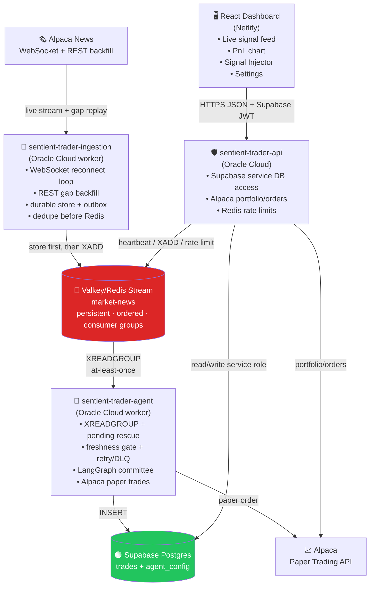
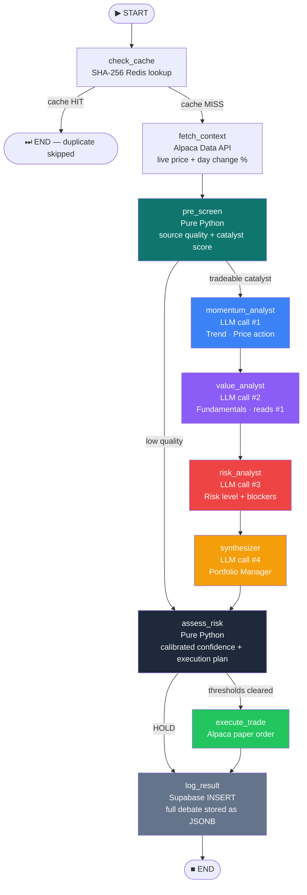
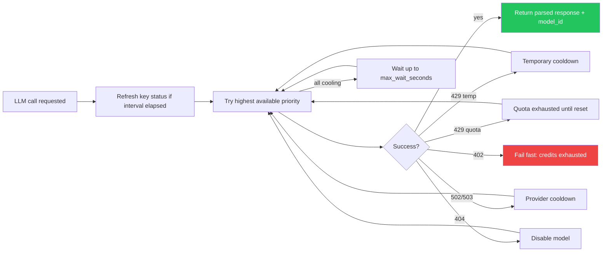
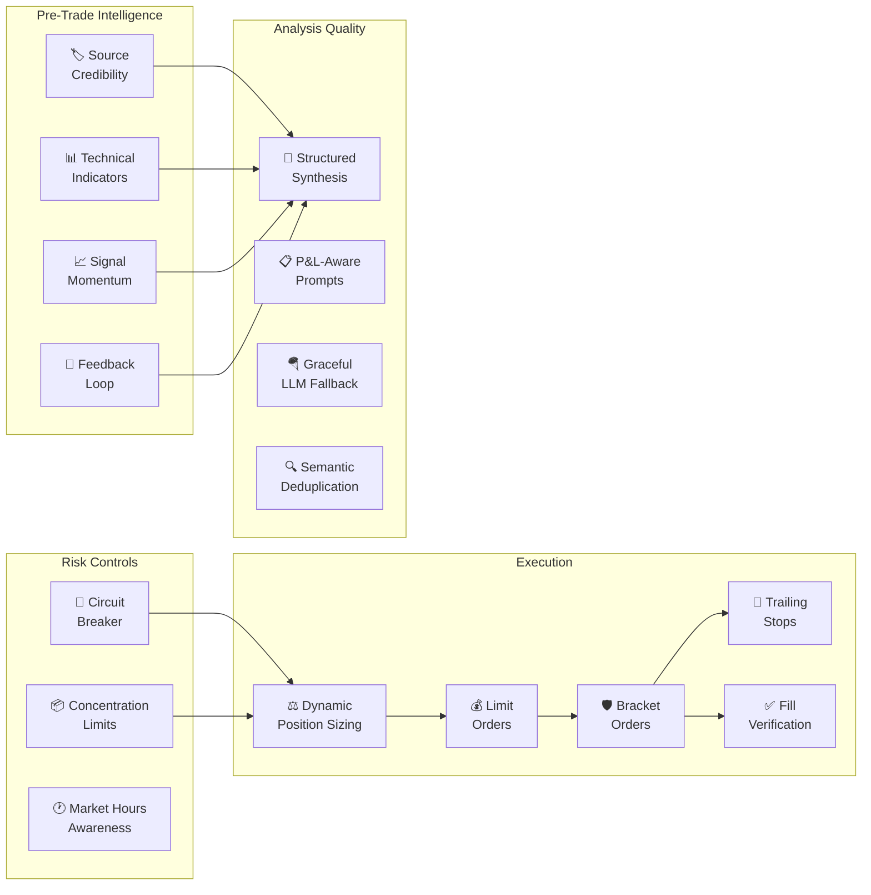

<div align="center">


<br/>

**Autonomous AI paper-trading system** — a four-LLM committee *debates* every market headline in real time,
then trades **only** when conviction, risk, and quality gates all clear.

<br/>

[](https://apps.sundeepdayalan.in/sentient-trader)
&nbsp;&nbsp;
[](https://apps.sundeepdayalan.in/sentient-trader)
&nbsp;&nbsp;
[](https://apps.sundeepdayalan.in/sentient-trader)

<br/>

[](#tech-stack)
[](#tech-stack)
[](#tech-stack)
[](#tech-stack)
[](#tech-stack)
[](#tech-stack)
[](#deployment)

<br/>

**[🚀 Live Demo](https://apps.sundeepdayalan.in/sentient-trader)** · **[📖 How It Works](#how-it-works)** · **[⚡ Quick Start](#quick-start)**

<br/>

<!-- ──────────────────────────────────────────────────────────────────────────
     DEMO CLIP — swap the poster below for a real recording of the dashboard.
       1. Screen-record ~20–40s of the live app: signals streaming in, a card
          expanding into the 4-agent debate, the PnL chart, a trade firing.
       2. Optimize it (keep under ~10 MB):
            ffmpeg -i demo.mov -vf "fps=12,scale=1280:-1" -loop 0 .github/assets/demo.gif
          (or drag an .mp4 into the GitHub web editor and paste the hosted URL)
       3. Save as .github/assets/demo.gif and change the src below to demo.gif.
────────────────────────────────────────────────────────────────────────── -->
<a href="https://apps.sundeepdayalan.in/sentient-trader">
  
</a>

</div>

<br/>

---

<br/>

## 📊 By the Numbers

*Live production figures pulled straight from the database — running autonomously since **25 May 2026**. These are real counters, not benchmarks, and they grow every day the system is up.*

| | Metric | Result |
|---|--------|-------:|
| 📰 | **News headlines ingested** | **8,500+** |
| 🧠 | **Signals evaluated end-to-end** | **7,200+** |
| 🤖 | **LLM committee calls executed** | **~14,600** *(4 per full debate)* |
| 🔬 | **Decision traces persisted** | **7,200+** — *100% audit coverage* |
| 📈 | **Signal outcomes back-labeled** | **6,700+** *(15m · 1h · EOD returns)* |
| ⚡ | **Resolved by deterministic pre-screen** | **~45%** — *zero LLM spend on noise* |
| 🎯 | **Conviction selectivity** | **10 trades / 7,200 signals** — *a 0.14% fire rate* |
| 📡 | **News delivery latency** | **~1.8s median** *(source → ingested)* |
| 🛡️ | **Scheduler reliability** | **96%** success across **261** runs |
| ✅ | **Execution cleanliness** | **3 errors** in 7,200+ signals — *99.96% clean* |

> The headline story isn't profit (it's a conviction-gated paper-trading demo that trades rarely by design) — it's **reliability and throughput**: thousands of signals reasoned over, fully traced, and risk-gated, running unattended for weeks with near-zero errors.

<br/>

---

<br/>

## 👁️ Full Transparency — Watch It Reason

No black box. Every signal persists its **complete decision trace** — all four agents'
stances and reasoning, the risk gate's verdict, and the final call.

- 🔍 **See it live, no login** — open any signal on the **[live dashboard](https://apps.sundeepdayalan.in/sentient-trader)** to read the full four-agent debate behind the decision.
- 🛰️ **Traced end-to-end** — every LLM call is captured in **LangSmith** (project `Sentient-Trader-PROD`) for latency, quota, and prompt-level observability.

#### 🔬 Real committee traces — public, no login

Watch the four-agent debate actually happen on a live **BUY**, **SELL**, and **HOLD**:

| Decision | Signal | Raw trace |
|:--:|---|:--:|
| 🟢 **BUY** | `GOOG` — *"Palantir Expands Google Cloud AI Partnership"* | **[View in LangSmith ↗](https://smith.langchain.com/public/9317f6f8-17b2-40e6-b8c7-00a744d99117/r)** |
| 🔴 **SELL** | `LULU` — *"Root Of The Challenges Not Fully Diagnosed"* | **[View in LangSmith ↗](https://smith.langchain.com/public/b6b99632-ac72-47e5-afd8-5a88a544fe8c/r)** |
| 🟡 **HOLD** | `LEN` — *"Lennar Appoints Jim Parker As COO"* | **[View in LangSmith ↗](https://smith.langchain.com/public/a7ee3880-ebf2-4c97-9912-dab9f85a9c23/r)** |

**[▶ Explore the live decision traces »](https://apps.sundeepdayalan.in/sentient-trader)**

<br/>

---

<br/>

## 💡 What Makes This Different

> **This is not a bot that fires on keywords.**

Most trading bots pattern-match headlines and fire orders. Sentient Trader runs a **sequential four-agent AI debate** where each persona reads and reacts to what the previous agent actually said — producing genuine disagreement, not averaged noise.

<table>
<tr>
<td width="50%">

### 🏗️ Systems Engineering
- **4 independent services** with distinct failure domains
- **At-least-once delivery** via Redis Streams + consumer groups
- **Store-first architecture** — nothing is lost if Redis goes down
- **4-layer deduplication** from ingestion to agent cache
- **Hot-reloadable config** — change thresholds without redeployment

</td>
<td width="50%">

### 🤖 AI / ML Engineering
- **Sequential multi-agent debate** via LangGraph StateGraph
- **Structured LLM output** with Pydantic schema validation
- **Quota-aware provider cascade** across Groq & OpenRouter
- **Deterministic pre-screening** saves 60%+ LLM budget
- **Full audit trail** — every LLM prompt & response stored as JSONB

</td>
</tr>
<tr>
<td width="50%">

### 📊 Quantitative Trading
- **RSI, SMA, EMA, MACD** technical analysis pipeline
- **Dynamic position sizing** scaled by conviction level
- **Circuit breaker** — auto-halt on daily loss threshold
- **Bracket orders** with take-profit & stop-loss automation
- **Signal outcome tracking** with 15m/1h/EOD return labeling

</td>
<td width="50%">

### 🛡️ Production Observability
- **Fill-verified execution** — only confirmed fills count as trades
- **Price-move gate** — blocks orders if price moved >3% since analysis
- **Decision trace storage** — full debate + risk gate reasoning persisted
- **Worker health heartbeats** via Redis with per-service counters
- **Structured logging** across all services for cloud-native monitoring

</td>
</tr>
</table>

<br/>

---

## ⚡ The Pipeline at a Glance

```
📰 Alpaca News API → 📡 Ingestion Worker → 🔴 Valkey Stream → 🤖 LangGraph Agent → 🧠 4-LLM Committee → 📈 Alpaca Orders → 🟢 Supabase → ⚡ FastAPI → 🖥️ React Dashboard
```

<br/>

---

<a id="how-it-works"></a>

<details>
<summary><b>🔬 How It Works — architecture, the AI committee &amp; the risk gate</b> &nbsp;<sub>(click to expand)</sub></summary>

<br/>

## 🏛️ Architecture

Four deployable processes, each with a distinct failure domain:



The services share **no in-process state**. An LLM provider rate limit on the agent doesn't affect ingestion. A noisy news day doesn't slow the API. A frontend deploy doesn't touch the Oracle Cloud workers.

<br/>

---

## 🤖 The AI Committee — How Decisions Are Made

The core innovation: a **sequential four-agent debate** where each persona sees and reacts to previous opinions. This produces genuine disagreement, not independent guesses.


| Agent | Role | Output Schema |
|-------|------|--------------|
| 🟦 **Momentum Trader** | Price action, trend analysis, technical signals | `PersonaAnalysis` — stance, conviction, reasoning |
| 🟣 **Value Investor** | Fundamental analysis, intrinsic value impact — **reads Momentum's take** | `PersonaAnalysis` — stance, conviction, reasoning |
| 🔴 **Risk Manager** | Non-directional risk assessment — **reads both prior opinions** | `RiskAssessment` — risk level, score, confidence cap, disqualifiers |
| 🟡 **Portfolio Manager** | Final synthesis — **reads all three as a debate transcript** | `SynthesisResult` — action, sentiment, confidence, reasoning |

> **Why sequential?** Parallel gives three independent opinions in a vacuum. Sequential gives a real argument: the value investor reads the momentum trader's actual take, so disagreement is *substantive* rather than *coincidental*. The risk manager stress-tests both sides. This is why the committee produces nuanced analysis rather than averaged noise.

<br/>

---

## 🧠 LangGraph Agent Pipeline

Every node is a pure function. Nodes never call each other directly. The graph handles all routing:



### Key Design: Deterministic Pre-Screening

Before spending LLM budget, a pure-Python quality scorer evaluates each headline. In production, **~45% of all signals (2,900+) are resolved by the pre-screen with zero LLM calls** — low-quality noise is filtered for free, while every tradeable catalyst still gets the full four-call committee debate.

<br/>

---

## 🛡️ Risk Gate

The final execution gate is **pure Python** — no LLM call. Five conditions must all pass:

```python
is_strong_buy  = action == "BUY"  and sentiment >= config.BUY_SENTIMENT_THRESHOLD
is_strong_sell = action == "SELL" and sentiment <= config.SELL_SENTIMENT_THRESHOLD
is_confident   = calibrated_confidence >= effective_confidence_threshold
quality_ok     = article_quality.score >= ARTICLE_EXECUTION_SCORE_FLOOR
plan_ok        = execution_plan.blocked_reasons == []

should_trade = (is_strong_buy or is_strong_sell) and is_confident and quality_ok and plan_ok
```

| Parameter | Default | Editable via Dashboard |
|-----------|---------|:-----:|
| `BUY_SENTIMENT_THRESHOLD` | 0.65 | ✅ |
| `SELL_SENTIMENT_THRESHOLD` | -0.65 | ✅ |
| `CONFIDENCE_THRESHOLD` | 0.70 | ✅ |

<br/>

---

## 🔌 LLM Provider Router — Quota-Aware Cascade

Every LLM call goes through `ModelRouter.call()`. The router handles **rate limits, quota exhaustion, and provider outages** automatically — a risk analyst can hit a free model's daily limit and still complete on a paid fallback within the same signal.



**Supported providers:**

| Provider | Config | Behavior |
|----------|--------|----------|
| **Groq Always Free** | `"type": "groq-always-free"` | Auto-discovers models at startup, ranks by capability, cools down on 429 |
| **OpenRouter** | `"type": "openrouter"` | Ordered priority fallback, per-model quota tracking, paid fallback support |

<br/>

</details>

---

<details>
<summary><b>🧰 Features, data model &amp; tech stack</b> &nbsp;<sub>(click to expand)</sub></summary>

<br/>

## 📊 Enhanced Trading Features

15+ institutional-grade features, all **toggleable via database config** — no code changes or redeployments needed.



<details>
<summary><b>📋 Full Feature Reference (click to expand)</b></summary>

<br/>

#### Pre-Trade Intelligence

| Feature | Config Key | Description |
|---------|-----------|-------------|
| **Source Credibility** | `source_credibility` | Scores 30+ news sources across 4 tiers (Reuters/Bloomberg → PR wires). Tier 1 sources boost quality scores; Tier 4 penalize them. |
| **Technical Indicators** | `technical_indicators` | Fetches 5-day hourly bars, computes RSI(14), SMA(20), EMA(12/26), MACD, volume ratio, and 52-week range position. Injected into all persona prompts. |
| **Signal Momentum** | `signal_momentum` | Tracks recent sentiment per ticker in Redis sorted sets. Detects directional consensus when multiple signals converge within an hour. |
| **Feedback Loop** | `feedback_loop` | Queries historical win rates by ticker and action. Adjusts calibrated confidence by up to ±8% based on track record. |

#### Risk Controls

| Feature | Config Key | Description |
|---------|-----------|-------------|
| **Circuit Breaker** | `circuit_breaker` | Blocks all trading if daily P&L loss exceeds threshold (default: 2%). Prevents cascading losses. |
| **Concentration Limits** | `concentration_limits` | Blocks orders that would push any single ticker above portfolio percentage (default: 10%). |
| **Market Hours Awareness** | `market_hours_awareness` | Categorizes signals as pre-market/regular/after-hours/weekend. Adds timing context to committee prompts. |

#### Execution

| Feature | Config Key | Description |
|---------|-----------|-------------|
| **Dynamic Position Sizing** | `dynamic_position_sizing` | Conviction-scaled sizing. High-confidence theses get up to 5% of portfolio; weak theses get 15% of that. |
| **Bracket Orders** | `bracket_orders` | Auto-places take-profit (+6%) and stop-loss (-3%) after BUY fill. Both GTC. |
| **Trailing Stops** | `trailing_stops` | Activates at +2% gain, trails 3% below current price. Ratchets up only. |
| **Limit Orders** | `use_limit_orders` | IOC limits with configurable buffer instead of market orders. |
| **Fill Verification** | Always active | 3-retry verification loop — `executed_action` only logged on confirmed fill. |
| **Price-Move Gate** | `price_move_gate` | Blocks orders if price moved >3% since initial analysis snapshot. |

#### Analysis Quality

| Feature | Config Key | Description |
|---------|-----------|-------------|
| **Structured Synthesis** | `structured_synthesis` | 5-point synthesis framework: catalyst clarity, timing, position context, risk-reward, conviction alignment. |
| **P&L-Aware Prompts** | Always active | Existing positions inject entry price, unrealized P&L, and P&L % into prompts. |
| **Graceful LLM Fallback** | Always active | Failed persona calls return neutral analysis instead of `None`. Synthesizer always gets three opinions. |
| **Semantic Deduplication** | Always active | Jaccard similarity catches reformulated duplicates ("NVIDIA beats Q3 earnings" ≈ "NVDA earnings top estimates"). |

</details>

<br/>

---

## 🖥️ Frontend Dashboard

**Framework:** React + Vite + Tailwind CSS &nbsp;|&nbsp; **Host:** Netlify &nbsp;|&nbsp; **Auth:** Supabase

| View | Description |
|------|-------------|
| **Live Signal Feed** | Real-time signals with action badges, conviction bars, and sentiment scores |
| **Signal Detail** | Full AI committee debate — every persona's stance, reasoning, and the raw LLM trace |
| **PnL Chart** | Recharts equity curve with portfolio performance history |
| **Signal Injector** | Submit custom headlines to test the full pipeline in seconds |
| **Settings** | Live-edit all agent thresholds, prompts, provider, and model list — no redeployment |

### Backend API Routes

| Route | Method | Purpose |
|-------|--------|---------|
| `/auth/me` | GET | Validates Supabase access token, returns dashboard role flags |
| `/simulate` | POST | Authenticated, rate-limited signal injection into Redis Stream |
| `/status` | GET | Combined health check: Supabase, Alpaca, Redis, LLM provider, agent heartbeat |
| `/agent-config` | GET/POST | Read/write agent config (POST requires super-user) |
| `/stats` | GET | Aggregated dashboard statistics |
| `/portfolio` | GET | Alpaca paper trading portfolio history |
| `/orders` | GET | Account, positions, and order list |
| `/orders/cancel` | POST | Cancel selected Alpaca orders (super-user only) |
| `/trades` | GET | Paginated trade summaries with polling cursor |
| `/trades/{id}` | GET | Trade detail with full Decision Core trace |

<br/>

---

## 🗄️ Data Architecture

| Store | Technology | Purpose |
|-------|-----------|---------|
| Raw news archive | Supabase `raw_news_articles` | Durable source payloads, normalized fields, dedupe links |
| Ingestion outbox | Supabase `news_outbox` | Retryable Redis publish queue |
| Message bus | Valkey/Redis Stream `market-news` | Hot ordered queue with consumer groups |
| Agent retry | Valkey sorted set + hash | Failed analysis retries outside the hot stream |
| Agent DLQ | Valkey/Redis Stream | Dead-letter queue for operator inspection |
| Agent cache | Valkey/Redis | SHA-256 + semantic Jaccard duplicate suppression |
| Signal log | Supabase `trades` | Every decision with full Decision Core trace as JSONB |
| Signal outcomes | Supabase `signal_outcomes` | Post-signal returns at 15m, 1h, and EOD |
| Config | Supabase `agent_config` | Single row (id=1) — all trading parameters |

<details>
<summary><b>📋 Full trades table schema (click to expand)</b></summary>

<br/>

| Column | Type | Notes |
|--------|------|-------|
| `id` | `uuid` | Primary key |
| `created_at` | `timestamptz` | Auto |
| `ticker` | `text` | |
| `headline` | `text` | |
| `sentiment_score` | `float4` | Portfolio Manager sentiment, -1.0 to 1.0 |
| `confidence_score` | `float4` | Raw Portfolio Manager confidence |
| `calibrated_confidence` | `float4` | Confidence after deterministic caps — this is what execution uses |
| `confidence_cap` | `float4` | Tightest cap applied |
| `trade_action` | `text` | Legacy Portfolio Manager recommendation |
| `pm_recommendation` | `text` | Explicit BUY/SELL/HOLD |
| `risk_should_trade` | `bool` | Final risk-gate result |
| `executed_action` | `text` | Actual order side — null when no confirmed fill |
| `order_id` | `text` | Alpaca order ID |
| `client_order_id` | `text` | Deterministic idempotency key |
| `order_status` | `text` | Alpaca order status |
| `execution_error` | `text` | Structured failure reason |
| `gate_reason` | `text` | Human-readable risk-gate decision |
| `decision_path` | `text` | `pre_screen`, `full_debate`, `expired`, `analysis_skipped` |
| `processing_started_at` | `timestamptz` | Agent processing start |
| `processing_finished_at` | `timestamptz` | Agent processing end |
| `quantity` | `int4` | Shares ordered |
| `is_simulated` | `bool` | True for Signal Injector |
| `article_url` | `text` | Link to original article |
| `trade_decision_traces` | JSONB (separate table) | Full audit payload |

</details>

<details>
<summary><b>📋 Signal outcome tracking (click to expand)</b></summary>

<br/>

`outcome_labeler.py` fills `signal_outcomes` with post-signal prices and returns at 15 minutes, 1 hour, and end of day. This turns audits from "did the committee look sane?" into "did recommendations actually move in the expected direction?"

```bash
cd backend/agent
python outcome_labeler.py --limit 250         # label unlabeled signals
python outcome_labeler.py --limit 250 --force  # relabel all
```

Background scheduler (disabled by default):
```bash
OUTCOME_LABELER_ENABLED=true
OUTCOME_LABELER_INTERVAL_SECONDS=3600
OUTCOME_LABELER_LIMIT=250
```

</details>

<br/>

---

## ⚙️ Tech Stack

| Layer | Technology | Why |
|-------|-----------|-----|
| AI Reasoning | Groq / OpenRouter (`instructor` JSON mode) | Structured output with provider-aware fallback and Pydantic validation |
| Agent Pipeline | LangGraph 0.2 StateGraph | Explicit conditional routing, composable nodes, no hidden side-effects |
| Message Bus | Valkey/Redis Streams | At-least-once delivery, consumer groups, persistent backlog |
| Market Data | Alpaca News + Data + Paper Trading API | Free tier: news, prices, and paper orders in one platform |
| Database | Supabase Postgres | JSONB for Decision Core traces; RLS for auth |
| Backend API | FastAPI | Async, typed, auto-documented endpoints |
| Backend Deploy | Oracle Cloud + Docker Compose | Private Valkey access inside Oracle subnet |
| Frontend | React + Vite + Tailwind CSS | Static Netlify deploy with Supabase Auth |
| Charts | Recharts | PnL equity curve and stats panels |
| Observability | LangSmith + structured logging | Trace every LLM call and agent decision |

<br/>

</details>

---

<a id="quick-start"></a>

<details>
<summary><b>🚀 Run It Yourself — structure, setup, testing &amp; deploy</b> &nbsp;<sub>(click to expand)</sub></summary>

<br/>

## 📁 Project Structure

```
sentient-trader/
│
├── backend/
│   ├── api/                          # FastAPI service
│   │   ├── main.py                   # Routes: /status, /simulate, /trades, /agent-config
│   │   ├── redis_client.py           # Valkey/Redis client factory
│   │   ├── requirements.txt
│   │   └── Dockerfile
│   │
│   ├── ingestion/                    # News ingestion worker
│   │   ├── main.py                   # Entry point — starts NewsListener
│   │   ├── listener.py               # WebSocket loop, REST backfill, outbox retry
│   │   ├── backfill.py               # Alpaca REST gap recovery
│   │   ├── store.py                  # Supabase raw article store + 4-layer dedupe
│   │   ├── models.py                 # Article normalization and hash helpers
│   │   ├── health.py                 # Redis-backed ingestion health state
│   │   ├── filter.py                 # Ticker relevance filter
│   │   ├── producer.py               # RedisStreamProducer — XADD to stream
│   │   ├── requirements.txt
│   │   └── Dockerfile
│   │
│   ├── agent/                        # LangGraph trading agent
│   │   ├── main.py                   # Entry point — reload config, build graph, start consumer
│   │   ├── analyst.py                # Full LangGraph graph: all nodes + AI committee
│   │   ├── consumer.py               # XREADGROUP consumer loop
│   │   ├── config.py                 # Type annotations + reload_from_supabase()
│   │   ├── trader.py                 # AlpacaTrader — orders + brackets
│   │   ├── cache.py                  # SHA-256 + semantic Jaccard dedup
│   │   ├── logger.py                 # SupabaseLogger — trades table insert
│   │   ├── schemas.py                # Pydantic models for all data structures
│   │   ├── decision_rules.py         # Committee metrics, article quality, execution plans
│   │   ├── position_manager.py       # Dynamic sizing, brackets, trailing stops, circuit breaker
│   │   ├── market_intelligence.py    # RSI, SMA, EMA, MACD, volume ratio, momentum
│   │   ├── source_credibility.py     # 4-tier news source scoring
│   │   ├── feedback_loop.py          # Historical accuracy + confidence calibration
│   │   ├── outcome_labeler.py        # Post-signal price tracking and return labeling
│   │   ├── observability.py          # Feature activation & execution observability
│   │   ├── test_*.py  (×8)           # decision rules · LLM router · execution observability
│   │   │                             #   · outcome labeler/scheduler · price confirmation
│   │   ├── requirements.txt
│   │   └── Dockerfile
│   │
│   └── shared/
│       └── worker_health.py          # Shared Redis worker health helpers
│
├── frontend/
│   ├── index.html
│   ├── main.tsx                      # React root + AuthProvider
│   ├── DashboardClient.tsx           # Dashboard SPA state and polling
│   ├── globals.css                   # Tailwind + theme variables
│   ├── components/
│   │   ├── AgentMonologue.tsx        # Signal detail: each persona's stance + reasoning
│   │   ├── CustomNewsForm.tsx        # Signal Injector form
│   │   ├── PnLChart.tsx              # Recharts equity curve
│   │   ├── PipelinePage.tsx          # React Flow live pipeline visualization
│   │   ├── OrdersPage.tsx            # Alpaca orders + positions
│   │   ├── PortfolioPage.tsx         # Portfolio history + holdings
│   │   ├── SettingsPage.tsx          # Live agent-config editor (super-user)
│   │   ├── StatsBar.tsx              # Aggregate dashboard stats
│   │   ├── SystemStatus.tsx          # Live health of every dependency
│   │   ├── LiveTicker.tsx            # Streaming signal ticker
│   │   ├── AuthGate.tsx / AuthProvider.tsx  # Supabase auth (OAuth + anonymous)
│   │   ├── ThemeToggle.tsx           # Cross-tab synced light/dark theme
│   │   └── AppErrorNotice.tsx        # Centralized API error surface
│   └── lib/
│       ├── api.ts                    # FastAPI client + bearer token forwarding
│       ├── errors.ts                 # Normalized API error model
│       ├── dashboardStats.ts         # Stats aggregation helpers
│       ├── news.ts / constants.ts    # Signal feed helpers + static config
│       ├── theme.ts                  # Theme state + cross-tab sync
│       ├── supabase-browser.ts       # Supabase browser auth client
│       ├── supabase-schema.ts        # Schema-scoped client options
│       └── types.ts
│
├── supabase/
│   ├── schema.sql                    # One-file master DB setup (run once)
│   ├── queries/                      # Ad-hoc analysis & ops queries
│   └── maintenance/                  # Storage reclaim scripts
│
├── docker-compose.coolify.yml        # Production deployment config
└── README.md
```

<br/>

---

## 🚀 Running Locally

### Prerequisites

| Requirement | Version |
|-------------|---------|
| Python | 3.11+ |
| Node.js | 20+ |
| Valkey/Redis | Any recent version |
| Supabase | Free tier works |
| Alpaca | Free paper trading account |
| LLM Provider | Groq API key **or** OpenRouter API key |

### 1. Set Up the Database

Run the single master setup script once via the Supabase SQL Editor:

```
supabase/schema.sql
```

It creates the full schema in one pass — all tables, indexes, the seeded
`agent_config`, the `dashboard_stats()` function, row-level security, and
realtime. The script is idempotent (`IF NOT EXISTS` / `CREATE OR REPLACE`), so
it is safe to re-run.

> **Access model:** RLS is on and only the `service_role` is granted table
> access — the public anon key cannot read or write app data. All access goes
> through the FastAPI backend. To target a dev schema, find/replace
> `sentient_trader` in the script before running.

### 2. Agent Service

```bash
cd backend/agent
pip install -r requirements.txt

# Required env vars (see .env.example for full list):
export SUPABASE_URL=https://xxx.supabase.co
export SUPABASE_SERVICE_ROLE_KEY=...
export SUPABASE_DB_SCHEMA=sentient_trader
export REDIS_HOST=127.0.0.1
export REDIS_PORT=6379
export ALPACA_API_KEY=...
export ALPACA_SECRET_KEY=...
export GROQ_API_KEY=...          # or OPENROUTER_API_KEY

python main.py
```

### 3. Ingestion Service

```bash
cd backend/ingestion
pip install -r requirements.txt

export SUPABASE_URL=https://xxx.supabase.co
export SUPABASE_SERVICE_ROLE_KEY=...
export REDIS_HOST=127.0.0.1
export ALPACA_API_KEY=...
export ALPACA_SECRET_KEY=...
export INGESTION_LIVE_ENABLED=true

python main.py
```

### 4. Backend API

```bash
cd backend/api
pip install -r requirements.txt

export SUPABASE_URL=https://xxx.supabase.co
export SUPABASE_ANON_KEY=...
export SUPABASE_SERVICE_ROLE_KEY=...
export CORS_ORIGINS=http://localhost:3000
export ALPACA_API_KEY=...
export ALPACA_SECRET_KEY=...

uvicorn main:app --host 0.0.0.0 --port 8000
```

### 5. Frontend

```bash
cd frontend
npm install

# Create .env.local:
echo "VITE_SUPABASE_URL=https://xxx.supabase.co" >> .env.local
echo "VITE_SUPABASE_ANON_KEY=..." >> .env.local
echo "VITE_BACKEND_API_URL=http://127.0.0.1:8000" >> .env.local

npm run dev
# → http://localhost:3000
```

### Testing Without Waiting for News

Open the dashboard → **Signal Injector** → enter a ticker and headline → click **Inject**. The signal travels the full pipeline and appears in the live feed within seconds.

<br/>

---

## 🧪 Controlled Proof Test

Run after applying migrations and deploying:

### Unit Tests

```bash
cd backend/agent
python3 -m unittest test_decision_rules test_execution_observability test_outcome_labeler
```

This validates:
- Risk manager doesn't count as directional dissenter
- Risk disqualifiers cap calibrated confidence
- Flat-account SELLs blocked before Alpaca
- `submitted=true` without Alpaca `order_id` isn't counted as executed
- Pre-screen rows get `decision_path='pre_screen'`
- Outcome labeler records 15m/1h/EOD returns correctly

### Paper BUY-Path Proof

Submit a high-quality catalyst and verify:

```sql
SELECT ticker, pm_recommendation, risk_should_trade, calibrated_confidence,
       executed_action, order_id, order_status, decision_path
FROM sentient_trader.trades
ORDER BY created_at DESC LIMIT 5;
```

✅ Pass: `risk_should_trade=true`, `executed_action='BUY'`, `order_id IS NOT NULL`

<br/>

---

<details>
<summary><h2>📜 Historical Replay Runbook (click to expand)</h2></summary>

<br/>

Historical replay exercises the normal pipeline from Alpaca REST news through normalization, storage, dedupe, ticker selection, outbox, Redis Stream, agent processing, and Supabase logging.

### Replay Environment Overrides

| Env var | Normal | Replay | Why |
|---------|--------|--------|-----|
| `INGESTION_LIVE_ENABLED` | `true` | `false` | Prevent live news mixing with replay |
| `REDIS_STREAM_MAX_LEN` | `1000` | `20000` | Prevent trimming before agent reads |
| `AGENT_MAX_TRADE_SIGNAL_AGE_SECONDS` | `900` | `1209600` | Allow historical articles through |
| `AGENT_MAX_AUDIT_SIGNAL_AGE_SECONDS` | `86400` | `1209600` | Prevent dead-lettering old articles |

### Preflight Reset

```sql
TRUNCATE TABLE
  sentient_trader.trade_decision_traces,
  sentient_trader.trades,
  sentient_trader.news_outbox,
  sentient_trader.news_article_symbols,
  sentient_trader.raw_news_articles,
  sentient_trader.ingestion_events,
  sentient_trader.ingestion_cursors
RESTART IDENTITY CASCADE;
```

### Run Replay

```bash
cd backend/ingestion
python replay_historical.py --days 1 --dry-run          # dry run first
python replay_historical.py --days 10 --max-pages 300 --confirm-replay  # real run
```

### Post-Run Validation

```sql
SELECT 'trades_total' AS metric, COUNT(*)::bigint AS value FROM sentient_trader.trades
UNION ALL
SELECT 'traces_total', COUNT(*)::bigint FROM sentient_trader.trade_decision_traces
UNION ALL
SELECT 'outbox_published', COUNT(*)::bigint FROM sentient_trader.news_outbox WHERE status = 'PUBLISHED';
```

Expected: `trades_total ≈ traces_total ≈ outbox_published`, retry/DLQ at `0`, Redis lag near `0`.

</details>

<br/>

---

## 🚢 Deployment

### Oracle Cloud Backend

All services are containerized with Docker Compose. See `.env.example` for the full environment variable reference.

```bash
docker-compose -f docker-compose.coolify.yml up -d
```

### Frontend (Netlify)

Connect the repo to Netlify. Set environment variables in the dashboard (same as `frontend/.env.local.example`). Auto-deploys on push to `main`.

### Config Changes (No Redeploy Needed)

Update agent parameters via the **Settings** page in the dashboard. The worker refreshes `agent_config` before the next signal after `AGENT_CONFIG_REFRESH_SECONDS` elapses — no restart required.

<br/>

</details>

---

<details>
<summary><b>🎯 Key design decisions &amp; trade-offs</b> &nbsp;<sub>(click to expand)</sub></summary>

<br/>

## 🎯 Key Design Decisions

<table>
<tr>
<td width="30%"><b>Sequential debate over parallel</b></td>
<td>Parallel gives three independent opinions in a vacuum. Sequential gives a real argument: the value investor reads the momentum trader's actual take, so disagreement is <i>substantive</i> rather than <i>coincidental</i>.</td>
</tr>
<tr>
<td><b>Redis Streams as the message bus</b></td>
<td>Persistent ordered log, consumer groups for at-least-once delivery, <code>XACK</code> for processing confirmation, and auto-ID generation. The same instance handles headline deduplication.</td>
</tr>
<tr>
<td><b>Separate backend workers</b></td>
<td>An LLM rate limit on the agent doesn't pause news ingestion. The Redis Stream buffer absorbs any processing delay.</td>
</tr>
<tr>
<td><b>Summary field, not full articles</b></td>
<td>Alpaca's summary is ~150–400 tokens vs ~2,000–3,000 for full articles. With 4 sequential LLM calls per signal, full bodies would exhaust free-tier quotas immediately.</td>
</tr>
<tr>
<td><b><code>instructor</code> JSON mode over TOOLS</b></td>
<td>Tool-calling behavior differs across Groq and routed OpenRouter models. JSON mode with a system schema produces consistent, validatable output across all providers.</td>
</tr>
<tr>
<td><b>Supabase as the only config source</b></td>
<td>Python type annotations without assignment crash with <code>AttributeError</code> if <code>reload_from_supabase()</code> fails — loud and obvious. Hardcoded defaults would let the process silently trade at wrong thresholds.</td>
</tr>
<tr>
<td><b>Provider-aware cooldowns</b></td>
<td>Temporary rate limits ≠ quota exhaustion. The router distinguishes 429 minute limits from daily/weekly quota, uses <code>Retry-After</code> headers, and keeps paid fallbacks active while free models cool down.</td>
</tr>
</table>

<br/>

</details>

---

<div align="center">

**Built by [Sundeep Dayalan](https://sundeepdayalan.in)**

[](https://apps.sundeepdayalan.in/sentient-trader)

*If you find this interesting, ⭐ the repo — it helps with visibility!*

</div>
