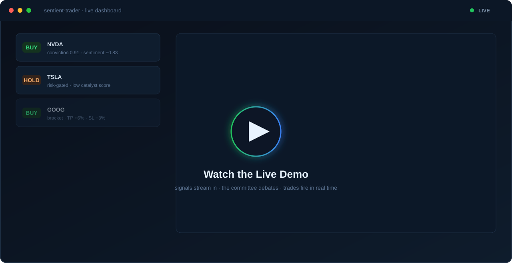
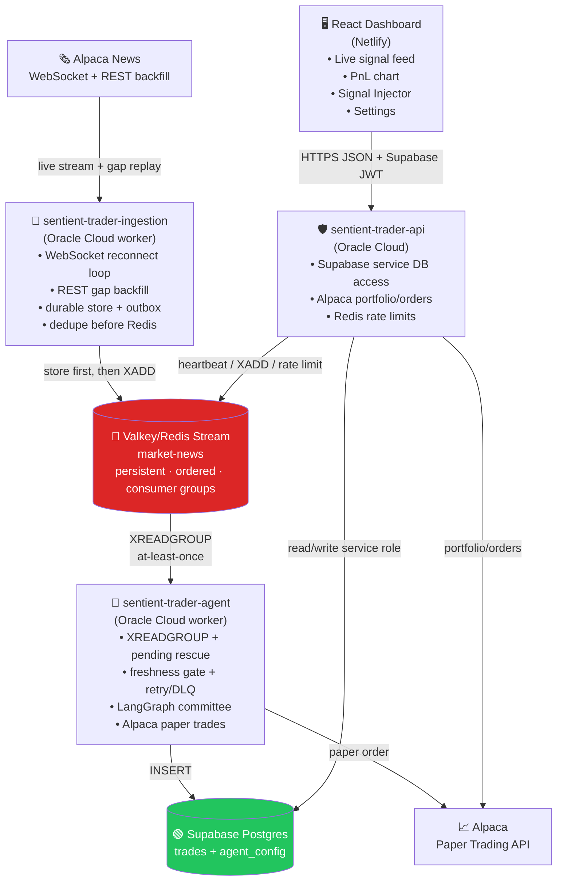
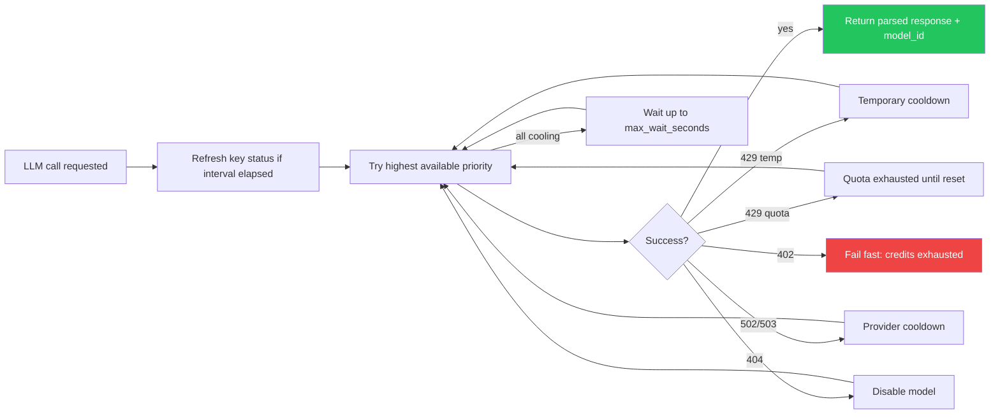
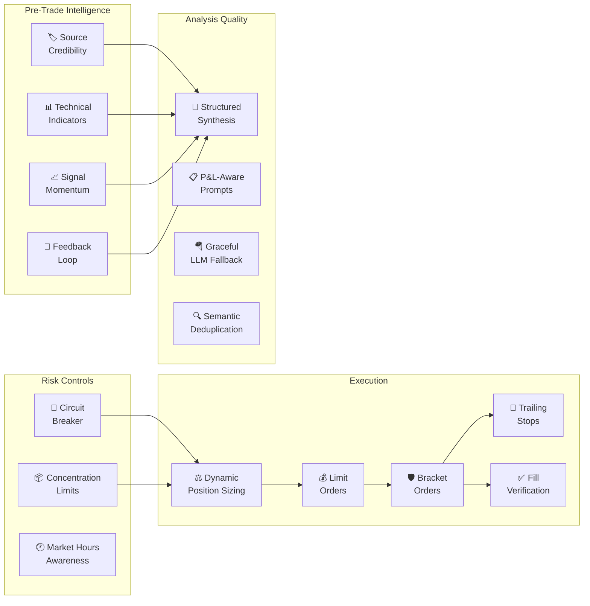

<div align="center">


<br/>

**Autonomous AI paper-trading system** — a four-LLM committee *debates* every market headline in real time,
then trades **only** when conviction, risk, and quality gates all clear.

<br/>

[](https://apps.sundeepdayalan.in/sentient-trader)
&nbsp;&nbsp;
[](https://apps.sundeepdayalan.in/sentient-trader)
&nbsp;&nbsp;
[](https://apps.sundeepdayalan.in/sentient-trader)

<br/>

[](#tech-stack)
[](#tech-stack)
[](#tech-stack)
[](#tech-stack)
[](#tech-stack)
[](#tech-stack)
[](#deployment)
[](LICENSE)

<br/>

**[🚀 Live Demo](https://apps.sundeepdayalan.in/sentient-trader)** · **[⚡ Quick Start](#quick-start)** · **[🧪 Local Demo](docs/LOCAL_DEMO.md)** · **[🤝 Contribute](CONTRIBUTING.md)** · **[🛡️ Security](SECURITY.md)**

<br/>

> ### 🐞 Featured: [The Bug Log](#-bug-log)
> **25+ production postmortems, documented in full** — the safety loop that ran 1,050 iterations
> without acting, the sweep that stripped 66 stop-losses in two minutes, the enum that silently
> disabled an entire subsystem. Every entry: what broke, what it cost, and the fix.
> *The postmortems turned out to be more valuable than the features.*

<br/>

<!-- ──────────────────────────────────────────────────────────────────────────
     DEMO CLIP — swap the poster below for a real recording of the dashboard.
       1. Screen-record ~20–40s of the live app: signals streaming in, a card
          expanding into the 4-agent debate, the PnL chart, a trade firing.
       2. Optimize it (keep under ~10 MB):
            ffmpeg -i demo.mov -vf "fps=12,scale=1280:-1" -loop 0 .github/assets/demo.gif
          (or drag an .mp4 into the GitHub web editor and paste the hosted URL)
       3. Save as .github/assets/demo.gif and change the src below to demo.gif.
────────────────────────────────────────────────────────────────────────── -->
<a href="https://apps.sundeepdayalan.in/sentient-trader">
  
</a>

</div>

<br/>

---

<br/>

## ⭐ Start Here

Sentient Trader is a reference implementation for **auditable multi-agent AI decisions** in a real-time paper-trading pipeline. It is useful if you are exploring LangGraph agents, event-driven AI systems, risk-gated automation, or transparent LLM observability.

| Want to... | Start here |
|------------|------------|
| Watch the system reason | Open the **[live dashboard](https://apps.sundeepdayalan.in/sentient-trader)** and expand any signal. No login required for browsing. |
| Replay a full decision | Open one of the permanent pipeline replays below: BUY, SELL, and HOLD examples are included. |
| Try a safe signal | Use the dashboard **Signal Injector** or `POST /simulate`; simulated signals are marked `is_simulated=true` and cannot submit Alpaca orders. |
| Run it yourself | Follow **[Quick Start](#quick-start)** or the shorter **[Local Demo Guide](docs/LOCAL_DEMO.md)**. |
| Help the project | Pick up a `good first issue`, improve setup docs, or add demo material. See **[CONTRIBUTING.md](CONTRIBUTING.md)**. |

> **Safety boundary:** paper trading only, educational use only, not financial advice. Use Alpaca paper credentials, never live-trading keys.

> If this helps you learn multi-agent systems, paper-trading architecture, or auditable AI workflows, a GitHub star helps other builders find it too.

<br/>

---

<br/>

## 📊 By the Numbers

*Live production figures pulled straight from the database — running autonomously since **25 May 2026**. These are real counters, not benchmarks, and they grow every day the system is up.*

| | Metric | Result |
|---|--------|-------:|
| 📰 | **News headlines ingested** | **8,500+** |
| 🧠 | **Signals evaluated end-to-end** | **7,200+** |
| 🤖 | **LLM committee calls executed** | **~14,600** *(4 per full debate)* |
| 🔬 | **Decision traces persisted** | **7,200+** — *100% audit coverage* |
| 📈 | **Signal outcomes back-labeled** | **6,700+** *(15m · 1h · EOD returns)* |
| ⚡ | **Resolved by deterministic pre-screen** | **~45%** — *zero LLM spend on noise* |
| 🎯 | **Conviction selectivity** | **10 trades / 7,200 signals** — *a 0.14% fire rate* |
| 📡 | **News delivery latency** | **~1.8s median** *(source → ingested)* |
| 🛡️ | **Scheduler reliability** | **96%** success across **261** runs |
| ✅ | **Execution cleanliness** | **3 errors** in 7,200+ signals — *99.96% clean* |

> The headline story isn't profit (it's a conviction-gated paper-trading demo that trades rarely by design) — it's **reliability and throughput**: thousands of signals reasoned over, fully traced, and risk-gated, running unattended for weeks with near-zero errors.

> 🔁 **Reproduce these numbers.** They aren't marketing — every figure is a live query you can run yourself: scheduler reliability and execution cleanliness come from [`supabase/queries/ai_behavior_master_report.sql`](supabase/queries/ai_behavior_master_report.sql), P&L / outcome figures from [`supabase/queries/pnl_performance_debug.sql`](supabase/queries/pnl_performance_debug.sql), and the conviction→outcome edge from [`supabase/queries/signal_calibration.sql`](supabase/queries/signal_calibration.sql) (also served at `GET /calibration` and surfaced on the dashboard).

<br/>

---

<br/>

## 👁️ Full Transparency — Watch It Reason

No black box. Every signal persists its **complete decision trace** — all four agents'
stances and reasoning, the risk gate's verdict, and the final call.

- 🔍 **See it live, no login** — open any signal on the **[live dashboard](https://apps.sundeepdayalan.in/sentient-trader)** to read the full four-agent debate behind the decision.
- 🛰️ **Traced end-to-end** — every LLM call is captured in **LangSmith** (project `Sentient-Trader-PROD`) for latency, quota, and prompt-level observability.

#### 🔬 Replay any decision — full pipeline, in-house & permanent

Every signal is replayable as an **interactive pipeline** — news → pre-screen → market context → 4-agent debate → risk gate → execution — reconstructed from the decision trace. No login, no expiry:

| Decision | Signal | Pipeline replay |
|:--:|---|:--:|
| 🟢 **BUY** | `GOOG` — *"Palantir Expands Google Cloud AI Partnership"* | **[▶ Replay](https://apps.sundeepdayalan.in/sentient-trader/pipeline/be963ddb-285a-42f8-832a-f40303be8b3d)** |
| 🔴 **SELL** | `LULU` — *"Root Of The Challenges Not Fully Diagnosed"* | **[▶ Replay](https://apps.sundeepdayalan.in/sentient-trader/pipeline/8266a5dc-35c2-4e79-9d58-59e741975dd1)** |
| 🟡 **HOLD** | `LEN` — *"Lennar Appoints Jim Parker As COO"* | **[▶ Replay](https://apps.sundeepdayalan.in/sentient-trader/pipeline/12ce41b2-22d9-401b-b3b5-9b2193bf88f8)** |

**[▶ Explore the live decision traces »](https://apps.sundeepdayalan.in/sentient-trader)**

<br/>

---

<br/>

## 💡 What Makes This Different

> **This is not a bot that fires on keywords.**

Most trading bots pattern-match headlines and fire orders. Sentient Trader runs a **sequential four-agent AI debate** where each persona reads and reacts to what the previous agent actually said — producing genuine disagreement, not averaged noise.

<table>
<tr>
<td width="50%">

### 🏗️ Systems Engineering
- **4 independent services** with distinct failure domains
- **At-least-once delivery** via Redis Streams + consumer groups
- **Store-first architecture** — nothing is lost if Redis goes down
- **4-layer deduplication** from ingestion to agent cache
- **Hot-reloadable config** — change thresholds without redeployment

</td>
<td width="50%">

### 🤖 AI / ML Engineering
- **Sequential multi-agent debate** via LangGraph StateGraph
- **Structured LLM output** with Pydantic schema validation
- **Quota-aware provider cascade** across Groq & OpenRouter
- **Deterministic pre-screening** saves 60%+ LLM budget
- **Full audit trail** — every LLM prompt & response stored as JSONB

</td>
</tr>
<tr>
<td width="50%">

### 📊 Quantitative Trading
- **RSI, SMA, EMA, MACD** technical analysis pipeline
- **Dynamic position sizing** scaled by conviction level
- **Circuit breaker** — auto-halt on daily loss threshold
- **Bracket orders** with take-profit & stop-loss automation
- **Signal outcome tracking** with 15m/1h/EOD return labeling

</td>
<td width="50%">

### 🛡️ Production Observability
- **Fill-verified execution** — only confirmed fills count as trades
- **Price-move gate** — blocks orders if price moved >3% since analysis
- **Decision trace storage** — full debate + risk gate reasoning persisted
- **Worker health heartbeats** via Redis with per-service counters
- **Structured logging** across all services for cloud-native monitoring

</td>
</tr>
</table>

<br/>

---

## ⚡ The Pipeline at a Glance

```
📰 Alpaca News API → 📡 Ingestion Worker → 🔴 Valkey Stream → 🤖 LangGraph Agent → 🧠 4-LLM Committee → 📈 Alpaca Orders → 🟢 Supabase → ⚡ FastAPI → 🖥️ React Dashboard
```

<br/>

---

<a id="how-it-works"></a>

<details>
<summary><b>🔬 How It Works — architecture, the AI committee &amp; the risk gate</b> &nbsp;<sub>(click to expand)</sub></summary>

<br/>

## 🏛️ Architecture

Four deployable processes, each with a distinct failure domain:



The services share **no in-process state**. An LLM provider rate limit on the agent doesn't affect ingestion. A noisy news day doesn't slow the API. A frontend deploy doesn't touch the Oracle Cloud workers.

<br/>

---

## 🤖 The AI Committee — How Decisions Are Made

The core innovation: a **sequential four-agent debate** where each persona sees and reacts to previous opinions. This produces genuine disagreement, not independent guesses.


| Agent | Role | Output Schema |
|-------|------|--------------|
| 🟦 **Momentum Trader** | Price action, trend analysis, technical signals | `PersonaAnalysis` — stance, conviction, reasoning |
| 🟣 **Value Investor** | Fundamental analysis, intrinsic value impact — **reads Momentum's take** | `PersonaAnalysis` — stance, conviction, reasoning |
| 🔴 **Risk Manager** | Non-directional risk assessment — **reads both prior opinions** | `RiskAssessment` — risk level, score, confidence cap, disqualifiers |
| 🟡 **Portfolio Manager** | Final synthesis — **reads all three as a debate transcript** | `SynthesisResult` — action, sentiment, confidence, reasoning |

> **Why sequential?** Parallel gives three independent opinions in a vacuum. Sequential gives a real argument: the value investor reads the momentum trader's actual take, so disagreement is *substantive* rather than *coincidental*. The risk manager stress-tests both sides. This is why the committee produces nuanced analysis rather than averaged noise.

<br/>

---

## 🧠 LangGraph Agent Pipeline

Every node is a pure function. Nodes never call each other directly. The graph handles all routing:


### Key Design: Deterministic Pre-Screening

Before spending LLM budget, a pure-Python quality scorer evaluates each headline. In production, **~45% of all signals (2,900+) are resolved by the pre-screen with zero LLM calls** — low-quality noise is filtered for free, while every tradeable catalyst still gets the full four-call committee debate.

<br/>

---

## 🛡️ Risk Gate

The final execution gate is **pure Python** — no LLM call. Five conditions must all pass:

```python
is_strong_buy  = action == "BUY"  and sentiment >= config.BUY_SENTIMENT_THRESHOLD
is_strong_sell = action == "SELL" and sentiment <= config.SELL_SENTIMENT_THRESHOLD
is_confident   = calibrated_confidence >= effective_confidence_threshold
quality_ok     = article_quality.score >= ARTICLE_EXECUTION_SCORE_FLOOR
plan_ok        = execution_plan.blocked_reasons == []

should_trade = (is_strong_buy or is_strong_sell) and is_confident and quality_ok and plan_ok
```

| Parameter | Default | Editable via Dashboard |
|-----------|---------|:-----:|
| `BUY_SENTIMENT_THRESHOLD` | 0.65 | ✅ |
| `SELL_SENTIMENT_THRESHOLD` | -0.65 | ✅ |
| `CONFIDENCE_THRESHOLD` | 0.70 | ✅ |

<br/>

---

## 🔌 LLM Provider Router — Quota-Aware Cascade

Every LLM call goes through `ModelRouter.call()`. The router handles **rate limits, quota exhaustion, and provider outages** automatically — a risk analyst can hit a free model's daily limit and still complete on a paid fallback within the same signal.



**Supported providers:**

| Provider | Config | Behavior |
|----------|--------|----------|
| **Groq Always Free** | `"type": "groq-always-free"` | Auto-discovers models at startup, ranks by capability, cools down on 429 |
| **OpenRouter** | `"type": "openrouter"` | Ordered priority fallback, per-model quota tracking, paid fallback support |

<br/>

</details>

---

<details>
<summary><b>🧰 Features, data model &amp; tech stack</b> &nbsp;<sub>(click to expand)</sub></summary>

<br/>

## 📊 Enhanced Trading Features

15+ institutional-grade features, all **toggleable via database config** — no code changes or redeployments needed.



<details>
<summary><b>📋 Full Feature Reference (click to expand)</b></summary>

<br/>

#### Pre-Trade Intelligence

| Feature | Config Key | Description |
|---------|-----------|-------------|
| **Source Credibility** | `source_credibility` | Scores 30+ news sources across 4 tiers (Reuters/Bloomberg → PR wires). Tier 1 sources boost quality scores; Tier 4 penalize them. |
| **Technical Indicators** | `technical_indicators` | Fetches 5-day hourly bars, computes RSI(14), SMA(20), EMA(12/26), MACD, volume ratio, and 52-week range position. Injected into all persona prompts. |
| **Signal Momentum** | `signal_momentum` | Tracks recent sentiment per ticker in Redis sorted sets. Detects directional consensus when multiple signals converge within an hour. |
| **Feedback Loop** | `feedback_loop` | Queries historical win rates by ticker and action. Adjusts calibrated confidence by up to ±8% based on track record. |

#### Risk Controls

| Feature | Config Key | Description |
|---------|-----------|-------------|
| **Circuit Breaker** | `circuit_breaker` | Blocks all trading if daily P&L loss exceeds threshold (default: 2%). Prevents cascading losses. |
| **Concentration Limits** | `concentration_limits` | Blocks orders that would push any single ticker above portfolio percentage (default: 10%). |
| **Market Hours Awareness** | `market_hours_awareness` | Categorizes signals as pre-market/regular/after-hours/weekend. Adds timing context to committee prompts. |

#### Execution

| Feature | Config Key | Description |
|---------|-----------|-------------|
| **Dynamic Position Sizing** | `dynamic_position_sizing` | Conviction-scaled sizing. High-confidence theses get up to 5% of portfolio; weak theses get 15% of that. |
| **Bracket Orders** | `bracket_orders` | Auto-places take-profit (+6%) and stop-loss (-3%) after BUY fill. Both GTC. |
| **Trailing Stops** | `trailing_stops` | Activates at +2% gain, trails 3% below current price. Ratchets up only. |
| **Limit Orders** | `use_limit_orders` | IOC limits with configurable buffer instead of market orders. |
| **Fill Verification** | Always active | 3-retry verification loop — `executed_action` only logged on confirmed fill. |
| **Price-Move Gate** | `price_move_gate` | Blocks orders if price moved >3% since initial analysis snapshot. |

#### Analysis Quality

| Feature | Config Key | Description |
|---------|-----------|-------------|
| **Structured Synthesis** | `structured_synthesis` | 5-point synthesis framework: catalyst clarity, timing, position context, risk-reward, conviction alignment. |
| **P&L-Aware Prompts** | Always active | Existing positions inject entry price, unrealized P&L, and P&L % into prompts. |
| **Graceful LLM Fallback** | Always active | Failed persona calls return neutral analysis instead of `None`. Synthesizer always gets three opinions. |
| **Semantic Deduplication** | Always active | Jaccard similarity catches reformulated duplicates ("NVIDIA beats Q3 earnings" ≈ "NVDA earnings top estimates"). |

</details>

<br/>

---

## 🖥️ Frontend Dashboard

**Framework:** React + Vite + Tailwind CSS &nbsp;|&nbsp; **Host:** Netlify &nbsp;|&nbsp; **Auth:** Supabase

| View | Description |
|------|-------------|
| **Live Signal Feed** | Real-time signals with action badges, conviction bars, and sentiment scores |
| **Signal Detail** | Full AI committee debate — every persona's stance, reasoning, and the raw LLM trace |
| **PnL Chart** | Recharts equity curve with portfolio performance history |
| **Signal Injector** | Submit custom headlines to test the full pipeline in seconds |
| **Settings** | Live-edit all agent thresholds, prompts, provider, and model list — no redeployment |

### Backend API Routes

| Route | Method | Purpose |
|-------|--------|---------|
| `/auth/me` | GET | Validates Supabase access token, returns dashboard role flags |
| `/simulate` | POST | Authenticated, rate-limited signal injection into Redis Stream |
| `/status` | GET | Combined health check: Supabase, Alpaca, Redis, LLM provider, agent heartbeat |
| `/agent-config` | GET/POST | Read/write agent config (POST requires super-user) |
| `/stats` | GET | Aggregated dashboard statistics |
| `/calibration` | GET | Conviction→outcome edge (forward returns + hit rate, bucketed by conviction) |
| `/portfolio` | GET | Alpaca paper trading portfolio history (auth required; account id redacted) |
| `/orders` | GET | Account, positions, and order list (auth required; account id redacted) |
| `/orders/cancel` | POST | Cancel selected Alpaca orders (super-user only) |
| `/trades` | GET | Paginated trade summaries with polling cursor |
| `/trades/{id}` | GET | Trade detail with full Decision Core trace |
| `/metrics` | GET | Prometheus exposition of worker health + LLM budget (optional `METRICS_AUTH_TOKEN`) |

<br/>

---

## 🗄️ Data Architecture

| Store | Technology | Purpose |
|-------|-----------|---------|
| Raw news archive | Supabase `raw_news_articles` | Durable source payloads, normalized fields, dedupe links |
| Ingestion outbox | Supabase `news_outbox` | Retryable Redis publish queue |
| Message bus | Valkey/Redis Stream `market-news` | Hot ordered queue with consumer groups |
| Agent retry | Valkey sorted set + hash | Failed analysis retries outside the hot stream |
| Agent DLQ | Valkey/Redis Stream | Dead-letter queue for operator inspection |
| Agent cache | Valkey/Redis | SHA-256 + semantic Jaccard duplicate suppression |
| Signal log | Supabase `trades` | Every decision with full Decision Core trace as JSONB |
| Signal outcomes | Supabase `signal_outcomes` | Post-signal returns at 15m, 1h, and EOD |
| Config | Supabase `agent_config` | Single row (id=1) — all trading parameters |

<details>
<summary><b>📋 Full trades table schema (click to expand)</b></summary>

<br/>

| Column | Type | Notes |
|--------|------|-------|
| `id` | `uuid` | Primary key |
| `created_at` | `timestamptz` | Auto |
| `ticker` | `text` | |
| `headline` | `text` | |
| `sentiment_score` | `float4` | Portfolio Manager sentiment, -1.0 to 1.0 |
| `confidence_score` | `float4` | Raw Portfolio Manager confidence |
| `calibrated_confidence` | `float4` | Confidence after deterministic caps — this is what execution uses |
| `confidence_cap` | `float4` | Tightest cap applied |
| `trade_action` | `text` | Legacy Portfolio Manager recommendation |
| `pm_recommendation` | `text` | Explicit BUY/SELL/HOLD |
| `risk_should_trade` | `bool` | Final risk-gate result |
| `executed_action` | `text` | Actual order side — null when no confirmed fill |
| `order_id` | `text` | Alpaca order ID |
| `client_order_id` | `text` | Deterministic idempotency key |
| `order_status` | `text` | Alpaca order status |
| `execution_error` | `text` | Structured failure reason |
| `gate_reason` | `text` | Human-readable risk-gate decision |
| `decision_path` | `text` | `pre_screen`, `full_debate`, `expired`, `analysis_skipped` |
| `processing_started_at` | `timestamptz` | Agent processing start |
| `processing_finished_at` | `timestamptz` | Agent processing end |
| `quantity` | `int4` | Shares ordered |
| `is_simulated` | `bool` | True for Signal Injector |
| `article_url` | `text` | Link to original article |
| `trade_decision_traces` | JSONB (separate table) | Full audit payload |

</details>

<details>
<summary><b>📋 Signal outcome tracking (click to expand)</b></summary>

<br/>

`outcome_labeler.py` fills `signal_outcomes` with post-signal prices and returns at 15 minutes, 1 hour, and end of day. This turns audits from "did the committee look sane?" into "did recommendations actually move in the expected direction?"

```bash
cd backend/agent
python outcome_labeler.py --limit 250         # label unlabeled signals
python outcome_labeler.py --limit 250 --force  # relabel all
```

Background scheduler (disabled by default):
```bash
OUTCOME_LABELER_ENABLED=true
OUTCOME_LABELER_INTERVAL_SECONDS=3600
OUTCOME_LABELER_LIMIT=250
```

</details>

<br/>

---

## ⚙️ Tech Stack

| Layer | Technology | Why |
|-------|-----------|-----|
| AI Reasoning | Groq / OpenRouter (`instructor` JSON mode) | Structured output with provider-aware fallback and Pydantic validation |
| Agent Pipeline | LangGraph 0.2 StateGraph | Explicit conditional routing, composable nodes, no hidden side-effects |
| Message Bus | Valkey/Redis Streams | At-least-once delivery, consumer groups, persistent backlog |
| Market Data | Alpaca News + Data + Paper Trading API | Free tier: news, prices, and paper orders in one platform |
| Database | Supabase Postgres | JSONB for Decision Core traces; RLS for auth |
| Backend API | FastAPI | Async, typed, auto-documented endpoints |
| Backend Deploy | Oracle Cloud + Docker Compose | Private Valkey access inside Oracle subnet |
| Frontend | React + Vite + Tailwind CSS | Static Netlify deploy with Supabase Auth |
| Charts | Recharts | PnL equity curve and stats panels |
| Observability | LangSmith + structured logging | Trace every LLM call and agent decision |

<br/>

</details>

---

<a id="quick-start"></a>

<details>
<summary><b>🚀 Run It Yourself — structure, setup, testing &amp; deploy</b> &nbsp;<sub>(click to expand)</sub></summary>

<br/>

## 📁 Project Structure

```
sentient-trader/
│
├── backend/
│   ├── api/                          # FastAPI service
│   │   ├── main.py                   # Routes: /status, /simulate, /trades, /agent-config
│   │   ├── redis_client.py           # Valkey/Redis client factory
│   │   ├── requirements.txt
│   │   └── Dockerfile
│   │
│   ├── ingestion/                    # News ingestion worker
│   │   ├── main.py                   # Entry point — starts NewsListener
│   │   ├── listener.py               # WebSocket loop, REST backfill, outbox retry
│   │   ├── backfill.py               # Alpaca REST gap recovery
│   │   ├── store.py                  # Supabase raw article store + 4-layer dedupe
│   │   ├── models.py                 # Article normalization and hash helpers
│   │   ├── health.py                 # Redis-backed ingestion health state
│   │   ├── filter.py                 # Ticker relevance filter
│   │   ├── producer.py               # RedisStreamProducer — XADD to stream
│   │   ├── requirements.txt
│   │   └── Dockerfile
│   │
│   ├── agent/                        # LangGraph trading agent
│   │   ├── main.py                   # Entry point — reload config, build graph, start consumer
│   │   ├── analyst.py                # Full LangGraph graph: all nodes + AI committee
│   │   ├── consumer.py               # XREADGROUP consumer loop
│   │   ├── config.py                 # Type annotations + reload_from_supabase()
│   │   ├── trader.py                 # AlpacaTrader — orders + brackets
│   │   ├── cache.py                  # SHA-256 + semantic Jaccard dedup
│   │   ├── logger.py                 # SupabaseLogger — trades table insert
│   │   ├── schemas.py                # Pydantic models for all data structures
│   │   ├── decision_rules.py         # Committee metrics, article quality, execution plans
│   │   ├── position_manager.py       # Dynamic sizing, brackets, trailing stops, circuit breaker
│   │   ├── market_intelligence.py    # RSI, SMA, EMA, MACD, volume ratio, momentum
│   │   ├── source_credibility.py     # 4-tier news source scoring
│   │   ├── feedback_loop.py          # Historical accuracy + confidence calibration
│   │   ├── outcome_labeler.py        # Post-signal price tracking and return labeling
│   │   ├── observability.py          # Feature activation & execution observability
│   │   ├── test_*.py  (×8)           # decision rules · LLM router · execution observability
│   │   │                             #   · outcome labeler/scheduler · price confirmation
│   │   ├── requirements.txt
│   │   └── Dockerfile
│   │
│   └── shared/
│       └── worker_health.py          # Shared Redis worker health helpers
│
├── frontend/
│   ├── index.html
│   ├── main.tsx                      # React root + AuthProvider
│   ├── DashboardClient.tsx           # Dashboard SPA state and polling
│   ├── globals.css                   # Tailwind + theme variables
│   ├── components/
│   │   ├── AgentMonologue.tsx        # Signal detail: each persona's stance + reasoning
│   │   ├── CustomNewsForm.tsx        # Signal Injector form
│   │   ├── PnLChart.tsx              # Recharts equity curve
│   │   ├── PipelinePage.tsx          # React Flow live pipeline visualization
│   │   ├── OrdersPage.tsx            # Alpaca orders + positions
│   │   ├── PortfolioPage.tsx         # Portfolio history + holdings
│   │   ├── SettingsPage.tsx          # Live agent-config editor (super-user)
│   │   ├── StatsBar.tsx              # Aggregate dashboard stats
│   │   ├── SystemStatus.tsx          # Live health of every dependency
│   │   ├── LiveTicker.tsx            # Streaming signal ticker
│   │   ├── AuthGate.tsx / AuthProvider.tsx  # Supabase auth (OAuth + anonymous)
│   │   ├── ThemeToggle.tsx           # Cross-tab synced light/dark theme
│   │   └── AppErrorNotice.tsx        # Centralized API error surface
│   └── lib/
│       ├── api.ts                    # FastAPI client + bearer token forwarding
│       ├── errors.ts                 # Normalized API error model
│       ├── dashboardStats.ts         # Stats aggregation helpers
│       ├── news.ts / constants.ts    # Signal feed helpers + static config
│       ├── theme.ts                  # Theme state + cross-tab sync
│       ├── supabase-browser.ts       # Supabase browser auth client
│       ├── supabase-schema.ts        # Schema-scoped client options
│       └── types.ts
│
├── supabase/
│   ├── schema.sql                    # One-file master DB setup (run once)
│   ├── queries/                      # Ad-hoc analysis & ops queries
│   └── maintenance/                  # Storage reclaim scripts
│
├── docker-compose.coolify.yml        # Production deployment config
└── README.md
```

<br/>

---

## 🚀 Running Locally

### Prerequisites

| Requirement | Version |
|-------------|---------|
| Python | 3.11+ |
| Node.js | 20+ |
| Valkey/Redis | Any recent version |
| Supabase | Free tier works |
| Alpaca | Free paper trading account |
| LLM Provider | Groq API key **or** OpenRouter API key |

### Fastest Safe Demo Path

You do not need to wait for a live market headline to see the pipeline move:

1. Start the stack with Alpaca **paper** credentials and `MOCK_ALPACA=true` for local dry-run execution.
2. Open the dashboard and use **Signal Injector** to submit a realistic ticker/headline.
3. The API writes a simulated message to Redis via `POST /simulate`.
4. The agent processes the normal debate and risk-gate pipeline, but simulated signals are blocked from Alpaca order submission.
5. Open the resulting signal or pipeline replay to inspect the full decision trace.

See [`docs/LOCAL_DEMO.md`](docs/LOCAL_DEMO.md) for a shorter demo guide and CLI injection option.

### 1. Set Up the Database

Run the single master setup script once via the Supabase SQL Editor:

```
supabase/schema.sql
```

It creates the full schema in one pass — all tables, indexes, the seeded
`agent_config`, the `dashboard_stats()` function, row-level security, and
realtime. The script is idempotent (`IF NOT EXISTS` / `CREATE OR REPLACE`), so
it is safe to re-run.

> **Access model:** RLS is on and only the `service_role` is granted table
> access — the public anon key cannot read or write app data. All access goes
> through the FastAPI backend. To target a dev schema, find/replace
> `sentient_trader` in the script before running.

### 2. Agent Service

```bash
cd backend/agent
pip install -r requirements.txt

# Required env vars (see .env.example for full list):
export SUPABASE_URL=https://xxx.supabase.co
export SUPABASE_SERVICE_ROLE_KEY=...
export SUPABASE_DB_SCHEMA=sentient_trader
export REDIS_HOST=127.0.0.1
export REDIS_PORT=6379
export ALPACA_API_KEY=...
export ALPACA_SECRET_KEY=...
export GROQ_API_KEY=...          # or OPENROUTER_API_KEY

python main.py
```

### 3. Ingestion Service

```bash
cd backend/ingestion
pip install -r requirements.txt

export SUPABASE_URL=https://xxx.supabase.co
export SUPABASE_SERVICE_ROLE_KEY=...
export REDIS_HOST=127.0.0.1
export ALPACA_API_KEY=...
export ALPACA_SECRET_KEY=...
export INGESTION_LIVE_ENABLED=true

python main.py
```

### 4. Backend API

```bash
cd backend/api
pip install -r requirements.txt

export SUPABASE_URL=https://xxx.supabase.co
export SUPABASE_ANON_KEY=...
export SUPABASE_SERVICE_ROLE_KEY=...
export CORS_ORIGINS=http://localhost:3000
export ALPACA_API_KEY=...
export ALPACA_SECRET_KEY=...

uvicorn main:app --host 0.0.0.0 --port 8000
```

### 5. Frontend

```bash
cd frontend
npm install

# Create .env.local:
echo "VITE_SUPABASE_URL=https://xxx.supabase.co" >> .env.local
echo "VITE_SUPABASE_ANON_KEY=..." >> .env.local
echo "VITE_BACKEND_API_URL=http://127.0.0.1:8000" >> .env.local

npm run dev
# → http://localhost:3000
```

### Testing Without Waiting for News

Open the dashboard → **Signal Injector** → enter a ticker and headline → click **Inject**. The signal travels the full pipeline and appears in the live feed within seconds.

<br/>

---

## 🧪 Controlled Proof Test

Run after applying migrations and deploying:

### Unit Tests

```bash
cd backend/agent
python3 -m unittest test_decision_rules test_execution_observability test_outcome_labeler
```

This validates:
- Risk manager doesn't count as directional dissenter
- Risk disqualifiers cap calibrated confidence
- Flat-account SELLs blocked before Alpaca
- `submitted=true` without Alpaca `order_id` isn't counted as executed
- Pre-screen rows get `decision_path='pre_screen'`
- Outcome labeler records 15m/1h/EOD returns correctly

### Paper BUY-Path Proof

Submit a high-quality catalyst and verify:

```sql
SELECT ticker, pm_recommendation, risk_should_trade, calibrated_confidence,
       executed_action, order_id, order_status, decision_path
FROM sentient_trader.trades
ORDER BY created_at DESC LIMIT 5;
```

✅ Pass: `risk_should_trade=true`, `executed_action='BUY'`, `order_id IS NOT NULL`

<br/>

---

<details>
<summary><h2>📜 Historical Replay Runbook (click to expand)</h2></summary>

<br/>

Historical replay exercises the normal pipeline from Alpaca REST news through normalization, storage, dedupe, ticker selection, outbox, Redis Stream, agent processing, and Supabase logging.

### Replay Environment Overrides

| Env var | Normal | Replay | Why |
|---------|--------|--------|-----|
| `INGESTION_LIVE_ENABLED` | `true` | `false` | Prevent live news mixing with replay |
| `REDIS_STREAM_MAX_LEN` | `1000` | `20000` | Prevent trimming before agent reads |
| `AGENT_MAX_TRADE_SIGNAL_AGE_SECONDS` | `900` | `1209600` | Allow historical articles through |
| `AGENT_MAX_AUDIT_SIGNAL_AGE_SECONDS` | `86400` | `1209600` | Prevent dead-lettering old articles |

### Preflight Reset

```sql
TRUNCATE TABLE
  sentient_trader.trade_decision_traces,
  sentient_trader.trades,
  sentient_trader.news_outbox,
  sentient_trader.news_article_symbols,
  sentient_trader.raw_news_articles,
  sentient_trader.ingestion_events,
  sentient_trader.ingestion_cursors
RESTART IDENTITY CASCADE;
```

### Run Replay

```bash
cd backend/ingestion
python replay_historical.py --days 1 --dry-run          # dry run first
python replay_historical.py --days 10 --max-pages 300 --confirm-replay  # real run
```

### Post-Run Validation

```sql
SELECT 'trades_total' AS metric, COUNT(*)::bigint AS value FROM sentient_trader.trades
UNION ALL
SELECT 'traces_total', COUNT(*)::bigint FROM sentient_trader.trade_decision_traces
UNION ALL
SELECT 'outbox_published', COUNT(*)::bigint FROM sentient_trader.news_outbox WHERE status = 'PUBLISHED';
```

Expected: `trades_total ≈ traces_total ≈ outbox_published`, retry/DLQ at `0`, Redis lag near `0`.

</details>

<br/>

---

## 🚢 Deployment

### Oracle Cloud Backend

All services are containerized with Docker Compose. See `.env.example` for the full environment variable reference.

```bash
docker-compose -f docker-compose.coolify.yml up -d
```

### Frontend (Netlify)

Connect the repo to Netlify. Set environment variables in the dashboard (same as `frontend/.env.local.example`). Auto-deploys on push to `main`.

### Config Changes (No Redeploy Needed)

Update agent parameters via the **Settings** page in the dashboard. The worker refreshes `agent_config` before the next signal after `AGENT_CONFIG_REFRESH_SECONDS` elapses — no restart required.

<br/>

</details>

---

## 🤝 Community & Project Health

Sentient Trader is open for contributors who care about transparent AI systems, safer automation, and practical paper-trading infrastructure.

- **Contributing:** see [`CONTRIBUTING.md`](CONTRIBUTING.md) for setup checks, safety rules, and PR expectations.
- **Security:** report vulnerabilities privately via [`SECURITY.md`](SECURITY.md).
- **Local demos:** use [`docs/LOCAL_DEMO.md`](docs/LOCAL_DEMO.md) to exercise the pipeline with simulated signals.
- **Roadmap:** see [`docs/ROADMAP.md`](docs/ROADMAP.md) for the next onboarding and community priorities.
- **Releases:** maintainers can cut the first public release with [`docs/RELEASE_CHECKLIST.md`](docs/RELEASE_CHECKLIST.md).
- **Launch:** community/share checklist and post templates live in [`docs/LAUNCH_PLAN.md`](docs/LAUNCH_PLAN.md).

---

<details>
<summary><b>🎯 Key design decisions &amp; trade-offs</b> &nbsp;<sub>(click to expand)</sub></summary>

<br/>

## 🎯 Key Design Decisions

<table>
<tr>
<td width="30%"><b>Sequential debate over parallel</b></td>
<td>Parallel gives three independent opinions in a vacuum. Sequential gives a real argument: the value investor reads the momentum trader's actual take, so disagreement is <i>substantive</i> rather than <i>coincidental</i>.</td>
</tr>
<tr>
<td><b>Redis Streams as the message bus</b></td>
<td>Persistent ordered log, consumer groups for at-least-once delivery, <code>XACK</code> for processing confirmation, and auto-ID generation. The same instance handles headline deduplication.</td>
</tr>
<tr>
<td><b>Separate backend workers</b></td>
<td>An LLM rate limit on the agent doesn't pause news ingestion. The Redis Stream buffer absorbs any processing delay.</td>
</tr>
<tr>
<td><b>Summary field, not full articles</b></td>
<td>Alpaca's summary is ~150–400 tokens vs ~2,000–3,000 for full articles. With 4 sequential LLM calls per signal, full bodies would exhaust free-tier quotas immediately.</td>
</tr>
<tr>
<td><b><code>instructor</code> JSON mode over TOOLS</b></td>
<td>Tool-calling behavior differs across Groq and routed OpenRouter models. JSON mode with a system schema produces consistent, validatable output across all providers.</td>
</tr>
<tr>
<td><b>Supabase as the only config source</b></td>
<td>Python type annotations without assignment crash with <code>AttributeError</code> if <code>reload_from_supabase()</code> fails — loud and obvious. Hardcoded defaults would let the process silently trade at wrong thresholds.</td>
</tr>
<tr>
<td><b>Provider-aware cooldowns</b></td>
<td>Temporary rate limits ≠ quota exhaustion. The router distinguishes 429 minute limits from daily/weekly quota, uses <code>Retry-After</code> headers, and keeps paid fallbacks active while free models cool down.</td>
</tr>
</table>

<br/>

</details>

---

## 🐞 Bug Log

> A running record of bugs found in production, their impact, and how they were resolved — kept for future reference. Newest first. Collapsed by default.

<details>
<summary><b>BUG-2026-07-15-02 — Position monitor was blind to every bracket stop-loss: Alpaca's <code>status=open</code> filter drops the <code>held</code> status that bracket stop legs live in</b></summary>

<br/>

**Identified:** 2026-07-15, during a routine "how's it performing" check. `get_open_orders` showed all 5 fresh positions holding a take-profit leg and **no stop-loss** — the exact BUG-2026-07-14-02 signature. But a `nested=true` audit revealed the stops *did* exist: `sell stop @ 179.96, status "held"`, live and protective. The positions were never naked. The monitor just couldn't see the stops.

**Impact:** `get_open_orders` queried `status=open`. Alpaca's `open` filter **excludes the `held` status**, and a bracket's stop-loss leg sits in `held` while its take-profit sibling is `new`. So every bracket-native stop was invisible to the monitor. Verified live: `status=open` returned 4 take-profit legs and 0 stops, while `status=all` showed 4 `stop/held` legs actively guarding the positions. Three consequences, all noise/degradation rather than risk (the money was protected the whole time):
1. A false `POSITION HAS NO STOP` CRITICAL every sweep for every bracket position — log noise that would *mask* a genuinely naked position.
2. **Trailing stops silently never functioned on bracket positions** — `_find_existing_stop_order` couldn't see the held stop to ratchet it, so winners' stops never tightened (the whole point of trailing).
3. Reconciliation wasted a placement attempt every sweep (rejected — shares held).
   Notably the Prometheus `positions_without_stop` gauge was **not** fooled — it keys on `qty_available`, not order visibility — which is why no false Telegram alerts fired; only the logs and the trailing logic were affected.

**Resolution:** `get_open_orders` now queries `status=all` and filters client-side to non-terminal statuses (`new, accepted, pending_new, accepted_for_bidding, partially_filled, held, pending_replace, pending_cancel`) — `held` included. Working orders are always recent, so the 500-row window reliably contains them.
- `backend/agent/trader.py` — `_ACTIVE_ORDER_STATUSES` set + `status=all` query with client-side filter.
- Live-verified: the fix surfaces the 4 previously-invisible `stop/held` legs; only the halted BLD short and the genuine TSLA orphan remain (correctly) stop-less.
- `backend/agent/test_risk_hardening.py` — held legs are returned, terminal orders excluded, and the stop-finder locates the held bracket stop.

**Lesson (3rd time this class appears — see BUG-2026-06-10-01, -07-14-01):** never trust a broker/SDK default filter to mean what you assume. `open` did not mean "all working orders". Query broadly, filter explicitly on statuses you've enumerated.

</details>

<details>
<summary><b>BUG-2026-07-15-01 — Signal-calibration dashboard reported a phantom −22% edge: raw averages let one penny-stock print dominate an entire conviction bucket</b></summary>

<br/>

**Identified:** 2026-07-15, reviewing the "Signal Calibration" panel. The SELL/<0.50 bucket showed a **−22.15% end-of-day edge** across 254 signals — a number that's physically impossible as an average (stocks don't move −22% in a day *on average*), and which had swung 16 points in a week from ~27 new labels. A month-over-month cohort analysis (median + winsorized mean) confirmed the true edge of that bucket was **≈ +0.7% to +2.5%**; the −22% was an artifact, not signal.

**Impact:** The `signal_calibration` Postgres RPC computed each bucket's edge as a plain `avg(dir * return_eod)` with no outlier control and no price floor. On sub-$5 tickers a single tick is a huge *percentage* move — a $1.68 stock ticking $0.37 is a "+22% return" — so ~70 penny-stock labels dragged a 254-signal mean to −26% while its median sat at +0.9%. The panel is the primary lens for "is the AI's conviction predictive?", so the artifact actively misleads threshold-tuning decisions (it made a marginally-positive short bucket look catastrophically anti-predictive). No trading impact — these signals are sub-threshold and never execute, and the live `feedback_loop` is win-rate based (immune to magnitude outliers), but the *measurement* was wrong.

**Resolution:** Robustify the display aggregate; keep the stored data raw.
- `supabase/schema.sql` + `supabase/queries/signal_calibration.sql` — every return is **winsorized to ±15%** before averaging (caps the tail, preserves sign so win rates are unchanged) and sub-$3 tickers are excluded (microstructure noise, not signal; permissive on NULL price since winsorization backstops it). Same single-arg signature and JSON shape — a drop-in `CREATE OR REPLACE`. Validated against a month of production labels: the −26.6% raw mean, the +15%-winsorized mean (+2.5%), and the price-filtered median (+0.9%) all converge on "small but positive".
- The `signal_outcomes` table still stores **raw** returns — only the read-time aggregate is robustified, so no information is lost and the fix is reversible.
- **Lesson:** never report a bare mean over ratio-of-price data with a mixed-price universe; winsorize or use the median, and put a price floor on percentage-return comparisons.

</details>

<details>
<summary><b>BUG-2026-07-14-02 — Trailing stops moved via cancel-then-place: the first real trailing sweep stripped 66 positions of their stop legs in two minutes</b></summary>

<br/>

**Identified:** 2026-07-14, minutes after deploying the BUG-2026-07-14-01 fix — the first boot where trailing stops could actually see the book. Watching the fresh container's logs live: `Trailing stop [ADI/long]: tightening $0.00 → $385.04` followed by `failed to place new stop order: insufficient qty available … held_for_orders`. An immediate account audit found **66 positions holding a take-profit leg and no stop**.

**Impact:** `_manage_trailing_stop` moved a stop by **cancelling the old order, sleeping 0.3s, then placing a new one**. For bracket-protected positions that is structurally broken, not just racy: cancelling the stop leg does **not** release the shares — the OCO take-profit sibling survives and keeps holding them — so the re-place is *always* rejected and the position is left with upside protection but no downside protection. The failure-restore added in BUG-2026-07-10-05 only knew the *tracked* stop price, which is empty on a fresh boot, so nothing was restored. One sweep of a healthy monitor de-protected most of the book; had this happened before a red open instead of after hours, every one of those positions would have gapped unguarded.

**Resolution:** Stops are now MOVED, never re-created.
- `backend/agent/trader.py` — new `replace_stop_order()` using Alpaca's atomic order replacement (`PATCH /v2/orders/{id}`): the old stop keeps working until the replacement is accepted, so there is no unprotected window and the TP sibling is untouched.
- `backend/agent/position_monitor.py` — `_manage_trailing_stop` uses replace whenever any stop exists (tracked or found via broker search); cancel+place is gone from the trailing path entirely. A failed replace leaves the old stop live by construction. Fresh placement happens only when no stop exists at all.
- **Incident remediation:** the 66 orphan TP legs were cancelled (freeing the shares), after which the running monitor re-armed stops itself — trailing for in-profit positions within 60s, the reconciliation sweep for the rest within 5 minutes.
- `backend/agent/test_risk_hardening.py` — replace is used for existing stops with zero cancels; a failed replace keeps the old stop; fresh placement still works when no stop exists.

**Lesson:** any two-step mutate of protective orders is a bug by default. The broker offers atomic replace — use it everywhere a stop moves.

</details>

<details>
<summary><b>BUG-2026-07-14-01 — The monitor ran perfectly and did nothing: un-normalized position sides made it skip its entire book, while the SDK dropped <code>position_intent</code> and truncated open orders at 50</b></summary>

<br/>

**Identified:** 2026-07-14, the first full session with a verifiably-alive monitor (heartbeat fresh, 1,050 iterations, zero errors) — yet zero time-exits, zero trailing stops, zero reconciliations all day; the 82-position book never drained, and a PSHG entry sat unfilled for 6h18m past the 10-minute reap policy while the zombie gauge read 0. Live introspection inside the container found three stacked data-layer defects:

**Impact:**
1. **`get_all_positions()`/`get_position_context()` returned `side` as the raw SDK enum string (`"PositionSide.SHORT"`).** The monitor's gate `side not in ("long", "short")` therefore skipped **every position on every sweep** — trailing stops, time-based exit, and stop reconciliation were all structurally unreachable, silently, with the heartbeat green. This is the same enum-prefix class as BUG-2026-06-10-01, fixed then in `get_open_orders` but never audited in the position methods; it means trailing stops and time-exit have likely *never* functioned through the SDK path.
2. **alpaca-py 0.26's Order model predates `position_intent` and silently drops it** — every open order surfaced with intent `""`, so the intent-filtered reaper (BUG-2026-07-01-01 / -07-13-02 fixes) skipped everything, and the `stale_entry_orders` gauge always read 0. The reaper has been a no-op since the intent filter shipped; the Jun 29–Jul 10 zombie graveyard had two causes, not one.
3. **`get_open_orders()` used the endpoint's default `limit` (50)** while ~100 orders were working — the invisible half is the *oldest*, exactly where zombies live and where the stop-finder needs to look.

**Resolution:** Fetch open orders via **raw REST** (`GET /v2/orders?status=open&limit=500&nested=false`) — raw JSON carries `position_intent` regardless of SDK version, plain lowercase tokens immune to enum-prefix bugs, and an explicit 500 limit; `created_at` strings are parsed back to aware datetimes so the reaper's age math is unchanged. Position sides pass through a new `_normalize_side()` (enum or raw → exactly `long`/`short`).
- `backend/agent/trader.py` — raw-REST `get_open_orders()`, `_normalize_side()`, `_parse_iso_utc()`; sides normalized in `get_all_positions()` and `get_position_context()`.
- `backend/agent/test_risk_hardening.py` — enum-side normalization, raw-path limit/intent/datetime parsing, and an end-to-end reap of a raw zombie dict.
- Live-verified against the paper API: 81 orders returned with real intents (was 50 with none); sides `long/short`.

**Lesson (repeats BUG-2026-06-10-01):** every value crossing the SDK boundary must be normalized at the source, and "the loop is alive" is not "the loop is acting" — the next invariant worth exporting is an action counter.

</details>

<details>
<summary><b>BUG-2026-07-13-02 — Stale-entry reaper was blind to short-entry zombies: a buy-side pre-filter made <code>sell_to_open</code> orders unreapable forever</b></summary>

<br/>

**Identified:** 2026-07-13 (evening), sweeping open orders after the monitor-wedge diagnosis. **20 zombie unfilled entry orders dated Jun 29–Jul 10 were still working** — a graveyard left by the dead monitor (BUG-2026-07-13-01). Four of them (AMPH, AZN, IONS, RXT) were `sell_to_open` short entries, and inspection showed the reaper could never have cancelled those even when healthy.

**Impact:** `reap_stale_entry_orders()` filtered `side == "buy"` *before* its intent check. That pre-filter dates from the long-only era; when protected shorts were added, short entries became SELL-side `sell_to_open` orders — skipped at the first gate, invisible to the 10-minute staleness policy, lingering under GTC for ~90 days. A stale short entry filling weeks later on dead news is the exact hazard the reaper exists to kill (BUG-2026-06-08-02), now on the short side: e.g. RXT `sell_to_open 55` would open a $360 short on a 4-day-old headline whenever the price drifted to its limit. All 20 zombies were cancelled manually during the incident.

**Resolution:** Reap strictly by **intent ∈ {`buy_to_open`, `sell_to_open`}** — the two intents that open positions — with no side filter at all. Side is the wrong axis in both directions: buy-side filtering cancels a short's `buy_to_close` protection (BUG-2026-07-01-01), and it hides `sell_to_open` entries (this bug). `*_to_close` orders and intent-less orders are still always skipped (fail safe toward keeping protection).
- `backend/agent/trader.py` — intent-only reap filter.
- `backend/agent/test_risk_hardening.py` — a stale `sell_to_open` zombie is reaped; a long's protective `sell_to_close` stop leg still survives.

</details>

<details>
<summary><b>BUG-2026-07-13-01 — Position monitor thread silently wedged on a timeout-less Alpaca HTTP call — the entire safety loop (stops, exits, reaper, reconciliation) was dead for days while the consumer kept trading</b></summary>

<br/>

**Identified:** 2026-07-13, first trading day after the risk-hardening deploy. The market-hours gate and circuit breaker (consumer-side code) were verifiably live, yet none of the monitor-side behaviors ran: positions opened at 13:50/13:56/14:07 UTC blew past the 1-hour time-exit untouched, no reconciliation stops appeared for known-naked positions, and — decisively — an unfilled `buy_to_open` BKR order from **July 8** was still working despite the 10-minute stale-entry reaper. Container logs confirmed it: `Position monitor thread started` at 04:10:20, `Acquired leader lock sentient:locks:position-monitor` at 04:11:20, then **zero output from `agent.position_monitor` for 2.5 days** — no actions, and no errors either. A running loop would have logged reaps/trails; an erroring loop would have logged errors; total silence means a thread frozen mid-call.

**Impact:** alpaca-py (≤0.26) sends every REST request through a plain `requests.Session` **with no timeout** — `RESTClient._request` never passes one — so a single stalled connection blocks the calling thread *forever*, raising nothing. The monitor makes these calls serially in one thread; the first wedge (here, seconds after acquiring the leader lock) froze stop reconciliation, trailing stops, time-based exits, and the zombie-order reaper simultaneously and indefinitely. The consumer thread was unaffected, so the system kept **opening** positions while the machinery that protects and closes them was dead — the worst possible asymmetry. The BKR zombie surviving since July 8 shows the same failure predates the deploy and explains weeks of "time exit is enabled but positions live for days".

**Resolution:** Two independent layers — kill the hang class, and survive anything that still hangs.
- `backend/agent/trader.py` — new `harden_alpaca_client()`: wraps the SDK session's `request()` with a default 20s timeout (caller-supplied timeouts still win; idempotent; fails open to an unwrapped client if SDK internals change). Applied to the trading client and lazy data client.
- `backend/agent/analyst.py` — the three `StockHistoricalDataClient` instances (context fetch, price confirmation, price-move gate) get the same hardening, so a stalled market-data call can no longer freeze signal processing either.
- `backend/agent/position_monitor.py` — every loop iteration stamps a heartbeat; a dedicated **watchdog thread** (pure supervision, no network calls, cannot wedge) respawns the monitor loop when the heartbeat is >10 min stale, logging CRITICAL with the exact dead window. A generation token makes a later-unwedged zombie loop exit before touching the trader instead of double-managing orders. A periodic heartbeat INFO line (~30 min) makes "quiet" distinguishable from "dead" in future log pulls.
- `backend/agent/test_risk_hardening.py` — timeout injection (default applied, explicit wins, idempotent wrap) and superseded-generation exit.

</details>

<details>
<summary><b>BUG-2026-07-10-05 — Positions that lost their protective stop were never re-protected — several longs and an 11%-underwater short sat naked for days</b></summary>

<br/>

**Identified:** 2026-07-10, during a full-account audit of the consistent-loss investigation. Several open positions had `qty_available == qty` — no working order of any kind held their shares, i.e. **no stop-loss existed at all**. Worst case: a MAGS short 11.4% underwater (−$41 unrealized) with unbounded upside risk and nothing protecting it.

**Impact:** Multiple code paths could strip or skip a position's protection, and *nothing ever put it back*: (1) `place_order()`'s bracket-ineligibility fallback submits a **plain unprotected order** with a comment promising "the position monitor attaches a stop afterwards" — but no such attach logic existed anywhere; (2) the trailing-stop manager **cancels the old stop first**, and if placing the replacement failed the position went naked *and* the stale `_current_stop_prices` cache made every later loop conclude "new stop isn't better" and never retry; (3) a failed close after leg-cancellation (see BUG-2026-07-10-03). The system's entire loss-bounding premise ("every position is protected by a stop") was silently false for any position that hit one of these paths.

**Resolution:** Protection is now *reconciled*, not assumed.
- `backend/agent/position_monitor.py` — new `_ensure_protective_stops()` sweep (every 5 min, gated on `bracket_orders`/`trailing_stops`): any position with free (unheld) whole shares and no working protective stop gets a GTC policy stop re-armed. The stop anchors to the **less punitive** of entry vs current price — in-profit positions get a normal entry-anchored stop, underwater positions get the policy distance from *here* (bounding future downside without force-realizing the whole existing loss in one shot). Shares locked by non-stop orders (e.g. a lone take-profit leg) are never cancelled by automation — that state logs CRITICAL for the operator.
- `backend/agent/position_monitor.py` — a failed trailing-stop replacement now immediately re-places the previous stop and clears the wedged tracking cache either way, so the next loop re-derives state from the broker instead of trusting a stale cache.
- `backend/agent/trader.py` — `get_all_positions()` now surfaces `qty_available`, the field that makes "unprotected shares" detectable in the first place.
- `backend/agent/test_risk_hardening.py` — naked long gets a sell stop, underwater naked short gets a buy stop with room from current price, protected positions are untouched, and locked-but-stopless positions are escalated, never auto-cancelled.

</details>

<details>
<summary><b>BUG-2026-07-10-04 — <code>market_hours_awareness</code> was loaded from config but enforced nowhere — after-hours signals produced broker rejections or overnight-queued entries on dead news</b></summary>

<br/>

**Identified:** 2026-07-10. `MARKET_HOURS_AWARENESS_ENABLED` (set `true` in the live Supabase config) was read by `config.py` and echoed by observability — and used by **zero** decision or execution code paths. Order history showed the consequences: 19 rejections for *"ioc orders are only accepted during market hours"*, and after-hours bracket entries (GTC) accepted by Alpaca and **filled at the next open**, 10–17 hours after the headline.

**Impact:** For a news-driven system whose own measurements say the edge peaks within ~15–60 minutes (BUG-2026-06-25-03), an entry queued overnight executes on fully stale news — pure cost, no edge. The IOC path failed "safely" but noisily, by broker rejection rather than by design; the GTC bracket path didn't fail at all and actively traded dead catalysts.

**Resolution:** The flag now does what its name says.
- `backend/agent/trader.py` — new `get_market_clock()` / `is_market_open()` (60s TTL cache) off Alpaca's clock endpoint.
- `backend/agent/analyst.py` — `fetch_context` attaches `market_open` to the account snapshot.
- `backend/agent/decision_rules.py` — `build_execution_plan` blocks **risk-increasing** orders when the flag is on and the market is verifiably closed. When the clock is *unavailable* the gate stays permissive by design: the broker's own off-hours rejection is a safe backstop, whereas failing closed on a flaky clock endpoint would halt trading entirely.
- `backend/agent/test_risk_hardening.py` — closed market blocks a BUY, unknown clock does not, and a de-risking SELL is never blocked.

</details>

<details>
<summary><b>BUG-2026-07-10-03 — Off-hours time-based exit cancelled a position's protective legs, then had its liquidation rejected — leaving the position naked overnight</b></summary>

<br/>

**Identified:** 2026-07-10, tracing why time-based exit (1h max hold) coexisted with positions held for days and why some of them had no working orders (`qty_available == qty`).

**Impact:** `close_position()` cancels all working orders for the symbol first (Alpaca can't liquidate shares held by open orders), *then* submits a market liquidation. Outside regular hours the cancels succeed but the market order is rejected — so the position kept its full size and **lost its stop-loss and take-profit**. The monitor retried every 60s all night, re-failing the same way. Any adverse gap at the next open hit a position with zero protection. The same cancel-then-fail hazard existed for *any* close failure, not just off-hours ones.

**Resolution:** A close may never leave a position less protected than it found it.
- `backend/agent/trader.py` — `close_position()` refuses up front (leaving every working order intact) unless the market is **verifiably open**; and it snapshots the protective stops it cancels so that, if the liquidation still fails, `_restore_protective_stops()` re-places them at their previous prices (failure to restore logs CRITICAL, and the BUG-2026-07-10-05 reconciliation sweep is the second line of defence).
- `backend/agent/position_monitor.py` — the monitor skips time-exit work entirely when the market isn't open, instead of churning against the guard.
- `backend/agent/test_risk_hardening.py` — a closed-market close cancels nothing; a failed liquidation restores the cancelled stop at its old price.

</details>

<details>
<summary><b>BUG-2026-07-10-02 — Capital-preservation gates blocked <em>de-risking</em> SELLs — a tripped breaker locked losing longs in place</b></summary>

<br/>

**Identified:** 2026-07-10, reviewing the circuit-breaker call site in `build_execution_plan` while fixing BUG-2026-07-10-01.

**Impact:** Breaker trips (and the new market-hours block) were appended to `blocked_reasons` unconditionally — for **every** action, including a SELL that reduces an existing long. On a real −2% day the system would pause new entries (correct) *and also refuse to exit losing positions* (exactly backwards): the risk machinery designed to preserve capital actively prevented de-risking. All day on 2026-07-07 — the false breaker-trip day — SELL-to-reduce signals were rejected with "Daily loss limit reached".

**Resolution:** Gates now classify the order first: `risk_increasing = BUY or (SELL with no long position)`. Circuit breakers (daily, drawdown, data-integrity) and the market-hours gate apply **only** to risk-increasing orders; a reduce-long SELL passes through even in the worst state (breaker tripped + equity data missing + market closed).
- `backend/agent/decision_rules.py` — `risk_increasing` predicate; all capital-preservation gates scoped to it.
- `backend/agent/test_risk_hardening.py` — a de-risking SELL clears the gate with the breaker tripped, data missing, and the market closed simultaneously.

</details>

<details>
<summary><b>BUG-2026-07-10-01 — Circuit breaker trusted a single unvalidated account snapshot (tripped at a phantom −22.7% on a −0.3% day) and was structurally blind to the slow bleed</b></summary>

<br/>

**Identified:** 2026-07-10, investigating the account's consistent −$115/day loss. On 2026-07-07 every gate log showed *"Daily loss limit reached (−22.5…−22.8% vs −2% limit)"* — while Alpaca's own portfolio-history showed a maximum intraday drawdown of **−0.3%** that day. The breaker had been fed a corrupted `get_account` snapshot (equity ≈ $38k vs real ≈ $49.3k, consistent with a bad position mark) and dutifully acted on it. Meanwhile on the genuinely losing days (−0.2…−0.5%/day, 11 of 14 days negative, −$1,638 realized) the breaker never fired once — a slow bleed can't touch a *daily* −2% limit.

**Impact:** The system's only account-level safety mechanism was unreliable in both directions: it tripped on phantom data it had no way to sanity-check, reported a false loss figure to the audit trail, silently **deactivated** whenever its inputs were missing (`equity=None` → "breaker inactive"), and had no concept of cumulative drawdown — the failure mode the account was actually experiencing.

**Resolution:** Three layers, all under the existing `circuit_breaker` config gate.
- `backend/agent/trader.py` — new `get_risk_context()` (5-min TTL cache) pulls **independently computed** equity from Alpaca's portfolio-history endpoint: the latest intraday point (corroboration reference) and the 1-month equity maximum (high-water mark).
- `backend/agent/position_manager.py` — new pure checks: `equity_snapshot_consistent()` (snapshot vs reference within 5%) and `check_total_drawdown()` (equity vs HWM, `max_total_drawdown_pct`, default −5%). The HWM is the rolling 1-month maximum, so the floor self-heals over time instead of pinning to an all-time high forever.
- `backend/agent/decision_rules.py` — the execution gate now: (1) pauses entries with an accurate *data-integrity* reason when snapshot and reference disagree (can't trust our own eyes → don't open new risk — the safe direction either way); (2) **fails closed** for risk-increasing orders when equity data is missing or the breaker machinery itself errors — a breaker that deactivates when its inputs vanish is not a breaker; (3) checks the total-drawdown floor alongside the daily limit, so the slow bleed a per-day limit is blind to now has a hard stop.
- `backend/agent/config.py` — new `max_total_drawdown_pct` knob (Supabase `enhanced_trading`, default 0.05).
- `backend/agent/test_risk_hardening.py` — the observed Jul-7 corruption blocks with a data-integrity reason (not a phantom percentage), a corroborated real −3% day still trips the daily limit, missing equity fails closed, and a −0.4% day at −6% cumulative trips the drawdown floor.

</details>

<details>
<summary><b>BUG-2026-07-01-01 — Stale-entry reaper cancelled every short's protective legs, leaving all shorts naked</b></summary>

<br/>

**Identified:** 2026-07-01, investigating a −0.40% day (−$196) on the live paper account. Every long held its bracket take-profit/stop-loss legs (`qty_available = 0`), but **all ~21 short positions had `qty_available == qty` — zero protective orders**. The day's losses were concentrated in unprotected shorts (MSTR −$104 intraday, stock +10.9%, with no stop). Order history was the smoking gun: the LI short filled at `13:36:12` and its two `buy_to_close` protective legs were cancelled **13 seconds later** at `13:36:25`.

**Impact:** `reap_stale_entry_orders()` cancels unfilled BUY orders older than 10 min to kill zombie GTC entries. Its filter was **side-only** (`side == "buy"`), resting on the comment *"the system only ever submits BUY orders to open positions."* That premise broke when protected shorts were added (BUG-2026-06-25-02): a short's protection is a pair of **`buy_to_close`** legs — also BUY side, unfilled, and inheriting the bracket parent's `created_at`. So as soon as a short's entry filled, the reaper saw its protective legs as stale entries and cancelled them, leaving the short naked with unbounded downside. (The reaper only started actually firing after BUG-2026-06-10-01 fixed its enum-prefix no-op, so the two fixes together surfaced this.) The trailing-stop net didn't save shorts either — a short's replacement stop is also a BUY order, and it only arms once the short is in profit.

**Resolution:** Reap strictly by **`position_intent == "buy_to_open"`**, never by side alone.
- `backend/agent/trader.py` — `get_open_orders()` now surfaces `position_intent`; `reap_stale_entry_orders()` skips any order that isn't a genuine `buy_to_open` entry (missing/empty intent → skip, failing safe toward keeping protection).
- `backend/agent/test_order_execution_fixes.py` — a `buy_to_close` short leg survives the reaper, a stale `buy_to_open` entry is still cancelled, and an intent-less BUY is left alone.

</details>

<details>
<summary><b>BUG-2026-06-25-03 — News-driven trades earned their edge in the first hour, then round-tripped it back to a loss by the close</b></summary>

<br/>

**Identified:** 2026-06-25, during an 8-day performance review of the live paper account. Joining each executed trade to its `signal_outcomes` returns (direction-aware — a short counts as a win when the price *falls*) showed the edge decaying with hold time.

**Impact:** Across 115 executed trades, the system was good at catching the *initial pop* on a news catalyst but held far too long, giving it all back:

| Time after entry | Avg P&L / trade | Win rate |
|------------------|-----------------|----------|
| 15 minutes | **+1.18%** | 60.9% |
| 1 hour | **+0.59%** | 57.9% |
| End of day | **−0.87%** | 46.8% |

By the close the average trade was a small loss and worse than a coin-flip — the position monitor only ever *tightened* stops, so winners drifted back to break-even (or below) with nothing harvesting the early move.

**Resolution:** A config-gated time-based exit in the position monitor (`enhanced_trading.time_based_exit`, default OFF; `max_position_hold_seconds`, default 3600).
- `backend/agent/position_monitor.py` — `_maybe_time_exit()` flattens any position held past the window and takes priority over trailing-stop work for that symbol. The hold clock is anchored to the **actual entry fill** (`trader.get_position_entry_time()`), falling back to first-observed time so a restart doesn't reset every clock; a `_closing_positions` guard prevents double-submitting a close. The monitor loop now fetches positions when *either* trailing stops or the time exit is enabled (previously it bailed out whenever trailing stops were off).
- `backend/agent/trader.py` — `close_position()` (cancels working orders first, then liquidates long *or* short) and `get_position_entry_time()` (most recent entry-side fill from closed orders).
- `backend/agent/config.py` — `time_based_exit`, `max_position_hold_seconds`.
- `backend/agent/test_order_execution_fixes.py` — holds under the window, closes once past it, and no second close while one is in flight.

</details>

<details>
<summary><b>BUG-2026-06-25-02 — Short sells on hard-to-borrow stocks were rejected and silently dropped (wrong time-in-force)</b></summary>

<br/>

**Identified:** 2026-06-25 performance review — 3 trades in 8 days (ATLN ×2, KEQU) failed with Alpaca `42210000: "only day orders are allowed for hard-to-borrow asset"`.

**Impact:** Opening a short submits a bracket order with `time_in_force = GTC`. For a hard-to-borrow (HTB) name Alpaca only accepts **DAY** orders, so the whole order was rejected and the fully-vetted trade was dropped — no retry, no fallback. We can't know which tickers are HTB up front, so the failure only surfaced at submission.

**Resolution:** `backend/agent/trader.py` — `place_order()` now submits normally and, on that specific rejection, **retries the order once as a DAY order** rather than dropping it. Any other rejection still fails fast. The build/submit path was refactored around a single `_build_request(tif)` helper so the retry rebuilds an identical order with only the time-in-force changed.
- `backend/agent/test_order_execution_fixes.py` — an HTB short retries GTC→DAY exactly once; a normal asset is never retried.

</details>

<details>
<summary><b>BUG-2026-06-25-01 — "Bracket orders must be entry orders" — a BUY on a stock we already held was rejected and dropped</b></summary>

<br/>

**Identified:** 2026-06-25 performance review — a BUY on MU failed with Alpaca `42210000: "bracket orders must be entry orders"`.

**Impact:** A bracket (entry + attached take-profit/stop-loss legs) is only valid when it **opens** a position from flat. The code chose to bracket purely from the trade direction, never checking whether we already held the name or had a working order for it. When either was true, Alpaca rejected the entire order and the trade was lost — again with no fallback.

**Resolution:** `backend/agent/trader.py` — a new `_can_open_bracket()` guard checks the position is flat with no working orders *before* committing to a bracket; when it isn't, `place_order()` falls back to a plain order so the trade still goes through (the position monitor attaches/maintains a protective stop afterwards).
- `backend/agent/test_order_execution_fixes.py` — brackets when flat; falls back to a simple order when a position or a working order already exists.

</details>

<details>
<summary><b>BUG-2026-06-11-02 — Flat 3% stop-loss sat <em>inside</em> a volatile stock's daily noise, knocking out good trades</b></summary>

<br/>

**Identified:** 2026-06-11, reviewing the paper account's realized losers. Every flat-3% stop produced a loser whose stop was tighter than one normal day's range.

**Impact:** The bracket stop was a one-size-fits-all `entry × (1 − 0.03)` regardless of the stock's volatility. Measured against each name's ATR (average true range):

| Trade | Daily range (ATR) | Flat 3% stop = | Outcome |
|-------|-------------------|----------------|---------|
| AU (gold miner) | 5.3%/day | **0.57×** a normal day | stopped out in ~90 min |
| GOOG | 2.8%/day | **1.08×** a normal day | stopped out, then recovered |
| ESS / PLD (REITs) | 1.5–1.9%/day | 1.6–2.0× a normal day | survived → profitable |

The losers were mathematically primed to be knocked out by ordinary intraday noise before any thesis could play out; the flat percent was simultaneously too tight for jumpy names and fine for calm ones.

**Resolution:** Volatility-scaled (ATR) bracket stops, config-gated (`enhanced_trading.atr_stops`, default OFF; requires `bracket_orders`).
- `backend/agent/position_manager.py` — pure-logic `compute_atr_pct()` (ATR as a fraction of price from daily OHLC bars) and `compute_atr_bracket_prices()` (stop = `clamp(ATR% × stop_mult)` within `[2.5%, 12%]`; take-profit set off the *clamped* stop so the intended reward:risk survives clamping).
- `backend/agent/analyst.py` — `execute_trade` fetches daily ATR via the existing data client and uses the volatility stop when enabled; **falls back to the flat 3%/6%** if ATR can't be fetched, so a missing bar never blocks an approved trade. Logs the method (`atr` / `atr_clamped` / `flat_pct`) and effective ATR%.
- `backend/agent/config.py` — `atr_stops`, `atr_period`, `atr_stop_mult`, `atr_tp_mult`, `atr_stop_min_pct`, `atr_stop_max_pct`.
- `backend/agent/test_enhancements.py` — 7 tests covering ATR math, gap true-range, floor/ceiling clamps, R:R preservation, and clean fallback.

Replaying the real entries, the AU stop widens 3%→10.6% ($83.20→$76.70) and GOOG 3%→5.5% ($354.77→$345.48); both losers clear their original noise stop-outs, while ESS/PLD are essentially unchanged (3.0% / 3.8%).

</details>

<details>
<summary><b>BUG-2026-06-11-01 — Per-route rate limiting 500'd every public read (<code>/trades</code>, <code>/stats</code>, …) — Signals page went blank in prod</b></summary>

<br/>

**Identified:** 2026-06-11, immediately after deploying the hardening pass — the Signals feed showed "No signals yet" while the status pill stayed green.

**Impact:** The new per-endpoint `@limiter.limit(...)` decorators (BUG-free in intent, broken in wiring) made **every request** to `/trades`, `/trades/{id}`, `/stats`, `/calibration`, and `/tickers/search` raise `Exception: parameter 'response' must be an instance of starlette.responses.Response` → HTTP 500. slowapi with `headers_enabled=True` injects `X-RateLimit-*` headers after a decorated sync endpoint returns, and for endpoints that return plain dicts it requires a `response: Response` parameter in the signature to inject into — none of the five had one. The dashboard rendered an empty feed; `/status` (undecorated) still reported all-operational, masking the outage.

**Root cause of the test gap:** the API security tests covered auth/JWT/metrics but never executed a Supabase-backed decorated route end-to-end, so header injection never ran in CI.

**Resolution:**
- `backend/api/main.py` — added `response: Response` to all five decorated endpoint signatures.
- `backend/api/test_api_security.py` — regression tests now call `/tickers/search`, `/stats`, and `/trades` through the full decorator path (Supabase stubbed) and assert 200 + `X-RateLimit-*` headers present.

</details>

<details>
<summary><b>BUG-2026-06-10-02 — Stream redelivery could insert duplicate <code>trades</code> rows (non-unique <code>client_order_id</code>)</b></summary>

<br/>

**Identified:** 2026-06-10, during an end-to-end reliability review.

**Impact:** The Redis stream is at-least-once: a crash after the Supabase insert but before `XACK` re-runs the entire pipeline for the same signal. The Alpaca **order** was already idempotent (deterministic `client_order_id`, deduped broker-side), but `idx_trades_client_order_id` was a non-unique index and `log_trade()` did a plain `insert` — so the redelivered run inserted a **second trades row** for the same signal: inflated `/stats`, double entries in the dashboard feed, and double rows feeding the calibration/outcome pipeline.

**Resolution:**
- `supabase/schema.sql` — `idx_trades_client_order_id` is now a **UNIQUE** index (NULLs, i.e. HOLD/blocked rows, are exempt since Postgres treats NULLs as distinct).
- `supabase/maintenance/2026-06-10_unique_client_order_id.sql` — one-time migration for existing environments: deletes duplicate rows (keeping the oldest; traces cascade) and swaps the index. **Run in dev, then prod, before deploying the agent.**
- `backend/agent/logger.py` — `log_trade()` checks for an existing row by `client_order_id` before inserting and skips cleanly on redelivery; the unique index is the race-proof backstop.

</details>

<details>
<summary><b>BUG-2026-06-10-03 — Rate-limit buckets trusted an unverified JWT <code>sub</code> (bucket-griefing)</b></summary>

<br/>

**Identified:** 2026-06-10, during the same review.

**Impact:** `rate_limit_key()` base64-decoded the bearer token's payload **without verifying the signature** to pick the SlowAPI bucket. Anyone could mint a fake JWT carrying another user's `sub` and burn that user's global request budget (denial-of-service on a per-user limit). Authorization was never affected — protected routes always re-validate the session against Supabase Auth — but bucket identity was spoofable.

**Resolution:**
- `backend/api/main.py` — new `jwt_payload_for_rate_limit()`: when `SUPABASE_JWT_SECRET` is configured, the HS256 signature and `exp` are verified locally (no network hop); forged/expired tokens fall back to the caller's **IP** bucket so they can only grief themselves. Without the secret, the old coarse behavior remains with a startup warning.
- Covered by `backend/api/test_api_security.py` (forged signature, expired token, `alg=none`, distinct user buckets).

</details>

<details>
<summary><b>BUG-2026-06-10-04 — <code>.env</code> discovery could silently override real environment variables (<code>override=True</code>)</b></summary>

<br/>

**Identified:** 2026-06-10, during the same review.

**Impact:** All three service entrypoints loaded a discovered `.env` with `override=True`, meaning file values **beat** platform-injected environment variables. A stray `.env` accidentally baked into an image layer (or mounted into the container) would silently replace production credentials/config — the kind of failure that surfaces as "prod is using the wrong database" with no error anywhere. Also fixed in the same pass: `delete_trade` now relies on the existing `ON DELETE CASCADE` (single atomic statement) instead of two separate deletes that could leave an orphaned/partial state.

**Resolution:**
- `backend/api/main.py`, `backend/agent/main.py`, `backend/ingestion/main.py` — `override=False`: real env always wins; `.env` only fills in unset values (local dev unaffected).

</details>

<details>
<summary><b>BUG-2026-06-10-01 — Stale-entry reaper (and trailing-stop finder) silently no-op'd on an enum-prefixed <code>side</code>/<code>type</code></b></summary>

<br/>

**Identified:** 2026-06-10, investigating why a CASY bracket BUY (`…8535b2315d`, limit $769.14) — generated Jun 9 after close, activated Jun 10 04:00 ET — sat unfilled through the entire session instead of being reaped.

**Impact:** The reaper introduced for BUG-2026-06-08-02 had **never cancelled a single order**. `get_open_orders()` stored `side`/`type` via `str(getattr(o, "side"))`, but Alpaca's SDK (alpaca-py 0.26.0) returns these as enums whose `str()` is prefixed — `OrderSide.BUY`, not `buy`. So the reaper's first gate, `str(side).lower() != "buy"` → `"orderside.buy" != "buy"`, was **always true and skipped every order**. The exact "zombie GTC entry" class of bug that the reaper was built to kill was still live. The same dict feeds `_find_existing_stop_order()` (position_monitor.py), which needs `side == "sell"` and `type == "stop"` — so trailing-stop detection was broken identically, risking duplicate/missed stop placement.

**Root cause:** The codebase already had `_normalize_status()` to strip exactly this enum prefix — but it was only applied to the `status` field. `side` and `type` were stringified raw.

**Resolution:** Generalized the helper to `_enum_token()` (strip enum prefix + lowercase; `_normalize_status()` now delegates to it) and applied it to `side`/`type` at the source in `get_open_orders()`, including bracket legs. Verified end-to-end: a BUY/limit order now passes the reaper's gate, and `OrderSide.BUY → "buy"`, `OrderType.STOP → "stop"`.
- `backend/agent/trader.py` — new `_enum_token()`; `get_open_orders()` normalizes `side`/`type` for the order and its legs

</details>

<details>
<summary><b>BUG-2026-06-09-02 — <code>/enhanced-features/audit</code> always 500'd (undefined <code>supa_service()</code>)</b></summary>

<br/>

**Identified:** 2026-06-09, during a gold-standard review pass.

**Impact:** The enhanced-features audit endpoint called `supa_service()`, which is defined nowhere in the API — every other route uses `get_supabase()`. The route was dead: any request raised `NameError`, caught and returned as a 500. The endpoint additionally echoed `str(exc)` to the client, leaking internal detail.

**Resolution:**
- `backend/api/main.py` — renamed the call to `get_supabase()`; the endpoint now returns a generic message to the client and logs the detail server-side (`log.exception`) instead of echoing the exception string. Same `str(exc)` leak fixed in `/portfolio` and `/orders`.

</details>

<details>
<summary><b>BUG-2026-06-09-01 — <code>article_url</code> accepted <code>javascript:</code>/<code>data:</code> schemes (stored-XSS-ish link)</b></summary>

<br/>

**Identified:** 2026-06-09, during a gold-standard review pass.

**Impact:** `validate_simulation()` checked the article URL's length but not its scheme, so a `javascript:…` or `data:…` URL could be stored. The Pipeline view rendered it directly into `href={…}` without the `safeArticleUrl()` wrapper that LiveTicker and AgentMonologue both use — a clickable script-URL on a public page.

**Resolution:**
- `backend/api/main.py` — `validate_simulation()` now rejects any non-`http(s)` scheme at the boundary.
- `frontend/components/PipelinePage.tsx` — the Pipeline "Open source" link is wrapped in `safeArticleUrl()` (consistent with the other two render paths) and uses `rel="noopener noreferrer"`.

</details>

<details>
<summary><b>BUG-2026-06-08-02 — Unfilled bracket entries lingered as GTC "zombie" orders</b></summary>

<br/>

**Identified:** 2026-06-08, while auditing the MPAA trade. The Orders dashboard showed an open BUY order (`ed142df1…`) still "working" with `filled_qty = 0`.

**Impact:** Bracket BUY orders were submitted with `time_in_force = GTC`. When the entry didn't fill (see BUG-2026-06-08-01), Alpaca kept it working for ~90 days (`expires_at` far in the future). Risk: the stale entry could fill **weeks later on dead news**, then arm a take-profit/stop-loss anchored to a long-expired price thesis — a position the system never actually decided to take that day. The "1 working" open order in the dashboard was exactly this.

**Root cause:** `trader.py` set `TimeInForce.GTC` for all bracket orders. GTC is *correct for the protective TP/SL legs* (positions can be held across days), so simply switching the whole bracket to `DAY` would have stripped overnight stop-loss protection — a worse bug. The real defect was that the **entry** leg had no bounded lifetime.

**Resolution:** Added a **stale-entry reaper** that runs inside the position monitor (independent of the trailing-stops toggle). Each cycle it cancels any **unfilled BUY** order (`side = buy`, `filled_qty = 0`) older than `STALE_ENTRY_MAX_AGE_SECONDS` (10 min). It never touches SELL legs, trailing stops, or partially-filled orders, so protective legs keep their GTC persistence. Cancelling a bracket parent cancels its children, which is correct when no position exists.
- `backend/agent/trader.py` — `reap_stale_entry_orders()`; `get_open_orders()` now returns `created_at` + `filled_qty`
- `backend/agent/position_monitor.py` — reaper call in `_monitor_loop`; `REAP_STALE_ENTRIES`, `STALE_ENTRY_MAX_AGE_SECONDS`

</details>

<details>
<summary><b>BUG-2026-06-08-01 — Entry limit too tight / anchored to a stale price, so high-conviction trades never filled</b></summary>

<br/>

**Identified:** 2026-06-08. The MPAA earnings-beat signal was correct (stock ran +34.8%), but the BUY limit at $10.62 never filled — **zero P&L on a correct call**.

**Impact:** On the system's highest-conviction setups — catalyst-driven news (earnings beats) that *move the stock* — the entry limit failed to fill. The strategy systematically missed the very trades it exists to capture.

**Root cause:** Two compounding issues. (1) The entry limit used only a **0.5% buffer** (`LIMIT_ORDER_BUFFER_PCT = 0.005`), too tight to cross the bid/ask spread on the illiquid small/mid-caps it trades. (2) The limit was computed from a **stale pipeline snapshot** price, while the bracket TP/SL legs were anchored to a freshly re-fetched live price — so on a gap the entry was priced below where the market already was.

**Resolution:**
- `backend/agent/config.py` — widened `LIMIT_ORDER_BUFFER_PCT` default `0.005 → 0.01` (marketable, still caps slippage at 1%).
- `backend/agent/analyst.py` — re-anchored the entry limit to the **same freshly-fetched live price** used for the bracket legs, so the entry is marketable against the current market. A marketable entry also fills immediately, which eliminates the lingering-order condition behind BUG-2026-06-08-02 in the common case.

</details>

---

<div align="center">

**Built by [Sundeep Dayalan](https://sundeepdayalan.in)**

[](https://apps.sundeepdayalan.in/sentient-trader)

*If you find this interesting, ⭐ the repo — it helps with visibility!*

</div>
