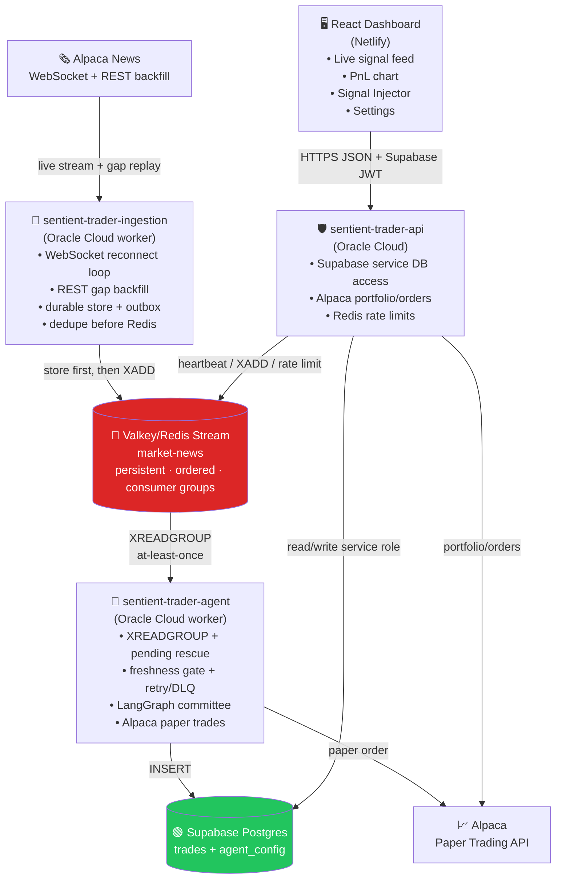
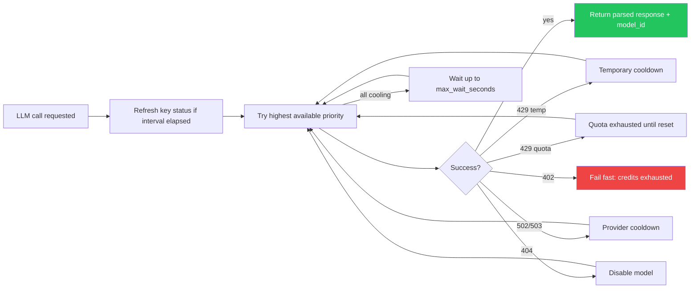
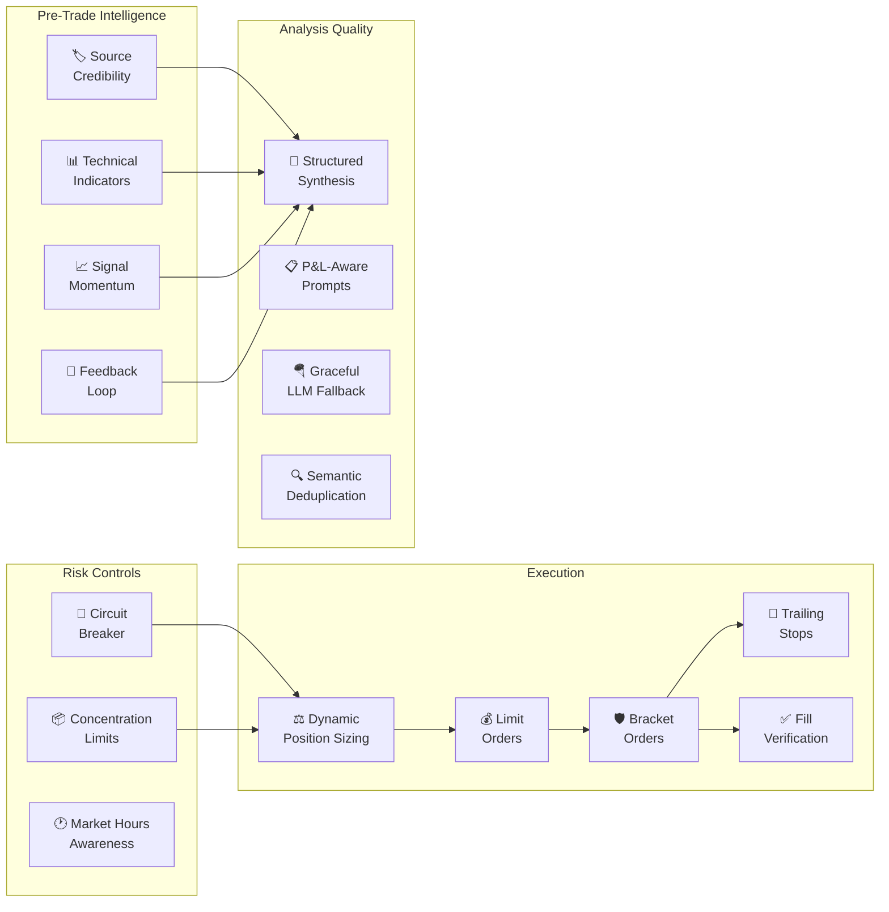

# Sentient Trader

An autonomous paper-trading system that reads live financial news, filters weak signals, runs a sequential AI committee on tradeable catalysts, and submits Alpaca paper orders only when the calibrated risk gate clears.

<div align="center">

### 🚀 [**Live Demo → apps.sundeepdayalan.in/sentient-trader**](https://apps.sundeepdayalan.in/sentient-trader)

*Watch the AI committee debate in real-time as it analyzes live market headlines.*

[](https://apps.sundeepdayalan.in/sentient-trader)
[](https://apps.sundeepdayalan.in/sentient-trader)
[](https://apps.sundeepdayalan.in/sentient-trader)

</div>

```
Alpaca News API -> Valkey Stream -> LangGraph Agent -> LLM Committee -> Alpaca Orders -> Supabase -> FastAPI -> React Dashboard
```

---

## Table of Contents

1. [What It Does](#what-it-does)
2. [System Overview](#system-overview)
3. [Full Data Flow](#full-data-flow)
4. [Service 1 — Ingestion](#service-1--ingestion)
5. [Service 2 — Agent](#service-2--agent)
   - [LangGraph Graph](#langgraph-graph)
   - [AI Committee — The Debate](#ai-committee--the-debate)
   - [LLM Provider Router — Quota-Aware Cascade](#llm-provider-router--quota-aware-cascade)
   - [Risk Gate](#risk-gate)
   - [Enhanced Trading Features](#enhanced-trading-features)
   - [Signal Visibility Guarantee](#signal-visibility-guarantee)
6. [Service 3 — Frontend](#service-3--frontend)
7. [Persistence Layer](#persistence-layer)
8. [Configuration — Supabase as Single Source of Truth](#configuration--supabase-as-single-source-of-truth)
9. [Tech Stack](#tech-stack)
10. [Project Structure](#project-structure)
11. [Running Locally](#running-locally)
12. [Historical Replay Runbook](#historical-replay-runbook)
13. [Controlled Proof Test](#controlled-proof-test)
14. [Deployment](#deployment)
15. [Key Design Decisions](#key-design-decisions)

---

## What It Does

Sentient Trader monitors financial news 24/7, stores and dedupes each article, deterministically pre-screens weak or broad headlines, then sends tradeable catalysts through a four-call AI committee. The agent submits an Alpaca paper order only when the Portfolio Manager recommendation, calibrated confidence, source quality, account state, and position-aware execution plan all clear the risk gate. Otherwise it logs a reasoned HOLD. Every decision is stored in full detail and visualized in a live dashboard.

**It is not just a bot that fires on keywords.** Cheap deterministic filters do the first pass, and the LLM committee is reserved for signals with enough catalyst quality to justify spend. When the committee runs, the momentum trader's opinion conditions the value investor's response, the risk manager outputs a non-directional risk level plus disqualifying conditions, and the portfolio manager makes the final recommendation. The full debate transcript is stored and shown in the UI.

---

## System Overview

Four deployable processes, each with a distinct failure domain:



The services share no in-process state. An LLM provider rate limit on the agent doesn't affect ingestion. A noisy news day doesn't slow ingestion. A frontend deploy doesn't touch the Oracle Cloud workers.

---

## Full Data Flow

Every headline that enters the system follows this exact path:

```
1.  Alpaca News WebSocket + REST API
      └─▶ ingestion/listener.py streams live articles, reconnects on failure,
            and REST-backfills from the durable cursor with a safety overlap

2.  ingestion/store.py
      └─▶ Stores raw article payloads in Supabase, dedupes by article id,
            normalized URL, normalized headline + ticker window, and article/ticker pair

3.  ingestion/filter.py + ingestion/store.py
      └─▶ Creates durable outbox rows only for relevant article/ticker signals

4.  ingestion/producer.py
      └─▶ Publishes outbox payloads with XADD "market-news" * ticker headline source published_at
            [summary] [article_url] [article_id]; failed publishes stay retryable

5.  agent/consumer.py
      └─▶ XREADGROUP reads new entries, XAUTOCLAIM rescues idle pending entries,
            stale-news freshness gates prevent late trades, and failed analysis
            moves to an independent retry queue or DLQ instead of blocking fresh news

6.  agent/analyst.py — LangGraph state machine (see graph below)
      └─▶ check_cache → fetch_context → deterministic pre-screen → 0 or 4 LLM calls
            → calibrated risk gate → paper order or HOLD → log

7.  agent/logger.py
      └─▶ INSERT into Supabase "trades" table
            Full trace payload is stored server-side for the dashboard API

8.  frontend — React dashboard
      └─▶ Polls FastAPI for new trades and detail rows; the browser never talks to Valkey or server-side Supabase APIs directly
```

---

## Service 1 — Ingestion

**Location:** `backend/ingestion/`  
**Host:** Oracle Cloud worker
**Entry point:** `main.py` → `NewsListener.run()`

### How live streaming and backfill work

`listener.py` uses Alpaca's live news WebSocket for low-latency capture. On startup and after every stream disconnect, it also calls Alpaca's REST news endpoint from the last durable cursor minus a safety overlap. Dedupe makes that overlap safe: already-seen articles are recorded as duplicate events and are not published again.

The ingestion flow is store-first:

```text
Alpaca article -> normalize -> Supabase raw_news_articles -> dedupe -> news_outbox -> Redis XADD
```

If Redis is unavailable, the article remains in `news_outbox` and the retry thread republishes it later.

### Relevance filter

`filter.py` implements a fast in-process relevance check. Articles with no `symbols` field are dropped. A symbol creates an outbox row only when the ticker text appears in the headline or the headline contains high-signal market-moving language.

### Ingestion dedupe

The ingestion service suppresses duplicate publishes using four conservative rules:

- exact `provider + source_article_id`
- same normalized URL hash
- same normalized headline + same ticker within the configured window
- same stored article + same ticker outbox pair

### What gets published

Each Redis stream entry contains:

| Field          | Source                             | Always present |
| -------------- | ---------------------------------- | -------------- |
| `ticker`       | Alpaca `symbols[0]`                | Yes            |
| `headline`     | Alpaca `headline`                  | Yes            |
| `source`       | Alpaca `source`                    | Yes            |
| `published_at` | Alpaca `created_at` ISO-8601       | Yes            |
| `summary`      | Alpaca `summary` (~150–400 tokens) | When available |
| `article_url`  | Alpaca `url`                       | When available |
| `article_id`   | Alpaca `id`                        | When available |

The stream is capped at 1,000 entries by default via `XADD MAXLEN ~` (configurable with `REDIS_STREAM_MAX_LEN`). Supabase is the durable replay source; Redis is the hot queue. For historical replay tests, set `REDIS_STREAM_MAX_LEN` comfortably above the expected `news_outbox` count so the agent can drain the full replay before Redis trims older entries.

### Simulated signals

The frontend's Signal Injector (`POST /simulate` on FastAPI) bypasses ingestion entirely — the Oracle backend API publishes to the Redis Stream with `XADD` and sets `is_simulated=true`. The agent processes simulated messages identically to real ones. All four fields (ticker, headline, summary, article_url) can be provided, so simulation exercises the full summary-aware prompt path.

---

## Service 2 — Agent

**Location:** `backend/agent/`  
**Host:** Oracle Cloud worker
**Entry point:** `main.py` → `config.reload_from_supabase()` → `build_agent_graph()` → `RedisStreamConsumer.start()`

### Startup sequence

```
main.py
  1. load_dotenv()                         # load local env when present
  2. logging.basicConfig(...)              # configure before any imports that log
  3. config.reload_from_supabase()         # fetch agent_config row — crash loudly on failure
  4. graph = build_agent_graph(...)        # compile LangGraph, init hot-reloadable LLM provider + ModelRouter
  5. RedisStreamConsumer.start(...)        # consume Redis stream forever
```

`config.reload_from_supabase()` is the only place trading parameters are loaded. If the Supabase row is missing or the connection fails, the process raises `RuntimeError` and exits — it never silently runs on hardcoded defaults.

### Agent reliability gates

The agent resolves every Redis message into one of four durable outcomes:

- **processed** — analysis/trade/hold was logged successfully, then `XACK`
- **expired** — article is older than the trading window, so it logs a HOLD without spending LLM or order API budget
- **retry scheduled** — temporary failure is moved to `market-news:agent-retry`, then the original stream entry is `XACK`'d so fresh news keeps flowing
- **dead-lettered** — malformed messages, max-attempt failures, or articles beyond the audit window are written to `market-news:agent-dlq`

The consumer also uses `XAUTOCLAIM` to rescue pending entries left behind by a crashed/stalled worker. Health is written through the shared worker health key (`sentient:workers:health`) with agent-specific counters for processed, expired, retried, dead-lettered, and errored messages.

---

### LangGraph Graph

The agent pipeline is a LangGraph `StateGraph`. Every node is a pure function that reads from `AgentState` and returns a partial dict update. Nodes never call each other directly.


**AgentState fields** (accumulated across nodes):

```python
news:             NewsMessage       # immutable input
is_cached:        bool
market_context:   {price, day_change_pct} | None
article_quality:  {score, grade, category, flags} | None
momentum_opinion: PersonaAnalysis | None
value_opinion:    PersonaAnalysis | None
risk_opinion:     RiskAssessment | None
analysis:         TradeAnalysis | None   # assembled by synthesizer
should_trade:     bool
trade_order_id:   str | None
processing_started_at: str | None
error:            str | None
is_simulated:     bool
```

#### Node: check_cache

SHA-256 hashes the headline text and checks Redis with a 5-minute TTL. If the hash exists → cached HIT → route to END. This prevents the same headline from firing twice in the same news cycle (Alpaca can return the same article across consecutive polls if it straddles the boundary).

#### Node: fetch_context

Calls Alpaca's Stock Snapshot endpoint for the ticker. Returns `{price, day_change_pct}` or `None` on any failure (non-standard tickers in simulate mode, market closed, network error). Fails gracefully — a missing price doesn't abort analysis, it just degrades the prompt context.

The day-change context matters substantively: a +8% NVDA headline reads differently on a day where NVDA is already +8% (momentum crowded) vs. a flat day (genuine surprise).

#### Node: pre_screen

Before spending LLM budget, `decision_rules.evaluate_article_quality()` scores whether the article is tradeable. Usable summaries, explicit ticker mentions, and concrete catalysts increase the score; watchlists, historical-return pieces, generic radar headlines, basket headlines, and thin summaries reduce it.

Rows below the execution quality floor become deterministic HOLDs with a synthetic 3x-neutral committee, `decision_path='pre_screen'`, and no LLM operations. Rows above the floor proceed to the full four-call debate. In the 3-day replay, this path handled 318/518 signals, so it is a major part of the system design rather than an implementation footnote.

---

### AI Committee — The Debate

Four sequential LLM calls. Each provider client is patched by `instructor` in JSON mode for schema-validated structured output.

`Mode.JSON` is used instead of `Mode.TOOLS` because tool-calling behavior varies across free and routed providers. JSON mode gives the agent one stable Pydantic validation path.

#### What every prompt includes

```
MARKET: {ticker} @ ${price} ({day_change_pct:+.2f}% today)
HEADLINE: "{headline}" — {source}

ARTICLE SUMMARY:           ← only when Alpaca provides a summary field
{summary text, ~150–400 tokens}
```


#### Call #1 — Momentum Trader

**System prompt:** Conditions the model to think purely in terms of price action, trend momentum, and technical signals. Told to ignore long-term fundamentals.

**User prompt:** The market line + headline + summary only. No prior opinions. This is an unconditioned, first-read reaction.

**Output:** `PersonaAnalysis` → `{stance: BULLISH|BEARISH|NEUTRAL, conviction: float 0–1, headline_take: str, analysis: str}`

#### Call #2 — Value Investor

**System prompt:** Long-horizon fundamental lens. Told to look past short-term noise and evaluate intrinsic value impact.

**User prompt:** Market line + headline + summary + the **full text of the Momentum Trader's opinion** (stance, conviction, full take and reasoning). The value investor reacts to what the momentum trader actually said — genuine disagreement surfaces here when they diverge.

**Output:** Same `PersonaAnalysis` schema.

#### Call #3 — Risk Manager

**System prompt:** Non-directional execution-risk mandate. Told to produce a risk level, risk score, confidence cap, and concrete disqualifying conditions using only supplied evidence.

**User prompt:** Market line + headline + summary + **both prior opinions** in full. The risk manager reads the complete debate so far.

**Output:** `RiskAssessment` → `{risk_level: LOW|MEDIUM|HIGH|CRITICAL, risk_score: float 0–1, confidence_cap: float 0–1, disqualifying_conditions: list[str], headline_take: str, analysis: str}`

#### Call #4 — Portfolio Manager (Synthesizer)

**System prompt:** Weighs the directional views from momentum/value, then applies the risk manager's level, confidence cap, and disqualifying conditions as execution constraints. Must resolve split decisions explicitly.

**User prompt:** Market line + headline + summary + **all three opinions** formatted as a debate transcript.

**Output:** `SynthesisResult` → `{sentiment: float -1 to 1, confidence: float 0–1, action: BUY|SELL|HOLD, reasoning: str}`

The synthesizer then assembles the final `TradeAnalysis`:

```python
TradeAnalysis(
    committee = [momentum_opinion, value_opinion, risk_card],  # full PersonaOpinion objects
    sentiment  = synthesis.sentiment,
    confidence = synthesis.confidence,
    action     = synthesis.action,
    reasoning  = synthesis.reasoning,
)
```

This is what gets stored in Supabase as the signal record. The top-level trade columns keep the dashboard fast, while the complete raw Decision Core audit trail is preserved as JSONB in `decision_trace`: exact LLM messages, structured outputs, committee debate, Portfolio Manager synthesis, risk gate, and execution metadata.

---

### LLM Provider Router — Quota-Aware Cascade

Every LLM call goes through `ModelRouter.call()`, but provider-specific state now lives behind a provider object created by `create_llm_client()`. The public contract stays stable:

```python
parsed_response, model_id = router.call(client, ResponseModel, messages)
```

That `model_id` is written to `decision_trace.llm_operations[*].model` for every persona call and to `portfolio_manager_decision.model` for the final synthesis. LangGraph stays provider-agnostic, and LangSmith still sees normal OpenAI-compatible calls because the underlying Groq/OpenRouter clients are wrapped before `instructor` patches them.

**Supported provider configs:**

```json
{
  "llm_provider": {
    "type": "groq-always-free"
  }
}
```

```json
{
  "llm_provider": {
    "type": "openrouter",
    "base_url": "https://openrouter.ai/api/v1",
    "routing": {
      "strategy": "ordered_fallback",
      "max_wait_seconds": 600,
      "default_cooldown_seconds": 60,
      "key_status_check_interval_seconds": 300
    },
    "models": [
      {
        "priority": 1,
        "id": "qwen/qwen3-coder:free",
        "temperature": 0.7,
        "top_p": 0.7
      },
      {
        "priority": 2,
        "id": "openai/gpt-4o-mini",
        "temperature": 0.7,
        "top_p": 0.7
      }
    ]
  }
}
```

Only one provider is active at a time. When Groq is active, the dashboard may keep the last OpenRouter model list under an inactive `llm_provider.openrouter` profile so switching back does not reset the ordered cascade. Secrets stay in environment variables: `GROQ_API_KEY` for Groq and `OPENROUTER_API_KEY` for OpenRouter.

Provider/model settings are hot-reloaded. The agent refreshes Supabase
`agent_config` before processing a signal when `AGENT_CONFIG_REFRESH_SECONDS`
has elapsed, and the stable LangGraph client swaps the underlying provider only
when the normalized `llm_provider` fingerprint changes. The active signal is not
interrupted; new prompts, thresholds, order quantity, provider, and model list
apply cleanly to the next signal. If a new provider config cannot initialize
(for example a missing API key), the worker logs the reload failure and keeps the
last working provider instead of crashing mid-run.

**Groq Always Free behavior:**

| Step | Rule |
| ---- | ---- |
| 1 | Fetch Groq `/openai/v1/models` at startup |
| 2 | Keep active text-analysis candidates with enough context/completion capacity |
| 3 | Exclude audio, speech, guardrail, safeguard, and compound/agentic systems |
| 4 | Rank by size, context, completion budget, and instruction/reasoning hints |
| 5 | On 429, cool that model down using `Retry-After` or the provider body and continue to the next active model |

Groq models are intentionally not configurable in `agent_config`. This prevents stale model pins from breaking a free-tier deployment when Groq rotates model availability.

**OpenRouter fallback behavior:**

| Failure type | Detection | Router action |
| ------------ | --------- | ------------- |
| Temporary rate limit | `429`, `free-models-per-min`, or `Retry-After` | Put only that model in temporary cooldown and try the next priority |
| Daily/weekly/monthly quota | `free-models-per-day`, `daily`, `weekly`, `monthly`, `quota`, or `X-RateLimit-Reset` metadata | Mark only that model quota-exhausted until reset and try the next priority |
| Provider outage | `502`, `503`, `504` | Temporary cooldown for that model and try the next priority |
| Missing/no-access model | `404`, `model_not_found`, or equivalent text | Disable that model for the process |
| Credit exhaustion | `402`, insufficient credits, or `/key` reports no credits remaining | Block OpenRouter globally and fail fast |
| Bad structured output | instructor/Pydantic validation failure | Try the next configured model |

OpenRouter `/api/v1/key` is checked at startup and periodically, not before every LLM call. It is used to catch provider-global credit exhaustion and to log daily/weekly/monthly usage. Per-model free quota exhaustion is learned from the failing inference response because OpenRouter's key endpoint exposes account credit state, not every free-model bucket.



Because fallback happens inside the same `call()` invocation, a risk analyst can hit a free OpenRouter model's daily limit and still complete on a paid fourth-priority model in that same signal. When the first priority's cooldown expires, the next call automatically switches back to it.

---

### Risk Gate

`assess_risk` node — pure Python, no LLM call.

```python
is_strong_buy  = action == "BUY"  and sentiment >= config.BUY_SENTIMENT_THRESHOLD
is_strong_sell = action == "SELL" and sentiment <= config.SELL_SENTIMENT_THRESHOLD
is_confident   = calibrated_confidence >= effective_confidence_threshold
quality_ok     = article_quality.score >= ARTICLE_EXECUTION_SCORE_FLOOR
plan_ok        = execution_plan.blocked_reasons == []

should_trade = (is_strong_buy or is_strong_sell) and is_confident and quality_ok and plan_ok
```

Requires a strong directional recommendation, calibrated confidence, sufficient article quality, and a valid account/position-aware execution plan. Raw Portfolio Manager confidence is retained for analysis; `calibrated_confidence` is what the order gate uses.

Default thresholds (seeded in Supabase, editable via Settings UI):

| Parameter                  | Default |
| -------------------------- | ------- |
| `BUY_SENTIMENT_THRESHOLD`  | 0.65    |
| `SELL_SENTIMENT_THRESHOLD` | -0.65   |
| `CONFIDENCE_THRESHOLD`     | 0.70    |

---

### Enhanced Trading Features

The agent ships with a suite of advanced trading features that extend the core pipeline with institutional-grade risk management, quantitative analysis, and intelligent execution. **Every feature defaults to OFF** and is activated by adding an `enhanced_trading` JSON block to the existing `agent_config` row in Supabase — no code changes or redeployments needed to toggle features on or off.



#### Feature Reference

##### Pre-Trade Intelligence

| Feature | Config Key | What It Does |
|---------|-----------|--------------|
| **Source Credibility** | `source_credibility` | Scores 30+ news sources across 4 tiers (Reuters/Bloomberg → PR wires). Tier 1 sources boost article quality scores; Tier 4 sources penalize them. Adds credibility notes to LLM prompts so the committee weighs source reliability. |
| **Technical Indicators** | `technical_indicators` | Fetches 5-day hourly bars from Alpaca and computes RSI(14), SMA(20), EMA(12/26), MACD, volume ratio, and 52-week range position. Injected into all persona prompts so the committee considers quantitative market structure alongside the headline. |
| **Signal Momentum** | `signal_momentum` | Tracks recent signal sentiment per ticker in Redis sorted sets. When multiple signals converge on the same ticker within an hour, the synthesizer sees the directional consensus — a strong clustering signal that single-article analysis misses. |
| **Feedback Loop** | `feedback_loop` | Queries `signal_outcomes` for historical win rates by ticker and action. If past BUY signals on NVDA hit 80% win rate, the synthesizer sees that context. Adjusts calibrated confidence by up to ±8% based on track record. |

##### Risk Controls

| Feature | Config Key | What It Does |
|---------|-----------|--------------|
| **Circuit Breaker** | `circuit_breaker` | Compares current equity to prior-close equity. If the daily P&L loss exceeds the configured threshold (default: 2%), all trading is blocked until the next session. Prevents cascading losses during adverse market conditions. |
| **Concentration Limits** | `concentration_limits` | Checks if a new order would push any single ticker above the configured portfolio percentage (default: 10%). Prevents overexposure to a single name regardless of how strong the signal is. |
| **Market Hours Awareness** | `market_hours_awareness` | Categorizes each signal as `pre_market`, `regular`, `after_hours`, or `weekend`. This timing context helps the committee reason about liquidity and price discovery differences. |

##### Execution Improvements

| Feature | Config Key | What It Does |
|---------|-----------|--------------|
| **Dynamic Position Sizing** | `dynamic_position_sizing` | Replaces the fixed `ORDER_QTY` with conviction-scaled sizing. High-confidence EXECUTABLE theses get up to `max_position_pct` (default: 5%) of portfolio; weak theses get 15% of that. Never exceeds buying power. |
| **Bracket Orders** | `bracket_orders` | After a BUY fill, automatically places a take-profit limit sell and a stop-loss order. Defaults: +6% take-profit, -3% stop-loss. Both are GTC (good-till-cancelled). |
| **Trailing Stops** | `trailing_stops` | Computes trailing stop parameters that tighten as positions gain. Activates once the position is up 2%+, then trails 3% below the current price (ratchets up only, never down). |
| **Limit Orders** | `use_limit_orders` | Submits IOC (immediate-or-cancel) limit orders instead of market orders. Adds a configurable buffer (default: 0.5%) above/below the current price. Can reduce slippage but may miss fills on fast-moving tickers. |
| **Fill Verification** | Always active when trading | Non-blocking check on order status immediately after submission. Records filled quantity, average fill price, and status in the execution trace. |

##### Analysis Quality

| Feature | Config Key | What It Does |
|---------|-----------|--------------|
| **Structured Synthesis** | `structured_synthesis` | Replaces the freeform synthesis prompt with a 5-point framework: (1) Catalyst clarity, (2) Timing/priced-in analysis, (3) Position context, (4) Risk-reward assessment, (5) Conviction alignment. Produces more disciplined BUY/SELL recommendations. |
| **P&L-Aware Prompts** | Always active | When the trader has an existing position, prompts now include entry price, unrealized P&L in dollars, and P&L percentage. The committee can now reason about "should we add to a winning position?" vs "should we average down?" |
| **Graceful LLM Fallback** | Always active | When a persona's LLM call fails, instead of returning `None` (which previously left a gap in the debate), returns a neutral `PersonaAnalysis(stance=NEUTRAL, conviction=0.30)`. The synthesizer always receives three opinions. |
| **Semantic Deduplication** | Always active | Extends the SHA-256 exact-match cache with Jaccard word-set similarity. Headlines like "NVIDIA beats Q3 earnings" and "NVDA earnings top estimates" are detected as covering the same story — saving LLM calls on reformulated duplicates. |

#### Configuration

All enhanced features are controlled via the `enhanced_trading` sub-object in `agent_config.config`:

```json
{
  "enhanced_trading": {
    "dynamic_position_sizing": true,
    "max_position_pct": 0.05,
    "bracket_orders": true,
    "stop_loss_pct": 0.03,
    "take_profit_pct": 0.06,
    "trailing_stops": true,
    "trailing_stop_pct": 0.03,
    "trailing_stop_activation_pct": 0.02,
    "concentration_limits": true,
    "max_single_ticker_pct": 0.10,
    "circuit_breaker": true,
    "max_daily_loss_pct": 0.02,
    "technical_indicators": true,
    "signal_momentum": true,
    "source_credibility": true,
    "feedback_loop": true,
    "feedback_loop_lookback_days": 30,
    "use_limit_orders": false,
    "limit_order_buffer_pct": 0.005,
    "market_hours_awareness": true,
    "structured_synthesis": true
  }
}
```

To enable via Supabase SQL Editor:

```sql
UPDATE agent_config
SET config = jsonb_set(
  config::jsonb,
  '{enhanced_trading}',
  '{
    "circuit_breaker": true,
    "source_credibility": true,
    "structured_synthesis": true,
    "technical_indicators": true,
    "signal_momentum": true,
    "feedback_loop": true,
    "dynamic_position_sizing": true,
    "bracket_orders": true,
    "concentration_limits": true,
    "market_hours_awareness": true,
    "use_limit_orders": false
  }'::jsonb,
  true
)
WHERE id = 1;
```

The agent hot-reloads config before each signal. Active features are logged:

```
Config loaded - buy=0.30  sell=-0.20  confidence=0.60  qty=1  llm_provider=openrouter
Enhanced features active: dynamic_sizing, bracket_orders, concentration, circuit_breaker, technicals, momentum, source_cred, feedback, market_hours, structured_synth
```

#### Recommended Rollout Order

1. **Stage 1 — Zero execution risk:** `circuit_breaker`, `source_credibility`, `structured_synthesis`, `market_hours_awareness`
2. **Stage 2 — Enriches LLM debate:** `technical_indicators`, `signal_momentum`, `feedback_loop`
3. **Stage 3 — Changes order execution:** `dynamic_position_sizing`, `bracket_orders`, `concentration_limits`, `trailing_stops`
4. **Stage 4 — Monitor closely:** `use_limit_orders` (may affect fill rates)

#### Architecture

Enhanced features are implemented across four new modules:

| Module | Location | Purpose |
|--------|----------|---------|
| `position_manager.py` | `backend/agent/` | Position sizing, bracket/trailing stop params, concentration, circuit breaker, market hours |
| `market_intelligence.py` | `backend/agent/` | RSI, SMA, EMA, MACD, volume ratio, signal momentum tracker (Redis-backed) |
| `source_credibility.py` | `backend/agent/` | 4-tier source scoring for 30+ financial news outlets |
| `feedback_loop.py` | `backend/agent/` | Historical outcome accuracy analysis and confidence calibration |

All new module imports are **lazy and wrapped in try/except** — if a module fails to load, the feature silently degrades rather than crashing the agent. No new dependencies are required.


Every unique headline that enters the graph **always produces a row in the `trades` table**, regardless of how analysis went.

| Outcome                                                       | Recommendation columns                       | Execution columns                         |
| ------------------------------------------------------------- | -------------------------------------------- | ----------------------------------------- |
| Pre-screen HOLD                                               | `trade_action=HOLD`, `decision_path=pre_screen` | `executed_action=null`, `order_id=null` |
| Full debate, threshold cleared, Alpaca accepted               | `pm_recommendation=BUY/SELL`                 | `executed_action=BUY/SELL`, `order_id=<alpaca id>` |
| Full debate, threshold not cleared                            | `pm_recommendation=BUY/SELL/HOLD`            | `risk_should_trade=false`, `order_id=null` |
| Partial debate (some persona calls failed), threshold cleared | `pm_recommendation=BUY/SELL`                 | `executed_action=BUY/SELL`, `order_id=<alpaca id>` |
| All LLM calls failed / all models exhausted                   | `trade_action=HOLD`                          | `execution_error` or trace error          |

Cached (duplicate) headlines are the only case that produces no new row — they were already logged the first time through.

---

## Service 3 — Frontend

**Location:** `frontend/`  
**Host:** Netlify
**Framework:** React + Vite + Tailwind CSS

### Views

The React app is a static single-page application. Netlify serves `dist/`, and the SPA redirect sends every route back to `index.html`.

| View                | What it shows                                                                                                 |
| ------------------- | ------------------------------------------------------------------------------------------------------------- |
| `/`                 | Live signal feed, PnL chart, pipeline diagram, dashboard stats                                                |
| Signal detail panel | Full signal detail: all three persona opinions, conviction bars, article link, tooltips on every trading term |
| Settings panel      | Live-edit all agent config values (thresholds, system prompts, model override, order qty)                     |

### Backend API

| Route            | Method | Purpose                                                                      |
| ---------------- | ------ | ---------------------------------------------------------------------------- |
| `/auth/me`       | GET    | Validates the Supabase access token and returns dashboard role flags         |
| `/simulate`      | POST   | Authenticates the user, rate-limits with Valkey, and injects a test headline |
| `/status`        | GET    | Combines Supabase, Alpaca, Redis, LLM provider, and agent heartbeat checks   |
| `/agent-config`  | GET    | Reads current agent_config row from Supabase                                 |
| `/agent-config`  | POST   | Super-user only; writes updated config with the Supabase service role        |
| `/stats`         | GET    | Aggregated dashboard stats                                                   |
| `/portfolio`     | GET    | Alpaca paper trading portfolio history                                       |
| `/orders`        | GET    | Alpaca account, positions, and order list                                    |
| `/orders/cancel` | POST   | Super-user only; cancels selected Alpaca orders                              |
| `/trades`        | GET    | Paginated trade summaries and polling cursor support                         |
| `/trades/{id}`   | GET    | Trade detail plus Decision Core trace                                        |

### Live feed

`DashboardClient.tsx` polls FastAPI for new rows using the latest known `created_at` cursor. The browser only uses Supabase for auth; all DB reads, config writes, Alpaca calls, and Redis operations stay inside the Oracle Cloud backend.

### Signal detail view

`AgentMonologue.tsx` renders the `decision_trace` JSONB stored per signal:

- Stance badge (BULLISH / BEARISH / NEUTRAL) with color coding
- Conviction bar (0–100% filled)
- Full reasoning text per persona
- Synthesizer action badge (BUY / SELL / HOLD) with sentiment and confidence scores
- Raw LLM operation trace with the exact messages and structured response for each Decision Core call
- Info icon tooltips on every trading term (sentiment, confidence, conviction, stance, consensus, action, paper trading)

### Signal Injector

`CustomNewsForm.tsx` accepts all four fields that Alpaca provides:

- **Ticker** (required) — validated to uppercase alpha only
- **Headline** (required, min 10 chars)
- **Article Summary** (optional) — gives personas richer context, same as a real Alpaca summary
- **Article URL** (optional) — stored and linked in the signal detail view

Submits to `/simulate` on FastAPI. The backend API rate-limits the user and publishes to Redis. The full pipeline fires within seconds and the new signal appears in the live feed.

---

## Persistence Layer

| Store            | Technology                        | Used for                                                             |
| ---------------- | --------------------------------- | -------------------------------------------------------------------- |
| Raw news archive | Supabase `raw_news_articles`      | Durable source payloads, normalized fields, dedupe links             |
| Ingestion outbox | Supabase `news_outbox`            | Retryable Redis publish queue                                        |
| Message bus      | Valkey/Redis Stream `market-news` | Hot ordered queue between ingestion and agent                        |
| Agent retry      | Valkey sorted set + hash          | Failed analysis retries outside the hot stream                       |
| Agent DLQ        | Valkey/Redis Stream               | Malformed, exhausted, or too-stale messages for operator inspection  |
| Agent cache      | Valkey/Redis                      | Last-mile duplicate LLM suppression with `HeadlineCache`             |
| Signal log       | Supabase `trades` table           | Every decision summary, linked to full Decision Core trace storage   |
| Config           | Supabase `agent_config` table     | Single row (id=1) — all trading parameters, editable via Settings UI |

### Supabase `trades` table schema

| Column                    | Type          | Notes                                                                                                               |
| ------------------------- | ------------- | ------------------------------------------------------------------------------------------------------------------- |
| `id`                      | `uuid`        | Primary key                                                                                                         |
| `created_at`              | `timestamptz` | Auto                                                                                                                |
| `ticker`                  | `text`        |                                                                                                                     |
| `headline`                | `text`        |                                                                                                                     |
| `sentiment_score`         | `float4`      | Portfolio Manager sentiment, -1.0 to 1.0                                                                            |
| `confidence_score`        | `float4`      | Raw Portfolio Manager confidence                                                                                    |
| `calibrated_confidence`   | `float4`      | Confidence after deterministic caps; this is what execution uses                                                    |
| `confidence_cap`          | `float4`      | Tightest cap applied by source quality, debate split, risk level, or market context                                 |
| `trade_action`            | `text`        | Legacy Portfolio Manager recommendation                                                                             |
| `pm_recommendation`       | `text`        | Explicit `BUY` / `SELL` / `HOLD` recommendation                                                                     |
| `risk_should_trade`       | `bool`        | Final risk-gate result                                                                                              |
| `executed_action`         | `text`        | Actual order side submitted to Alpaca, null when no order was placed                                                |
| `order_id`                | `text`        | Alpaca order ID, null unless an order ID was captured                                                               |
| `client_order_id`         | `text`        | Deterministic idempotency key sent to Alpaca                                                                        |
| `order_status`            | `text`        | Alpaca order status or execution anomaly status                                                                     |
| `execution_error`         | `text`        | Structured execution failure reason                                                                                 |
| `gate_reason`             | `text`        | Human-readable risk-gate decision reason                                                                            |
| `decision_path`           | `text`        | `pre_screen`, `full_debate`, `expired`, `analysis_skipped`, or legacy                                               |
| `processing_started_at`   | `timestamptz` | Agent active-processing start                                                                                        |
| `processing_finished_at`  | `timestamptz` | Agent active-processing finish                                                                                       |
| `quantity`                | `int4`        | Shares ordered or planned                                                                                           |
| `is_simulated`            | `bool`        | True for Signal Injector submissions                                                                                |
| `article_url`             | `text`        | Link to original article                                                                                            |
| `trade_decision_traces`   | separate row  | Full JSONB audit payload plus reasoning/source/article id                                                           |

### Supabase `signal_outcomes` table

`outcome_labeler.py` fills `signal_outcomes` with post-signal prices and
returns at 15 minutes, 1 hour, and end of day. This turns future audits from
"did the committee structure look sane?" into "did blocked or approved
recommendations actually move in the expected direction?"

```bash
cd backend/agent
python outcome_labeler.py --limit 250
```

Rows with no Alpaca bars, such as weekends, market holidays, invalid tickers, or
unsupported symbols, are persisted with `label_status='NO_BARS'` and
`label_error` instead of being retried every run. Completed rows are skipped on
future runs; use `--force` to relabel terminal rows after fixing data or schema
issues:

```bash
python outcome_labeler.py --limit 250 --force
```

The agent worker can also run this as a lightweight background scheduler. It is
disabled unless explicitly enabled, so deploying new code will not start labeling
prod rows until the env is set:

```bash
OUTCOME_LABELER_ENABLED=true
OUTCOME_LABELER_INTERVAL_SECONDS=3600
OUTCOME_LABELER_LIMIT=250
OUTCOME_LABELER_RUN_ON_STARTUP=true
SCHEDULER_RUN_TRACKING_ENABLED=true
```

If multiple agent replicas are running, enable the scheduler on only one replica
unless duplicate idempotent labeling requests are acceptable.

### Supabase `scheduler_runs` table

`scheduler_runs` is generic activity tracking for background jobs. It does not
control schedules; env vars still do that. Each run writes `RUNNING` at start,
then updates to `SUCCESS` or `ERROR` with duration, worker name, rows processed,
and error details when available.

Useful prod check:

```sql
select scheduler_name, status, started_at, finished_at, rows_processed, error_message
from sentient_trader.scheduler_runs
order by started_at desc
limit 20;
```

### Redis Stream message format

```
XADD market-news * ticker TSLA headline "Tesla misses Q3..." source alpaca published_at 2026-05-10T12:00:00Z summary "Tesla reported..." article_url "https://..." article_id "12345" is_simulated false
```

Consumer reads with `XREADGROUP` — at-least-once delivery. On success, expiry logging, retry scheduling, or DLQ write, the entry is `XACK`'d. `XAUTOCLAIM` rescues idle pending entries left behind by a crashed/stalled worker.

---

## Configuration — Supabase as Single Source of Truth

All agent parameters live in a single row in `agent_config` (id=1). Python declares them as type annotations without assignment — the process has no fallback defaults and will raise `AttributeError` if any value is missing from Supabase.

```python
# config.py — declared, never assigned at module level
BUY_SENTIMENT_THRESHOLD:  float
SELL_SENTIMENT_THRESHOLD: float
CONFIDENCE_THRESHOLD:     float
ORDER_QTY:                int
LLM_PROVIDER_CONFIG:      dict
MOMENTUM_SYSTEM_PROMPT:   str
VALUE_SYSTEM_PROMPT:      str
RISK_SYSTEM_PROMPT:       str
SYNTHESIS_SYSTEM_PROMPT:  str
```

`reload_from_supabase()` fetches the row at startup and binds all values via `global`. If the row is missing or the connection fails, the process exits with a `RuntimeError` — by design, so failures are loud and visible in worker logs immediately.

### Editing config without redeploying

The Settings page in the dashboard writes to `agent_config` via `POST /agent-config` on FastAPI. The agent hot-reloads Supabase config before the next signal after `AGENT_CONFIG_REFRESH_SECONDS` elapses, so thresholds, prompts, order size, provider, and model-list changes no longer require a process restart.

### Why FastAPI owns Settings writes

The React app sends the user's Supabase access token to FastAPI. FastAPI validates that token against Supabase Auth, checks `SUPER_USER_EMAILS`, and performs the update with the Supabase service role key inside Oracle Cloud. Netlify never receives the service role key, Alpaca secrets, or direct Valkey access.

---

## Tech Stack

| Layer          | Technology                                      | Why                                                                                            |
| -------------- | ----------------------------------------------- | ---------------------------------------------------------------------------------------------- |
| AI reasoning   | Groq Always Free or OpenRouter (`instructor` JSON mode) | Structured LLM output with provider-aware fallback and Pydantic validation              |
| Agent pipeline | LangGraph 0.2 StateGraph                        | Explicit conditional routing, composable nodes, no hidden side-effects                         |
| Message bus    | Valkey/Redis Streams                            | At-least-once delivery, consumer groups, persistent backlog                                    |
| Market data    | Alpaca News REST + Data API + Paper Trading API | Free tier; news, live prices, and paper orders in one platform                                 |
| Database       | Supabase Postgres                               | JSONB for Decision Core traces; all server-side reads and writes go through FastAPI or workers |
| Backend deploy | Oracle Cloud API + workers                      | Keeps private Valkey access inside the Oracle subnet                                           |
| Frontend       | React + Vite + Tailwind CSS                     | Static Netlify deploy; browser talks only to FastAPI and Supabase Auth                         |
| Charts         | Recharts                                        | PnL equity curve and stats panels                                                              |

---

## Project Structure

```
sentient-trader/
│
├── backend/
│   ├── api/
│   │   ├── main.py          # FastAPI service for /status, /simulate, and Redis rate limits
│   │   ├── redis_client.py  # Valkey/Redis client factory
│   │   ├── requirements.txt
│   │   └── Dockerfile
│   │
│   ├── ingestion/
│   │   ├── main.py          # Entry point — starts NewsListener
│   │   ├── listener.py      # WebSocket loop, REST backfill, outbox retry
│   │   ├── backfill.py      # Alpaca REST gap recovery
│   │   ├── store.py         # Supabase raw article store, dedupe, outbox
│   │   ├── models.py        # Article normalization and hash helpers
│   │   ├── health.py        # Redis-backed ingestion health state
│   │   ├── filter.py        # Ticker relevance filter (keyword matching)
│   │   ├── producer.py      # RedisStreamProducer — XADD to Redis Stream
│   │   ├── requirements.txt
│   │   └── Dockerfile
│   │
│   ├── agent/
│       ├── main.py          # Entry point — reload config, build graph, start consumer
│       ├── analyst.py       # Full LangGraph graph: all nodes, ModelRouter, AI committee
│       ├── consumer.py      # XREADGROUP consumer loop — one message at a time
│       ├── config.py        # Module-level type annotations + reload_from_supabase()
│       ├── trader.py        # AlpacaTrader — wraps alpaca-py order submission + brackets
│       ├── cache.py         # HeadlineCache — SHA-256 + semantic Jaccard dedup in Redis
│       ├── logger.py        # SupabaseLogger — inserts into trades table
│       ├── schemas.py       # Pydantic models: NewsMessage, PersonaAnalysis, TradeAnalysis, etc.
│       ├── position_manager.py    # Dynamic sizing, brackets, trailing stops, circuit breaker
│       ├── market_intelligence.py # RSI, SMA, EMA, MACD, volume ratio, signal momentum
│       ├── source_credibility.py  # 4-tier news source scoring
│       ├── feedback_loop.py       # Historical outcome accuracy + confidence calibration
│       ├── decision_rules.py      # Committee metrics, article quality, execution plans
│       ├── outcome_labeler.py     # Post-signal price tracking and return labeling
│       ├── outcome_scheduler.py   # Background scheduler for outcome labeling
│       ├── test_enhancements.py   # 40 tests for enhanced trading features
│       ├── requirements.txt
│       └── Dockerfile
│   │
│   └── shared/
│       └── worker_health.py # Shared Redis worker health helpers
│
├── frontend/
│   ├── index.html                       # Vite HTML shell
│   ├── main.tsx                         # React root + AuthProvider
│   ├── DashboardClient.tsx              # Dashboard SPA state and polling
│   ├── globals.css                      # Tailwind + theme variables
│   ├── vite.config.ts
│   │
│   ├── components/
│   │   ├── AgentMonologue.tsx    # Full signal detail: personas, conviction, tooltips
│   │   ├── CustomNewsForm.tsx    # Signal Injector form (ticker/headline/summary/url)
│   │   ├── PnLChart.tsx          # Recharts equity curve
│   │   ├── PipelineViz.tsx       # React Flow interactive pipeline diagram
│   │   └── TradeCard.tsx         # Individual signal card in the feed
│   │
│   ├── lib/
│   │   ├── api.ts                # FastAPI client with Supabase bearer token forwarding
│   │   ├── supabase-browser.ts   # Supabase browser auth client
│   │   └── types.ts
│   │
│   └── package.json
│
├── supabase/
│   └── migrations/
│       ├── 001_current_schema.sql       # current sentient_trader schema baseline
│       └── 002_llm_provider_config.sql  # provider config migration
│
└── README.md
```

---

## Running Locally

### Prerequisites

- Python 3.11+
- Node.js 20+
- Valkey or Redis instance available at `REDIS_HOST` / `REDIS_PORT`
- Supabase project (free tier works)
- Alpaca account (free paper trading)
- Groq API key or OpenRouter API key

`127.0.0.1` works when Valkey is running on the same host/network namespace as the process. For Docker or hosted workers, set `REDIS_HOST` to the reachable service hostname or private network address.

### 1. Apply Supabase migrations

Run the Supabase migration files in order via the Supabase SQL Editor:

1. `supabase/migrations/001_current_schema.sql`
2. `supabase/migrations/002_llm_provider_config.sql`
3. `supabase/migrations/003_execution_observability.sql`
4. `supabase/migrations/004_signal_outcomes.sql`
5. `supabase/migrations/005_signal_outcome_status.sql`
6. `supabase/migrations/006_scheduler_runs.sql`

### 2. Agent service

```bash
cd backend/agent
pip install -r requirements.txt

# Required env vars:
export SUPABASE_URL=https://xxx.supabase.co
export SUPABASE_SERVICE_ROLE_KEY=...
export SUPABASE_DB_SCHEMA=sentient_trader
export REDIS_HOST=127.0.0.1
export REDIS_PORT=6379
export REDIS_DB=0
export REDIS_STREAM_KEY=market-news          # default
export REDIS_CONSUMER_START_ID=0             # catch up retained stream entries on first boot
export WORKER_HEALTH_KEY=sentient:workers:health
export AGENT_WORKER_NAME=agent
export AGENT_MAX_TRADE_SIGNAL_AGE_SECONDS=900
export AGENT_MAX_AUDIT_SIGNAL_AGE_SECONDS=86400
export AGENT_MAX_PROCESSING_ATTEMPTS=3
export AGENT_RETRY_BASE_DELAY_SECONDS=30
export AGENT_RETRY_MAX_DELAY_SECONDS=300
export AGENT_RETRY_BATCH_SIZE=5
export AGENT_PENDING_IDLE_SECONDS=60
export AGENT_PENDING_BATCH_SIZE=5
export OUTCOME_LABELER_ENABLED=false
export OUTCOME_LABELER_INTERVAL_SECONDS=3600
export OUTCOME_LABELER_LIMIT=250
export OUTCOME_LABELER_RUN_ON_STARTUP=true
export SCHEDULER_RUN_TRACKING_ENABLED=true
export ALPACA_API_KEY=...
export ALPACA_SECRET_KEY=...
export GROQ_API_KEY=...
export OPENROUTER_API_KEY=...                 # required only when llm_provider.type=openrouter
export OPENROUTER_HTTP_REFERER=https://sentient-trader.coolify.sundeepdayalan.in
export OPENROUTER_APP_TITLE="Sentient Trader" # optional OpenRouter attribution

python main.py
```

### 3. Ingestion service

```bash
cd backend/ingestion
pip install -r requirements.txt

# Required env vars:
export SUPABASE_URL=https://xxx.supabase.co
export SUPABASE_SERVICE_ROLE_KEY=...
export SUPABASE_DB_SCHEMA=sentient_trader
export REDIS_HOST=127.0.0.1
export REDIS_PORT=6379
export REDIS_DB=0
export REDIS_STREAM_KEY=market-news
export REDIS_STREAM_MAX_LEN=1000
export WORKER_HEALTH_KEY=sentient:workers:health
export INGESTION_WORKER_NAME=ingestion
export INGESTION_LIVE_ENABLED=true
export ALPACA_API_KEY=...
export ALPACA_SECRET_KEY=...
export ALPACA_TRADING_BASE_URL=https://paper-api.alpaca.markets
export TICKER_META_HASH_KEY=sentient:ticker:meta
export TICKER_DIRECTORY_STATE_KEY=sentient:ticker:directory:state
export TICKER_ALIAS_OVERRIDES_KEY=sentient:ticker:alias-overrides
export TICKER_DIRECTORY_REFRESH_SECONDS=86400
export TICKER_DIRECTORY_REFRESH_CHECK_SECONDS=60
export TICKER_PUBLISH_SCORE_THRESHOLD=80

python main.py
```

### 4. Backend API

```bash
cd backend/api
pip install -r requirements.txt

# Required env vars:
export CORS_ORIGINS=http://localhost:3000
export SUPABASE_URL=https://xxx.supabase.co
export SUPABASE_ANON_KEY=...
export SUPABASE_SERVICE_ROLE_KEY=...
export SUPABASE_DB_SCHEMA=sentient_trader
export SUPER_USER_EMAILS=you@example.com
export REDIS_HOST=127.0.0.1
export REDIS_PORT=6379
export REDIS_DB=0
export REDIS_STREAM_KEY=market-news
export REDIS_STREAM_MAX_LEN=1000
export WORKER_HEALTH_KEY=sentient:workers:health
export AGENT_WORKER_NAME=agent
export ALPACA_API_KEY=...
export ALPACA_SECRET_KEY=...
export ALPACA_BASE_URL=https://paper-api.alpaca.markets
export GROQ_API_KEY=...                       # optional, used to show live Groq model cascade

uvicorn main:app --host 0.0.0.0 --port 8000
```

### 5. Frontend

```bash
cd frontend
npm install

# .env.local:
VITE_SUPABASE_URL=https://xxx.supabase.co
VITE_SUPABASE_ANON_KEY=...
VITE_SUPABASE_DB_SCHEMA=sentient_trader
VITE_BACKEND_API_URL=http://127.0.0.1:8000

npm run dev
# open http://localhost:3000
```

### Testing the pipeline without waiting for news

Open the dashboard → Signal Injector panel → enter a ticker and headline → click Inject. The signal travels through the full pipeline and appears in the live feed within a few seconds.

---

## Historical Replay Runbook

Historical replay is for reliability testing. It exercises the normal ingestion
pipeline from Alpaca REST news through normalization, durable storage, dedupe,
ticker selection, outbox, Redis Stream, agent processing, Supabase logging, and
optional paper order submission. It intentionally does not test the Alpaca live
WebSocket connection.

### Replay environment overrides

Use these overrides before running a multi-day replay. The example values are
for a 10-day replay.

| Env var | Normal live value | Replay value | Why |
| --- | --- | --- | --- |
| `INGESTION_LIVE_ENABLED` | `true` | `false` | Prevent live WebSocket/backfill news from mixing with replay data. |
| `REDIS_STREAM_MAX_LEN` | `1000` | `20000` | Redis uses `XADD MAXLEN ~`; the cap must be higher than expected `news_outbox` rows or replay entries can be trimmed before the agent reads them. |
| `AGENT_MAX_TRADE_SIGNAL_AGE_SECONDS` | `900` | `1209600` | Lets 10-day historical articles go through the full agent/trade path instead of being logged as expired HOLDs. |
| `AGENT_MAX_AUDIT_SIGNAL_AGE_SECONDS` | `86400` | `1209600` | Prevents older replay articles from being dead-lettered before audit logging. |
| `REDIS_CONSUMER_START_ID` | `0` | `0` | New consumer groups should start from retained stream history. Do not use `$` for replay. |

For a different replay window, set the two agent age values to at least the
window length plus runtime cushion. For example, 14 days is `1209600` seconds.

### Preflight reset

Only run this against a disposable paper-trading test environment. Preserve
`agent_config`; the agent needs it at startup.

```sql
truncate table
  sentient_trader.trade_decision_traces,
  sentient_trader.trades,
  sentient_trader.news_outbox,
  sentient_trader.news_article_symbols,
  sentient_trader.raw_news_articles,
  sentient_trader.ingestion_events,
  sentient_trader.ingestion_cursors
restart identity cascade;
```

If the Redis database is dedicated to this app, clear replay state and cache:

```redis
FLUSHDB
```

Restart/redeploy the services after changing env vars. Before replay, verify:

```redis
XLEN market-news
XINFO GROUPS market-news
ZCARD market-news:agent-retry
XLEN market-news:agent-dlq
HGET sentient:workers:health ingestion
HGET sentient:workers:health agent
```

Expected preflight state:

- `XLEN market-news` is `0`
- retry and DLQ are `0`
- ingestion health phase is `live_paused`
- agent health phase is `polling`
- ticker directory has loaded assets

### Dry run

Run a small dry run first. It fetches Alpaca news and prints counts without
writing Supabase or Redis.

```bash
cd backend/ingestion
python replay_historical.py --days 1 --dry-run
```

### Real replay

Run the real replay from the ingestion container or local ingestion environment:

```bash
cd backend/ingestion
python replay_historical.py --days 10 --max-pages 300 --confirm-replay
```

The completion summary should show nonzero `raw_news_articles`,
`news_outbox`, `ingestion_events`, and `redis_stream`. With
`REDIS_STREAM_MAX_LEN=20000`, `redis_stream` should be near the published
outbox count for a 10-day replay. If it is around `1000`, the stream cap is
still too low or the env var is not reaching the ingestion process.

### During-run checks

Redis:

```redis
XINFO STREAM market-news
XINFO GROUPS market-news
XPENDING market-news sentient-agent-group
ZCARD market-news:agent-retry
XLEN market-news:agent-dlq
HGET sentient:workers:health agent
HGET sentient:workers:health ingestion
```

Healthy signs:

- `XINFO STREAM entries-added` rises with published outbox rows
- `XINFO STREAM length` stays comfortably above `1000` for large replays
- `lag` may rise while replay publishes faster than the agent drains
- `pending` stays small
- retry and DLQ remain `0`
- agent `messages_processed` increases
- ingestion `articles_seen` and `articles_published` increase

Supabase:

```sql
select status, count(*)
from sentient_trader.news_outbox
group by status
order by status;
```

During a healthy replay, `PUBLISHED` should rise and `PENDING` /
`RETRYING` / `FAILED` should not accumulate.

### Post-run checks

Once the replay command finishes, ingestion is done but the agent may still be
draining Redis. Wait for Redis lag to approach zero:

```redis
XINFO GROUPS market-news
ZCARD market-news:agent-retry
XLEN market-news:agent-dlq
HGET sentient:workers:health agent
```

Then validate the database:

```sql
select status, count(*)
from sentient_trader.news_outbox
group by status
order by status;

select coalesce(dedupe_reason, 'not_duplicate') as dedupe_reason,
       is_duplicate,
       count(*)
from sentient_trader.raw_news_articles
group by dedupe_reason, is_duplicate
order by count(*) desc;

select 'trades_total' as metric, count(*)::bigint as value
from sentient_trader.trades
union all
select 'traces_total', count(*)::bigint
from sentient_trader.trade_decision_traces
union all
select 'outbox_published', count(*)::bigint
from sentient_trader.news_outbox
where status = 'PUBLISHED';

select trade_action, count(*)
from sentient_trader.trades
group by trade_action
order by count(*) desc;

select count(*) as trades_without_trace
from sentient_trader.trades t
left join sentient_trader.trade_decision_traces d on d.trade_id = t.id
where d.trade_id is null;
```

Expected post-run state:

- all outbox rows are `PUBLISHED`
- retry and DLQ are `0`
- Redis group `lag` is near `0`
- `trades_total` and `traces_total` are close to `outbox_published`
- `trades_without_trace` is `0`

If `outbox_published` is much larger than `trades_total` while `XINFO STREAM
length` is near `1000`, Redis trimmed the replay before the agent could read it.
Increase `REDIS_STREAM_MAX_LEN`, flush/reset, and rerun.

### Revert after replay

After the replay test is complete, restore normal live settings and redeploy or
restart affected services:

```env
INGESTION_LIVE_ENABLED=true
REDIS_STREAM_MAX_LEN=1000
AGENT_MAX_TRADE_SIGNAL_AGE_SECONDS=900
AGENT_MAX_AUDIT_SIGNAL_AGE_SECONDS=86400
REDIS_CONSUMER_START_ID=0
```

If the replay database should not remain visible in the dashboard, run the
preflight reset again after exporting any evidence you need. If the Alpaca paper
account was used for order placement, cancel open orders and close/reset paper
positions before returning to live ingestion.

---

## Controlled Proof Test

Run this after applying migrations and redeploying the agent/API/frontend. It is
the proof path for the execution and observability fixes from the 3-day audit.

### Local regression proof

```bash
cd backend/agent
python3 -m unittest test_decision_rules test_execution_observability test_outcome_labeler
```

This proves locally that:

- the risk manager no longer counts as a directional bearish dissenter
- risk disqualifiers cap calibrated confidence
- flat-account SELLs are blocked before Alpaca
- `submitted=true` without an Alpaca `order_id` is not counted as executed
- deterministic pre-screen rows get `decision_path='pre_screen'`
- outcome-label math records 15m, 1h, and EOD returns
- no-bar outcome rows are persisted and skipped unless `--force` is passed

### Paper BUY-path proof

Use an isolated Alpaca paper account. Temporarily lower thresholds only in the
test environment, publish one non-simulated high-quality BUY catalyst, and verify:

```sql
select
  ticker,
  pm_recommendation,
  risk_should_trade,
  calibrated_confidence,
  executed_action,
  order_id,
  client_order_id,
  order_status,
  execution_error,
  decision_path,
  processing_started_at,
  processing_finished_at
from sentient_trader.trades
order by created_at desc
limit 5;
```

Passing evidence is `risk_should_trade=true`, `executed_action='BUY'`,
`order_id is not null`, `client_order_id is not null`, no execution error, and a
matching Alpaca paper order in the Orders page.

### Paper SELL-path proof

Seed one whole-share long position in the same paper account, then run a
controlled SELL catalyst for that ticker. Passing evidence is
`executed_action='SELL'`, `order_id is not null`, and the position quantity
decreases by the configured order size. If the account is flat, the expected
result is a blocked SELL with `gate_reason` explaining that short sells are
disabled by policy.

---

## Deployment

### Oracle Cloud backend services

```bash
# All Oracle backend services need the private Redis settings:
  REDIS_HOST=127.0.0.1 \
  REDIS_PORT=6379 \
  REDIS_DB=0 \
  REDIS_STREAM_KEY=market-news \
  REDIS_STREAM_MAX_LEN=1000 \
  WORKER_HEALTH_KEY=sentient:workers:health

# backend/api additionally needs:
  CORS_ORIGINS=https://your-netlify-site.netlify.app \
  AGENT_WORKER_NAME=agent \
  SUPABASE_URL=... \
  SUPABASE_ANON_KEY=... \
  SUPABASE_SERVICE_ROLE_KEY=... \
  SUPABASE_DB_SCHEMA=sentient_trader \
  SUPER_USER_EMAILS=you@example.com \
  ALPACA_API_KEY=... \
  ALPACA_SECRET_KEY=... \
  ALPACA_BASE_URL=https://paper-api.alpaca.markets \
  GROQ_API_KEY=...

# backend/agent additionally needs:
  SUPABASE_URL=...
  SUPABASE_SERVICE_ROLE_KEY=...
  SUPABASE_DB_SCHEMA=sentient_trader
  REDIS_CONSUMER_START_ID=0
  WORKER_HEALTH_KEY=sentient:workers:health
  AGENT_WORKER_NAME=agent
  AGENT_MAX_TRADE_SIGNAL_AGE_SECONDS=900
  AGENT_MAX_AUDIT_SIGNAL_AGE_SECONDS=86400
  AGENT_MAX_PROCESSING_ATTEMPTS=3
  AGENT_RETRY_BASE_DELAY_SECONDS=30
  AGENT_RETRY_MAX_DELAY_SECONDS=300
  AGENT_RETRY_BATCH_SIZE=5
  AGENT_PENDING_IDLE_SECONDS=60
  AGENT_PENDING_BATCH_SIZE=5
  OUTCOME_LABELER_ENABLED=false
  OUTCOME_LABELER_INTERVAL_SECONDS=3600
  OUTCOME_LABELER_LIMIT=250
  OUTCOME_LABELER_RUN_ON_STARTUP=true
  SCHEDULER_RUN_TRACKING_ENABLED=true
  ALPACA_API_KEY=...
  ALPACA_SECRET_KEY=...
  GROQ_API_KEY=...
  OPENROUTER_API_KEY=...
  OPENROUTER_HTTP_REFERER=https://sentient-trader.coolify.sundeepdayalan.in
  OPENROUTER_APP_TITLE="Sentient Trader"

# backend/ingestion additionally needs:
  SUPABASE_URL=...
  SUPABASE_SERVICE_ROLE_KEY=...
  SUPABASE_DB_SCHEMA=sentient_trader
  WORKER_HEALTH_KEY=sentient:workers:health
  INGESTION_WORKER_NAME=ingestion
  INGESTION_LIVE_ENABLED=true
  ALPACA_API_KEY=...
  ALPACA_SECRET_KEY=...
  ALPACA_TRADING_BASE_URL=https://paper-api.alpaca.markets
  TICKER_META_HASH_KEY=sentient:ticker:meta
  TICKER_DIRECTORY_STATE_KEY=sentient:ticker:directory:state
  TICKER_ALIAS_OVERRIDES_KEY=sentient:ticker:alias-overrides
  TICKER_DIRECTORY_REFRESH_SECONDS=86400
  TICKER_DIRECTORY_REFRESH_CHECK_SECONDS=60
  TICKER_PUBLISH_SCORE_THRESHOLD=80
```

Optional ticker nicknames live in Redis. For example, `HSET sentient:ticker:alias-overrides GOOG '["google"]'` lets ingestion treat "Google" as a GOOG/GOOGL alias without hardcoding that nickname in the app.

### Frontend (Netlify)

Connect the repo to Netlify. Set environment variables in the Netlify dashboard (same values as `frontend/.env.local.example`). Netlify auto-deploys on push to `main`.

### Config changes (no redeploy needed)

Update agent parameters via the Settings page in the dashboard. The worker refreshes `agent_config` before the next signal after `AGENT_CONFIG_REFRESH_SECONDS` elapses, so normal settings changes do not require redeploying or restarting the agent.

---

## Key Design Decisions

**Sequential debate over parallel persona calls**

Parallel gives three independent opinions — each persona talks in a vacuum. Sequential gives a real argument: the value investor reads the momentum trader's actual take before responding, so disagreement is substantive rather than coincidental. The risk manager then stress-tests both. This is the core of why the committee produces nuanced analysis rather than averaged noise.

**Redis Streams as the message bus**

Redis Streams provide the queue semantics this pipeline needs: a persistent ordered log, consumer groups for at-least-once delivery, `XACK` for processing confirmation, and auto-ID generation. The same Valkey/Redis instance also handles headline deduplication.

**Separate backend workers**

A single process would mean an LLM provider rate limit pauses news ingestion. Splitting the services means ingestion always stays current regardless of LLM quota. The Redis Stream buffer absorbs any processing delay.

**Alpaca `summary` field, not full article body**

Alpaca's `summary` field is ~150–400 tokens. A full article body is ~2,000–3,000 tokens. With four sequential LLM calls per signal and free-tier provider limits, passing full article bodies would exhaust per-minute quotas under any moderate news volume. The summary field adds meaningful context (earnings numbers, specific details) while staying well within budget.

**`instructor` JSON mode over TOOLS mode**

Tool-calling behavior differs across Groq and routed OpenRouter models. `Mode.JSON` with a system prompt containing the JSON schema produces consistent, validatable output. `instructor` handles Pydantic deserialization and retries automatically.

**Supabase as the only source of config defaults**

Python type annotations without assignment (`BUY_SENTIMENT_THRESHOLD: float`) create no module-level attribute. If `reload_from_supabase()` is never called or fails, any code that reads these values crashes with `AttributeError` immediately — loud and obvious. The alternative (hardcoded Python defaults) would let the process run silently on stale values after a Supabase connection failure, producing trades at wrong thresholds with no log indication of why.

**Provider-aware cooldowns**

Temporary rate limits are not treated the same as quota exhaustion. For Groq, the router cools down the affected active model and tries the next discovered free model. For OpenRouter, the router reads `Retry-After` and `X-RateLimit-Reset` metadata where available; temporary minute limits get a short cooldown, while daily/weekly/monthly quota errors keep only that model out of rotation until reset. Paid lower-priority models can still run while free higher-priority models are exhausted.
