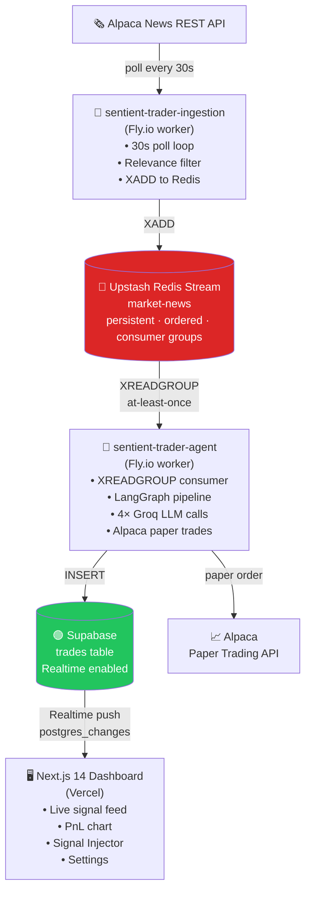
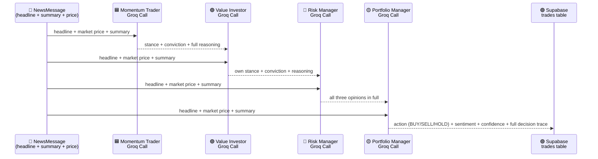
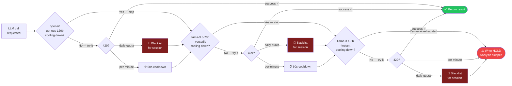

# Sentient Trader

An autonomous AI trading system that reads live financial news, debates market impact across three AI personas, and executes paper trades — end to end, with zero human input in the loop.

```
Alpaca News API → Redis Stream → LangGraph Agent → Groq LLM Committee → Alpaca Orders → Supabase → Next.js Dashboard
```

---

## Table of Contents

1. [What It Does](#what-it-does)
2. [System Overview](#system-overview)
3. [Full Data Flow](#full-data-flow)
4. [Service 1 — Ingestion](#service-1--ingestion)
5. [Service 2 — Agent](#service-2--agent)
   - [LangGraph Graph](#langgraph-graph)
   - [AI Committee — The Debate](#ai-committee--the-debate)
   - [ModelRouter — Quota-Aware Cascade](#modelrouter--quota-aware-cascade)
   - [Risk Gate](#risk-gate)
   - [Signal Visibility Guarantee](#signal-visibility-guarantee)
6. [Service 3 — Frontend](#service-3--frontend)
7. [Persistence Layer](#persistence-layer)
8. [Configuration — Supabase as Single Source of Truth](#configuration--supabase-as-single-source-of-truth)
9. [Tech Stack](#tech-stack)
10. [Project Structure](#project-structure)
11. [Running Locally](#running-locally)
12. [Deployment](#deployment)
13. [Key Design Decisions](#key-design-decisions)

---

## What It Does

Sentient Trader monitors financial news 24/7, processes each article through a four-call AI committee that debates the market impact from three investment worldviews, then either executes a paper trade or logs a reasoned HOLD. Every decision — trade or hold — is stored in full detail and visualized in a live dashboard.

**It is not a bot that fires on keywords.** The system runs a real sequential argument: the momentum trader's opinion conditions the value investor's response, and the risk manager stress-tests both before the portfolio manager makes a final call. The full debate transcript is stored and shown in the UI.

---

## System Overview

Three independent processes, each with a distinct failure domain:



The three services share no in-process state. A Groq rate limit on the agent doesn't affect ingestion. A noisy news day doesn't slow the LLM. A frontend deploy doesn't touch either backend.

---

## Full Data Flow

Every headline that enters the system follows this exact path:

```
1.  Alpaca News REST API
      └─▶ ingestion/listener.py polls every 30s
            Fetches articles published since last-seen timestamp (cursor-based, no duplicates)

2.  ingestion/filter.py
      └─▶ Drops articles with no ticker symbols
            Runs relevance check: headline must contain the ticker text or a known alias

3.  ingestion/producer.py
      └─▶ XADD "market-news" * ticker headline source published_at [summary] [article_url] [article_id]
            Upstash REST API call — no SDK socket, works behind NAT/Fly.io

4.  agent/consumer.py
      └─▶ XREADGROUP GROUP agent-group consumer-1 COUNT 1 BLOCK 5000 STREAMS market-news >
            Blocks until a new message arrives (5s timeout, then loops)
            One message at a time — sequential processing, no parallelism hazard

5.  agent/analyst.py — LangGraph state machine (see graph below)
      └─▶ check_cache → fetch_context → 4× Groq calls → assess_risk → trade/hold → log

6.  agent/logger.py
      └─▶ INSERT into Supabase "trades" table
            Supabase Realtime broadcasts the insert to all connected browser clients immediately

7.  frontend — Supabase Realtime subscription
      └─▶ New row appears in the live signal feed without any polling or page refresh
```

---

## Service 1 — Ingestion

**Location:** `backend/ingestion/`  
**Host:** Fly.io (`sentient-trader-ingestion` app)  
**Entry point:** `main.py` → `NewsListener.run()`

### How polling works

`listener.py` keeps a `_last_seen` timestamp initialized to "now minus 1 minute" on startup. Every 30 seconds it calls:

```python
NewsRequest(start=self._last_seen, sort="asc", limit=50)
```

`sort="asc"` returns oldest-first so the cursor advances in order. After processing each article, `_last_seen` is bumped to `article.created_at + 1 second`. Alpaca's `start` parameter is inclusive, so the +1s prevents re-fetching the boundary article on the next poll.

### Relevance filter

`filter.py` implements a fast in-process relevance check. An article passes if the ticker text appears in the headline (case-insensitive). Articles with no `symbols` field are dropped before the filter runs. Multi-ticker articles only produce one stream message (the first matching ticker) to prevent the same article from triggering parallel analyses.

### What gets published

Each Redis stream entry contains:

| Field | Source | Always present |
|---|---|---|
| `ticker` | Alpaca `symbols[0]` | Yes |
| `headline` | Alpaca `headline` | Yes |
| `source` | Alpaca `source` | Yes |
| `published_at` | Alpaca `created_at` ISO-8601 | Yes |
| `summary` | Alpaca `summary` (~150–400 tokens) | When available |
| `article_url` | Alpaca `url` | When available |
| `article_id` | Alpaca `id` | When available |

The stream is capped at 1,000 entries via `XADD MAXLEN ~` (approximate trimming for efficiency). This keeps storage bounded on Upstash's free tier.

### Simulated signals

The frontend's Signal Injector (`POST /api/simulate`) bypasses ingestion entirely — it calls the Upstash REST API directly with `XADD` and sets `is_simulated=true`. The agent processes simulated messages identically to real ones. All four fields (ticker, headline, summary, article_url) can be provided, so simulation exercises the full summary-aware prompt path.

---

## Service 2 — Agent

**Location:** `backend/agent/`  
**Host:** Fly.io (`sentient-trader-agent` app)  
**Entry point:** `main.py` → `config.reload_from_supabase()` → `build_agent_graph()` → `ConsumerLoop.run()`

### Startup sequence

```
main.py
  1. load_dotenv()                         # load Fly.io secrets
  2. logging.basicConfig(...)              # configure before any imports that log
  3. config.reload_from_supabase()         # fetch agent_config row — crash loudly on failure
  4. graph = build_agent_graph(...)        # compile LangGraph, init Groq client + ModelRouter
  5. ConsumerLoop(graph).run()             # block on Redis stream forever
```

`config.reload_from_supabase()` is the only place trading parameters are loaded. If the Supabase row is missing or the connection fails, the process raises `RuntimeError` and exits — it never silently runs on hardcoded defaults.

---

### LangGraph Graph

The agent pipeline is a LangGraph `StateGraph`. Every node is a pure function that reads from `AgentState` and returns a partial dict update. Nodes never call each other directly.


**AgentState fields** (accumulated across nodes):

```python
news:             NewsMessage       # immutable input
is_cached:        bool
market_context:   {price, day_change_pct} | None
momentum_opinion: PersonaAnalysis | None
value_opinion:    PersonaAnalysis | None
risk_opinion:     PersonaAnalysis | None
analysis:         TradeAnalysis | None   # assembled by synthesizer
should_trade:     bool
trade_order_id:   str | None
error:            str | None
is_simulated:     bool
```

#### Node: check_cache

SHA-256 hashes the headline text and checks Redis with a 5-minute TTL. If the hash exists → cached HIT → route to END. This prevents the same headline from firing twice in the same news cycle (Alpaca can return the same article across consecutive polls if it straddles the boundary).

#### Node: fetch_context

Calls Alpaca's Stock Snapshot endpoint for the ticker. Returns `{price, day_change_pct}` or `None` on any failure (non-standard tickers in simulate mode, market closed, network error). Fails gracefully — a missing price doesn't abort analysis, it just degrades the prompt context.

The day-change context matters substantively: a +8% NVDA headline reads differently on a day where NVDA is already +8% (momentum crowded) vs. a flat day (genuine surprise).

---

### AI Committee — The Debate

Four sequential Groq calls. Each call uses `instructor.from_groq(..., mode=instructor.Mode.JSON)` for schema-validated structured output.

`Mode.JSON` is used instead of `Mode.TOOLS` because Groq's tool-calling implementation is unreliable — models sometimes invent tool names or return plain text when tool use is required. JSON mode produces consistent results.

#### What every prompt includes

```
MARKET: {ticker} @ ${price} ({day_change_pct:+.2f}% today)
HEADLINE: "{headline}" — {source}

ARTICLE SUMMARY:           ← only when Alpaca provides a summary field
{summary text, ~150–400 tokens}
```



#### Call #1 — Momentum Trader

**System prompt:** Conditions the model to think purely in terms of price action, trend momentum, and technical signals. Told to ignore long-term fundamentals.

**User prompt:** The market line + headline + summary only. No prior opinions. This is an unconditioned, first-read reaction.

**Output:** `PersonaAnalysis` → `{stance: BULLISH|BEARISH|NEUTRAL, conviction: float 0–1, headline_take: str, analysis: str}`

#### Call #2 — Value Investor

**System prompt:** Long-horizon fundamental lens. Told to look past short-term noise and evaluate intrinsic value impact.

**User prompt:** Market line + headline + summary + the **full text of the Momentum Trader's opinion** (stance, conviction, full take and reasoning). The value investor reacts to what the momentum trader actually said — genuine disagreement surfaces here when they diverge.

**Output:** Same `PersonaAnalysis` schema.

#### Call #3 — Risk Manager

**System prompt:** Adversarial mandate. Told to find the flaw in both prior arguments. Stress-test for tail risk, regulatory exposure, macro factors, liquidity risk.

**User prompt:** Market line + headline + summary + **both prior opinions** in full. The risk manager reads the complete debate so far.

**Output:** Same `PersonaAnalysis` schema.

#### Call #4 — Portfolio Manager (Synthesizer)

**System prompt:** Weighs the committee's views. Told to consider conviction scores — a high-conviction BEARISH from risk should suppress a bullish consensus. Must resolve split decisions explicitly.

**User prompt:** Market line + headline + summary + **all three opinions** formatted as a debate transcript.

**Output:** `SynthesisResult` → `{sentiment: float -1 to 1, confidence: float 0–1, action: BUY|SELL|HOLD, reasoning: str}`

The synthesizer then assembles the final `TradeAnalysis`:

```python
TradeAnalysis(
    committee = [momentum_opinion, value_opinion, risk_opinion],  # full PersonaOpinion objects
    sentiment  = synthesis.sentiment,
    confidence = synthesis.confidence,
    action     = synthesis.action,
    reasoning  = synthesis.reasoning,
)
```

This is what gets stored in Supabase as the signal record. The top-level trade columns keep the dashboard fast, while the complete raw Decision Core audit trail is preserved as JSONB in `decision_trace`: exact LLM messages, structured outputs, committee debate, Portfolio Manager synthesis, risk gate, and execution metadata.

---

### ModelRouter — Quota-Aware Cascade

Every LLM call goes through `ModelRouter.call()`, which tries three Groq model tiers in quality-descending order and falls back automatically on rate limits.

**Tier order:**

| Priority | Model | Daily limit | TPM |
|---|---|---|---|
| 1 | `openai/gpt-oss-120b` | 1K req/day | 8K |
| 2 | `llama-3.3-70b-versatile` | 1K req/day | 12K |
| 3 | `llama-3.1-8b-instant` | 14.4K req/day | 6K |

**Groq enforces two distinct limit types, handled differently:**

| Error type | Detection | Behaviour |
|---|---|---|
| Per-minute (RPM/TPM) | `429` without "per day"/"daily" in message | 60-second cooldown on that model, fall back **within the same call** |
| Daily quota exhausted | `429` with "per day", "daily", "quota exceeded" in message | Blacklist model for the session (resets on process restart) |



**Key implementation detail — per-minute cooldown:**

```python
self._rate_limited_until: dict[str, float] = {}

# In call():
available = [
    m for m in self.TIERS
    if m not in self._blacklisted
    and time.time() >= self._rate_limited_until.get(m, 0)
]

# On per-minute 429:
self._rate_limited_until[model] = time.time() + 60
continue  # try next tier in the same call()
```

Because the fallback happens inside the same `call()` invocation, if Call #3 (Risk Analyst) hits a per-minute limit on `llama-3.3-70b`, the risk analyst still gets a valid response from `llama-3.1-8b-instant` in that same call — no analysis step is lost. On Call #4 (Synthesizer) 60 seconds later, `llama-3.3-70b` may have recovered and re-enters the pool.

**Hard override:** If `MODEL_OVERRIDE` is set in agent_config (Supabase), the entire cascade is bypassed and every call goes to that specific model. Useful for local testing.

---

### Risk Gate

`assess_risk` node — pure Python, no LLM call.

```python
is_strong_buy  = action == "BUY"  and sentiment >= config.BUY_SENTIMENT_THRESHOLD
is_strong_sell = action == "SELL" and sentiment <= config.SELL_SENTIMENT_THRESHOLD
is_confident   = confidence >= config.CONFIDENCE_THRESHOLD

should_trade = (is_strong_buy or is_strong_sell) and is_confident
```

Requires **both** a strong directional signal AND high confidence. The synthesizer prompt is designed to produce lower confidence on split committee votes, so a 2-vs-1 debate is naturally harder to clear this gate than a unanimous one.

Default thresholds (seeded in Supabase, editable via Settings UI):

| Parameter | Default |
|---|---|
| `BUY_SENTIMENT_THRESHOLD` | 0.65 |
| `SELL_SENTIMENT_THRESHOLD` | -0.65 |
| `CONFIDENCE_THRESHOLD` | 0.70 |

---

### Signal Visibility Guarantee

Every unique headline that enters the graph **always produces a row in the `trades` table**, regardless of how analysis went.

| Outcome | `trade_action` written | `reasoning` |
|---|---|---|
| Full debate, threshold cleared | `BUY` or `SELL` | Synthesizer's reasoning text |
| Full debate, threshold not cleared | `HOLD` | Synthesizer's reasoning text |
| Partial debate (some persona calls failed), threshold cleared | `BUY` or `SELL` | Synthesizer reasons on available opinions |
| All LLM calls failed / all models exhausted | `HOLD` | `"Analysis skipped — <error message>"` |

Cached (duplicate) headlines are the only case that produces no new row — they were already logged the first time through.

---

## Service 3 — Frontend

**Location:** `frontend/`  
**Host:** Vercel  
**Framework:** Next.js 14 App Router + Tailwind CSS

### Pages

| Route | What it shows |
|---|---|
| `/` | Live signal feed, PnL chart, pipeline diagram, dashboard stats |
| `/signals/[id]` | Full signal detail: all three persona opinions, conviction bars, article link, tooltips on every trading term |
| `/settings` | Live-edit all agent config values (thresholds, system prompts, model override, order qty) |

### API Routes (Next.js server-side)

| Route | Method | Purpose |
|---|---|---|
| `/api/simulate` | POST | Injects a test headline into Redis Stream via Upstash REST API |
| `/api/agent-config` | GET | Reads current agent_config row from Supabase |
| `/api/agent-config` | POST | Writes updated config to Supabase (anon key + RLS write policy) |
| `/api/stats` | GET | Aggregated dashboard stats (total signals, trades, win rate) |
| `/api/portfolio` | GET | Alpaca paper trading portfolio history (server-side, keeps secret key off client) |

### Live feed

`LiveTicker.tsx` opens a Supabase Realtime subscription on the `trades` table:

```typescript
supabase
  .channel("trades-feed")
  .on("postgres_changes", { event: "INSERT", schema: "public", table: "trades" }, handler)
  .subscribe()
```

New signals appear instantly when the agent writes to Supabase — no polling, no SSE, no websocket server to maintain. Supabase Realtime handles the fanout.

### Signal detail view

`AgentMonologue.tsx` renders the `decision_trace` JSONB stored per signal:
- Stance badge (BULLISH / BEARISH / NEUTRAL) with color coding
- Conviction bar (0–100% filled)
- Full reasoning text per persona
- Synthesizer action badge (BUY / SELL / HOLD) with sentiment and confidence scores
- Raw LLM operation trace with the exact messages and structured response for each Decision Core call
- Info icon tooltips on every trading term (sentiment, confidence, conviction, stance, consensus, action, paper trading)

### Signal Injector

`CustomNewsForm.tsx` accepts all four fields that Alpaca provides:
- **Ticker** (required) — validated to uppercase alpha only
- **Headline** (required, min 10 chars)
- **Article Summary** (optional) — gives personas richer context, same as a real Alpaca summary
- **Article URL** (optional) — stored and linked in the signal detail view

Submits to `/api/simulate` which calls Upstash directly. The full pipeline fires within seconds and the new signal appears in the live feed.

---

## Persistence Layer

| Store | Technology | Used for |
|---|---|---|
| Message bus | Upstash Redis Stream `market-news` | Durable ordered queue between ingestion and agent (max 1,000 entries) |
| Deduplication | Upstash Redis (same instance) | SHA-256 headline hash with 5-min TTL — `HeadlineCache` |
| Signal log | Supabase `trades` table | Every decision, full Decision Core trace as JSONB, Realtime-enabled |
| Config | Supabase `agent_config` table | Single row (id=1) — all trading parameters, editable via Settings UI |

### Supabase `trades` table schema

| Column | Type | Notes |
|---|---|---|
| `id` | `bigserial` | Primary key |
| `created_at` | `timestamptz` | Auto |
| `ticker` | `text` | |
| `headline` | `text` | |
| `sentiment_score` | `float4` | -1.0 to 1.0 |
| `confidence_score` | `float4` | 0.0 to 1.0 |
| `reasoning` | `text` | Synthesizer's final reasoning |
| `trade_action` | `text` | `BUY` / `SELL` / `HOLD` |
| `order_id` | `text` | Alpaca order ID (null if HOLD) |
| `quantity` | `int4` | Shares ordered |
| `is_simulated` | `bool` | True for Signal Injector submissions |
| `article_source` | `text` | News source name |
| `article_url` | `text` | Link to original article |
| `article_id` | `text` | Alpaca article ID |
| `decision_trace` | `jsonb` | Generic Decision Core trace: LLM inputs/outputs, committee debate, Portfolio Manager decision, risk gate, execution |

### Redis Stream message format

```
XADD market-news * ticker TSLA headline "Tesla misses Q3..." source alpaca published_at 2026-05-10T12:00:00Z summary "Tesla reported..." article_url "https://..." article_id "12345" is_simulated false
```

Consumer reads with `XREADGROUP` — at-least-once delivery. On success the entry is `XACK`'d. On exception the entry stays pending and will be redelivered (handled by `consumer.py`'s error recovery).

---

## Configuration — Supabase as Single Source of Truth

All agent parameters live in a single row in `agent_config` (id=1). Python declares them as type annotations without assignment — the process has no fallback defaults and will raise `AttributeError` if any value is missing from Supabase.

```python
# config.py — declared, never assigned at module level
BUY_SENTIMENT_THRESHOLD:  float
SELL_SENTIMENT_THRESHOLD: float
CONFIDENCE_THRESHOLD:     float
ORDER_QTY:                int
MODEL_OVERRIDE:           str | None
MOMENTUM_SYSTEM_PROMPT:   str
VALUE_SYSTEM_PROMPT:      str
RISK_SYSTEM_PROMPT:       str
SYNTHESIS_SYSTEM_PROMPT:  str
```

`reload_from_supabase()` fetches the row at startup and binds all values via `global`. If the row is missing or the connection fails, the process exits with a `RuntimeError` — by design, so failures are loud and visible in Fly logs immediately.

### Editing config without redeploying

The Settings page in the dashboard writes to `agent_config` via `POST /api/agent-config`. The new values take effect on the next agent process restart (Fly.io `fly machine restart`). The agent does not hot-reload config at runtime — a restart is intentional so config changes are auditable in Fly's deployment history.

### Why anon key for Settings writes

The frontend API route uses `NEXT_PUBLIC_SUPABASE_ANON_KEY` (not the service role key). A Supabase migration adds a targeted RLS policy:

```sql
CREATE POLICY "Public update on agent_config"
    ON agent_config FOR UPDATE TO anon
    USING (true) WITH CHECK (true);
```

This avoids exposing the service role key in Vercel environment variables while still allowing the Settings page to write config.

---

## Tech Stack

| Layer | Technology | Why |
|---|---|---|
| AI reasoning | Groq API (`instructor` JSON mode) | Sub-second structured LLM output; `instructor` handles Pydantic validation + retries |
| Agent pipeline | LangGraph 0.2 StateGraph | Explicit conditional routing, composable nodes, no hidden side-effects |
| Message bus | Upstash Redis Streams | At-least-once delivery, consumer groups, persistent backlog — Kafka semantics without Kafka |
| Market data | Alpaca News REST + Data API + Paper Trading API | Free tier; news, live prices, and paper orders in one platform |
| Database | Supabase (Postgres + Realtime) | JSONB for Decision Core traces, Realtime subscriptions for zero-polling live feed |
| Backend deploy | Two Fly.io workers (shared-cpu-1x, 256 MB) | Independent failure domains; ingestion and agent scale and fail separately |
| Frontend | Next.js 14 App Router + Tailwind CSS | Server components for Alpaca portfolio API (key never exposed to browser) |
| Charts | Recharts | PnL equity curve and stats panels |

---

## Project Structure

```
sentient-trader/
│
├── backend/
│   ├── ingestion/
│   │   ├── main.py          # Entry point — starts NewsListener
│   │   ├── listener.py      # 30s poll loop, cursor-based dedup, publishes to Redis
│   │   ├── filter.py        # Ticker relevance filter (keyword matching)
│   │   ├── producer.py      # RedisStreamProducer — XADD via upstash-redis
│   │   ├── requirements.txt
│   │   └── fly.toml         # Fly.io deploy config for ingestion service
│   │
│   └── agent/
│       ├── main.py          # Entry point — reload config, build graph, start consumer
│       ├── analyst.py       # Full LangGraph graph: all nodes, ModelRouter, AI committee
│       ├── consumer.py      # XREADGROUP consumer loop — one message at a time
│       ├── config.py        # Module-level type annotations + reload_from_supabase()
│       ├── trader.py        # AlpacaTrader — wraps alpaca-py order submission
│       ├── cache.py         # HeadlineCache — SHA-256 dedup in Redis, 5-min TTL
│       ├── logger.py        # SupabaseLogger — inserts into trades table
│       ├── schemas.py       # Pydantic models: NewsMessage, PersonaAnalysis, TradeAnalysis, etc.
│       ├── requirements.txt
│       └── fly.toml         # Fly.io deploy config for agent service
│
├── frontend/
│   ├── app/
│   │   ├── page.tsx                     # Dashboard home
│   │   ├── signals/[id]/page.tsx        # Signal detail view
│   │   ├── settings/page.tsx            # Agent config editor
│   │   └── api/
│   │       ├── simulate/route.ts        # POST: inject headline into Redis Stream
│   │       ├── agent-config/route.ts    # GET/POST: read/write Supabase agent_config
│   │       ├── stats/route.ts           # GET: aggregated dashboard statistics
│   │       └── portfolio/route.ts       # GET: Alpaca paper portfolio history
│   │
│   ├── components/
│   │   ├── AgentMonologue.tsx    # Full signal detail: personas, conviction, tooltips
│   │   ├── CustomNewsForm.tsx    # Signal Injector form (ticker/headline/summary/url)
│   │   ├── LiveTicker.tsx        # Supabase Realtime feed of signals
│   │   ├── PnLChart.tsx          # Recharts equity curve
│   │   ├── PipelineViz.tsx       # React Flow interactive pipeline diagram
│   │   └── TradeCard.tsx         # Individual signal card in the feed
│   │
│   ├── lib/
│   │   ├── config.ts         # BASE_PATH and shared constants
│   │   └── supabase.ts       # Supabase client factory
│   │
│   └── package.json
│
├── supabase/
│   └── migrations/
│       ├── 001_initial_schema.sql         # trades table + indexes + Realtime enable
│       ├── 002_add_news_references.sql    # article_source, article_url, article_id
│       ├── 003_add_committee_debate.sql   # legacy committee_debate JSONB column
│       ├── 004_add_agent_config.sql       # agent_config table + seed default row
│       ├── 005_agent_config_write_policy.sql  # anon UPDATE RLS policy
│       ├── 006_fix_agent_config_rls.sql   # tighten Settings write policy
│       ├── 007_add_model_to_trades.sql     # legacy synthesis model column
│       └── 008_decision_trace_jsonb.sql    # decision_trace JSONB + legacy backfill
│
└── README.md
```

---

## Running Locally

### Prerequisites

- Python 3.11+
- Node.js 20+
- Upstash Redis instance (free tier works)
- Supabase project (free tier works)
- Alpaca account (free paper trading)
- Groq API key (free tier works)

### 1. Apply Supabase migrations

Run all files in `supabase/migrations/` in order via the Supabase SQL Editor.

### 2. Agent service

```bash
cd backend/agent
pip install -r requirements.txt

# Required env vars:
export SUPABASE_URL=https://xxx.supabase.co
export SUPABASE_SERVICE_ROLE_KEY=...
export UPSTASH_REDIS_URL=https://xxx.upstash.io
export UPSTASH_REDIS_TOKEN=...
export REDIS_STREAM_KEY=market-news          # default
export ALPACA_API_KEY=...
export ALPACA_SECRET_KEY=...
export ALPACA_BASE_URL=https://paper-api.alpaca.markets
export GROQ_API_KEY=...

python main.py
```

### 3. Ingestion service

```bash
cd backend/ingestion
pip install -r requirements.txt

# Required env vars (same Redis + Alpaca keys as above):
export UPSTASH_REDIS_URL=...
export UPSTASH_REDIS_TOKEN=...
export REDIS_STREAM_KEY=market-news
export ALPACA_API_KEY=...
export ALPACA_SECRET_KEY=...

python main.py
```

### 4. Frontend

```bash
cd frontend
npm install

# .env.local:
NEXT_PUBLIC_SUPABASE_URL=https://xxx.supabase.co
NEXT_PUBLIC_SUPABASE_ANON_KEY=...
UPSTASH_REDIS_URL=...
UPSTASH_REDIS_TOKEN=...
REDIS_STREAM_KEY=market-news
ALPACA_API_KEY=...
ALPACA_SECRET_KEY=...
ALPACA_BASE_URL=https://paper-api.alpaca.markets

npm run dev
# open http://localhost:3000
```

### Testing the pipeline without waiting for news

Open the dashboard → Signal Injector panel → enter a ticker and headline → click Inject. The signal travels through the full pipeline and appears in the live feed within a few seconds.

---

## Deployment

### Agent + Ingestion (Fly.io)

```bash
# Deploy agent
cd backend/agent
fly deploy --app sentient-trader-agent

# Set secrets (one-time)
fly secrets set -a sentient-trader-agent \
  SUPABASE_URL=... \
  SUPABASE_SERVICE_ROLE_KEY=... \
  UPSTASH_REDIS_URL=... \
  UPSTASH_REDIS_TOKEN=... \
  ALPACA_API_KEY=... \
  ALPACA_SECRET_KEY=... \
  ALPACA_BASE_URL=https://paper-api.alpaca.markets \
  GROQ_API_KEY=...

# Deploy ingestion
cd backend/ingestion
fly deploy --app sentient-trader-ingestion
```

### Frontend (Vercel)

Connect the repo to Vercel. Set environment variables in the Vercel dashboard (same values as `.env.local`). Vercel auto-deploys on push to `main`.

### Config changes (no redeploy needed)

Update agent parameters via the Settings page in the dashboard. Then restart the agent machine to apply:

```bash
fly machine restart -a sentient-trader-agent
```

---

## Key Design Decisions

**Sequential debate over parallel persona calls**

Parallel gives three independent opinions — each persona talks in a vacuum. Sequential gives a real argument: the value investor reads the momentum trader's actual take before responding, so disagreement is substantive rather than coincidental. The risk manager then stress-tests both. This is the core of why the committee produces nuanced analysis rather than averaged noise.

**Redis Streams over Kafka**

Upstash deprecated their Kafka product. Redis Streams provide identical semantics for this use case: persistent ordered log, consumer groups for at-least-once delivery, `XACK` for processing confirmation, and auto-ID generation. The existing Redis instance was already in the stack for headline deduplication.

**Two separate Fly.io workers**

A single process would mean a Groq rate limit pauses news ingestion. Splitting the services means ingestion always stays current regardless of LLM quota. The Redis Stream buffer absorbs any processing delay.

**Alpaca `summary` field, not full article body**

Alpaca's `summary` field is ~150–400 tokens. A full article body is ~2,000–3,000 tokens. With four sequential Groq calls per signal and Groq's 6K–12K TPM limits, passing full article bodies would exhaust per-minute quotas under any moderate news volume. The summary field adds meaningful context (earnings numbers, specific details) while staying well within budget.

**`instructor` JSON mode over TOOLS mode**

Groq's tool-calling implementation inconsistently invents tool names or returns unstructured text when `Mode.TOOLS` is requested. `Mode.JSON` with a system prompt containing the JSON schema produces consistent, validatable output. `instructor` handles Pydantic deserialization and retries automatically.

**Supabase as the only source of config defaults**

Python type annotations without assignment (`BUY_SENTIMENT_THRESHOLD: float`) create no module-level attribute. If `reload_from_supabase()` is never called or fails, any code that reads these values crashes with `AttributeError` immediately — loud and obvious. The alternative (hardcoded Python defaults) would let the process run silently on stale values after a Supabase connection failure, producing trades at wrong thresholds with no log indication of why.

**60-second per-minute rate limit cooldown**

Groq's per-minute limit is transient — it resets after 60 seconds. Rather than retrying the same rate-limited model on every call (wasteful round-trips), `ModelRouter` timestamps the cooldown expiry. Models that are cooling down are excluded from the `available` list before the first attempt. This eliminates one guaranteed failed API call per model per signal during high-volume periods.
